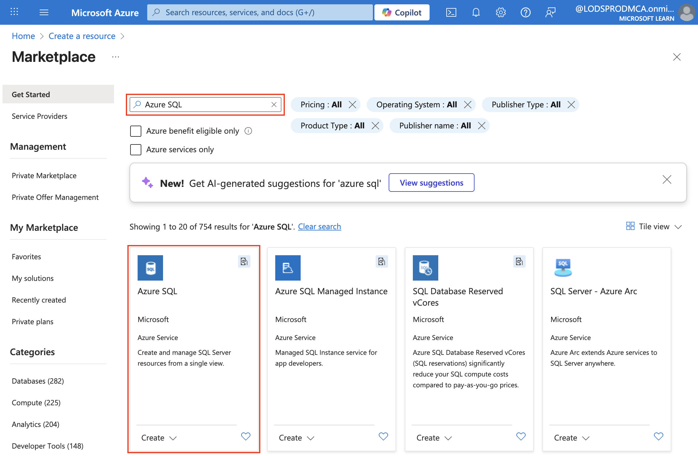

---
lab:
  title: Azure SQL Database について調べる
  module: Explore relational data in Azure
---

# Azure SQL Database について調べる

このラボでは、Azure SQL データベースをプロビジョニングし、SQL クエリを使用してデータベースを操作する方法について説明します。 テーブルとデータが事前に設定された Microsoft AdventureWorks サンプル データベースを使用するので、独自のスキーマを作成したりサンプル レコードを挿入したりすることなく、リレーショナル データの探索とクエリに集中できます。 このアプローチにより、作業をシンプルに保ち、データベースの基本概念と SQL 構文の理解に集中できます。

このラボは完了するまで、約 **15** 分かかります。

## 開始する前に

管理レベルのアクセス権を持つ [Azure サブスクリプション](https://azure.microsoft.com/free)が必要です。

## Azure SQL Database リソースをプロビジョニングする

1. [Azure portal](https://portal.azure.com?azure-portal=true) で、左上隅にある **[&#65291; リソースの作成]** を選択し、`Azure SQL` を検索します。 次に、表示される **[Azure SQL]** ページで、**[作成]** を選択します。

    

1. **[比較のオプション]** を選択します。
 
1. 使用可能な Azure SQL のオプションを確認し、**[SQL データベース]** タイルで **[単一データベース]** が選択されていることを確認して、**[作成]** を選択します。

    ![[Azure SQL] ページが表示された Azure portal のスクリーンショット。](images/azure-sql-portal.png)

    > _**ヒント**:このラボでは、単一データベースを設定するのが最も簡単で最速です。_ 他のオプションの場合、現時点では不要な設定が追加されます。

1. **[SQL データベースの作成]** ページに次の値を入力し、他のすべてのプロパティは既定の設定のままにします。
    - **サブスクリプション**:Azure サブスクリプションを選択します。
    - **リソース グループ**: ご自分で選択した名前を持つ新しいリソース グループを作成します。
    - **データベース名**: `AdventureWorks`
    - **サーバー**: **[新規作成]** を選択し、使用可能な任意の場所に一意の名前を持つ新しいサーバーを作成します。 **SQL 認証**を使用し、サーバー管理者ログインとしてご自分の名前を指定して、適切な複雑なパスワードを指定します (パスワードを覚えておいてください。後で必要になります)。
    - **SQL エラスティック プールを使用しますか?**: *いいえ*
    - **ワークロード環境**: 開発
    - **コンピューティングとストレージ**: 変更しません
    - **バックアップ ストレージの冗長性**: "ローカル冗長バックアップ ストレージ"**

    > _**ヒント**:最後に、SQL 認証を簡単にセットアップできます (Microsoft Entra ID の追加の手順は不要です)。開発の既定値はコストが低く高速です。_ ローカル バックアップは低コストの選択肢であり、一時的な演習用データベースに適しています。

1. **[SQL Database の作成]** ページで、 **[次へ: ネットワーク]** を選択し、 **[ネットワーク]** ページの **[ネットワーク接続]** セクションで、 **[パブリック エンドポイント]** を選択します。 **[ファイアウォール規則]** セクションの両方のオプションに対して **[はい]** を選択すると、Azure サービスと現在のクライアント IP アドレスからデータベース サーバーへのアクセスが許可されます。

    

    > _**ヒント**:パブリック エンドポイント + お使いの IP を許可することで、すぐに接続できます。短期間のラボに最適です。_ 通常、実際のプロジェクトでは、アクセスをより厳格にします。

1. **[次へ: セキュリティ]** を選択し、 **[Microsoft Defender for SQL を有効にする]** オプションを **[今はしない]** に設定します。

    > _**ヒント**:Defender は有料のセキュリティ アドオンです。_ 作業をシンプルに保ち、短期間の演習で発生するコストを回避するため、ここではスキップします。

1. **[次へ: 追加設定]** を選択し、 **[追加設定]** タブで、 **[既存のデータを使用します]** オプションを **[サンプル]** に設定します (これにより、後で利用できるサンプル データベースが作成されます)。

    > _**ヒント**:_ サンプル データには既製のテーブルと行が用意されているため、すぐにクエリを開始できます。

1. **[確認と作成]** を選択し、**[作成]** を選択して、Azure SQL データベースを作成します。

1. デプロイが完了するまで待ちます。 その後、デプロイされたリソースにアクセスすると、次のように表示されます。

    ![[SQL Database] ページが表示されている Azure portal のスクリーンショット。](images/sql-database-portal.png)

1. ページの左側のペインで、**[クエリ エディター (プレビュー)]** を選択し、サーバー用に指定した管理者のログインとパスワードを使用してサインインします。
    
    >**注**:クライアント IP アドレスが許可されていないことを示すエラー メッセージが表示された場合は、メッセージの最後にある **[許可リスト IP]** リンクを選択してアクセスを許可し、もう一度サインインします (以前にご自身のコンピューターのクライアント IP アドレスをファイアウォール規則に追加していますが、ネットワーク構成によっては、クエリ エディターが異なるアドレスから接続されることがあります)。
    
    クエリ エディターは次のようになります。
    
    

1. **Tables** フォルダーを展開し、データベース内のテーブルを表示します。

1. **[クエリ 1]** ペインで、次の SQL コードを入力します。

    ```sql
   SELECT * FROM SalesLT.Product;
    ```

    > _**ヒント**:SELECT * を使用すると、すべての列と一部の値をすばやく表示できます _(通常、実際のアプリではこれを避け、必要な列のみを選択します)。

1. 次に示すように、クエリの上にある **[&#9655; 実行]** を選択して実行し、結果を表示します。これには、次に示すように、**SalesLT.Product** テーブルにあるすべての行のすべての列が含まれています。

    

1. SELECT ステートメントを次のコードに置き換え、 **[&#9655; 実行]** を選択して新しいクエリを実行し、結果を確認します (**ProductID**、**Name**、**ListPrice**、**ProductCategoryID** の各列のみが含まれます)。

    ```sql
   SELECT ProductID, Name, ListPrice, ProductCategoryID
   FROM SalesLT.Product;
    ```

    > _**ヒント**:_ 必要な列のみを一覧表示すると、結果のサイズを抑え、より高速に実行することができます。

1. 次に、JOIN を使用して **SalesLT.ProductCategory** テーブルからカテゴリ名を取得する次のクエリを試してみましょう。

    ```sql
    SELECT 
        p.ProductID, 
        p.Name AS ProductName,
        c.Name AS Category, 
        p.ListPrice
    FROM SalesLT.Product AS p
    INNER JOIN SalesLT.ProductCategory AS c 
        ON p.ProductCategoryID = c.ProductCategoryID;
    ```

    > _**ヒント**:_ この JOIN は、一致する ID を使用して別のテーブルから関連データ (カテゴリ名) をプルする方法を示しています。

1. クエリ エディター ペインを閉じると、編集内容が破棄されます。

> _**ヒント**:Azure SQL Database の確認を完了したら、この演習で作成したリソース グループを削除できます。リソース グループを削除すると、1 つの手順ですべてのリソースが削除されます。_ また、コストも最小限に抑えられます。
