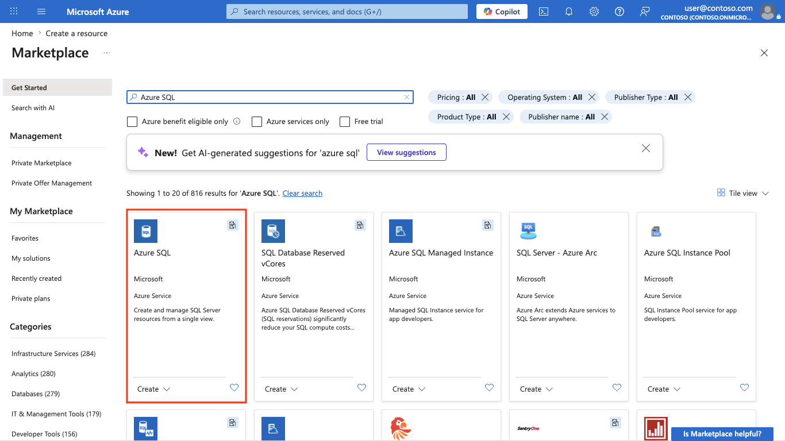
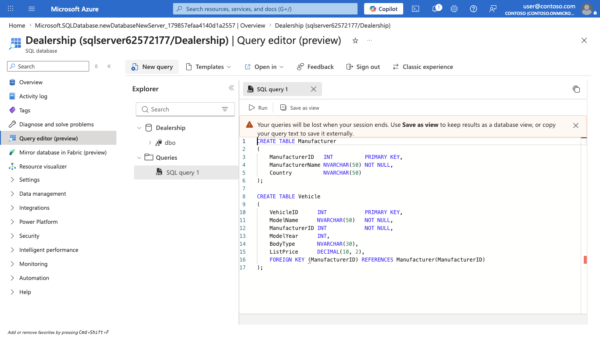
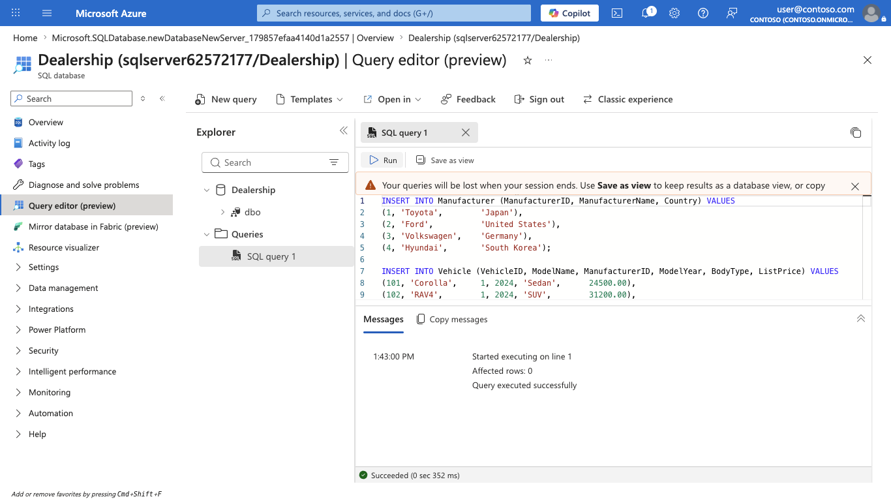
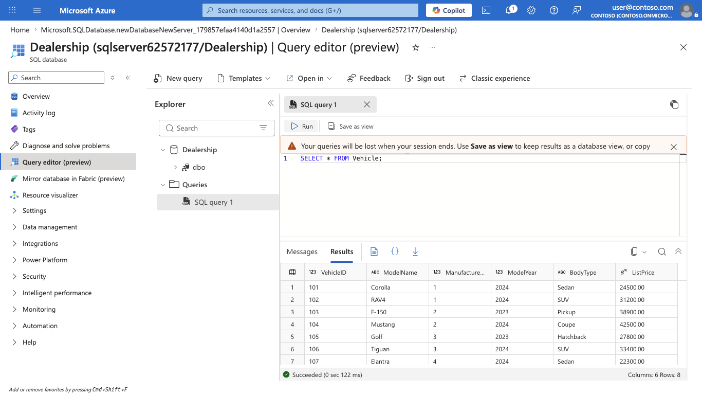
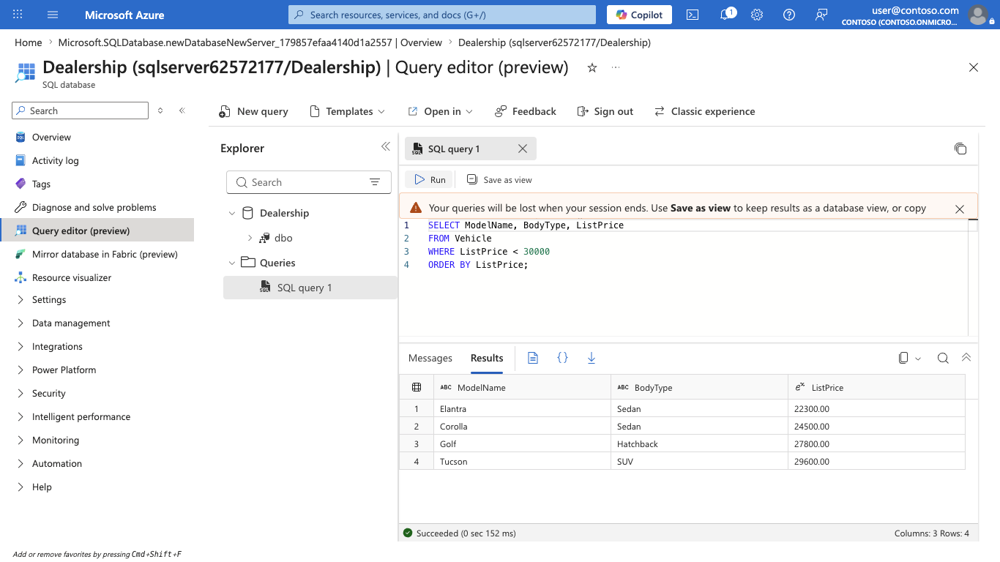
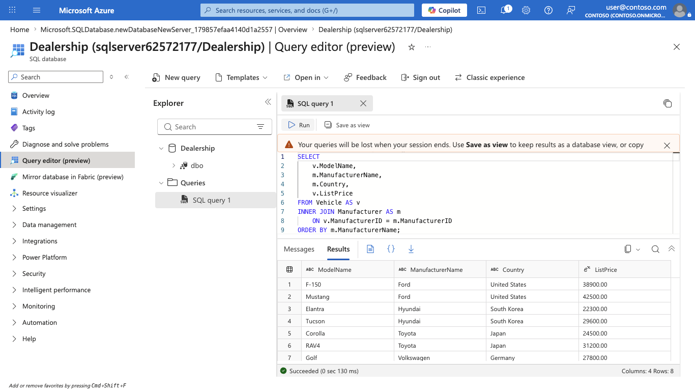

---
lab:
  title: Azure SQL Database について調べる
  module: Explore relational data in Azure
  description: このラボでは、Azure SQL データベースを一からプロビジョニングし、SQL クエリを使ってそれを操作します。 小さな自動車販売店データベースを構築し、サンプルの車とメーカーをいくつか追加してから、クエリを実行してデータを探索します。 このラボは、これまでに Azure またはデータベースを使った経験のないまったくの初心者向けに書かれているため、すべてのステップがわかりやすい言葉で説明されています。
  duration: 20 minutes
  level: 100
  islab: true
  primarytopics:
    - Azure SQL Database
    - Azure
    - Azure Portal
---

# Azure SQL Database について調べる

このラボでは、**Azure SQL Database** を使って初めてのクラウド データベースを作成します。 簡単に言えば、データベースとは、後で見つけて使えるように、情報を整理して格納するための場所です。 この例では、架空の自動車販売店のための情報、つまり、自動車を製造する**メーカー**と、販売店が販売する**車**の情報を格納します。

データベースを作成し、少量のサンプル データを追加してから、**SQL** (構造化照会言語) を使って "3 万ドル未満の車はどれですか?" といった質問をデータベースにします。 SQL を書いたり、Azure を使ったりしたことがなくても心配いりません。作業を進めながらすべてのステップについて説明します。

このラボは完了するまで、約 **20** 分かかります。

## 開始する前に

管理レベルのアクセス権を持つ [Azure サブスクリプション](https://azure.microsoft.com/free)が必要です。 お持ちでない場合は、上記のリンクを使って無料アカウントにサインアップしてください。

> **Azure とは?** Azure は Microsoft のクラウド プラットフォームです。独自のサーバー コンピューターを購入して実行する代わりに、Microsoft からコンピューティング リソース (データベースなど) をレンタルし、インターネット経由で使います。それらのリソースの作成と管理には、**Azure portal** という Web サイトを使います。__

## Azure SQL Database リソースをプロビジョニングする

"プロビジョニング" とは、新しいリソースを作成および設定することを意味します。 このセクションでは、データベース サーバーと、データを格納する空のデータベースを作成します。

1. ご自分の Azure アカウントを使用して [Azure portal](https://portal.azure.com?azure-portal=true) にサインインします。

1. ページの左上隅にある **[&#65291; リソースの作成]** を選びます。 **[Marketplace を検索]** ボックスに「`Azure SQL`」と入力して Enter キーを押します。 検索結果で **[Azure SQL]** (発行元は Microsoft) を選びます。

    

1. **[Azure SQL]** ページで **[作成]** を選びます。 **[お客様のワークロードに適した Azure SQL ソリューションを見つけてください]** ページの **[データベースの作成]** タイルで **[詳細情報]** を選んでから、**[SQL データベースの作成]** を選びます。

    > **ヒント:** 単一の SQL データベースは最も簡単な設定オプションであり、学習に最適です。他のオプション (Hyperscale、エラスティック プール、マネージド インスタンスなど) を選ぶと、まだ必要のない機能が追加されます。__

1. **[SQL データベースの作成]** ページに次の値を入力し、他のすべてのプロパティは既定の設定のままにします。

    - **サブスクリプション**:Azure サブスクリプションを選択します。
    - **リソース グループ**: ご自分で選択した名前を持つ新しいリソース グループを作成します。

        > **リソース グループとは?** それは、関連する Azure リソースをまとめて保持するフォルダーにすぎません。使い終えたら、ワンクリックでフォルダーを削除してすべてを削除できます。__

    - **データベース名**: `Dealership`

    ![リソース グループ、データベース名、サーバーの設定が示されている、[SQL データベースの作成] ページの [基本情報] タブのスクリーンショット。](images/01-sql-lab-basics.png)

    - **サーバー**: **[新規作成]** を選択し、使用可能な任意の場所に一意の名前を持つ新しいサーバーを作成します。 **SQL 認証**を使用し、サーバー管理者ログインとしてご自分の名前を指定して、適切な複雑なパスワードを指定します (パスワードを覚えておいてください。後で必要になります)。

        **[OK]** を選んでサーバー フォームを閉じます。

        ![[SQL 認証を使用する] が選ばれ、サーバー名、場所、管理者ログインが入力されている、[SQL Database サーバーの作成] フォームのスクリーンショット。](images/01-sql-lab-create-server.png)

    - **SQL エラスティック プールを使用しますか?**: *いいえ*
    - **[ワークロード環境]**: [開発]**
    - **コンピューティングとストレージ**: 変更しません。
    - **バックアップ ストレージの冗長性**: "ローカル冗長バックアップ ストレージ"**

    > **ヒント:** このラボにサインインする最も簡単な方法は SQL 認証 (ユーザー名とパスワード) です。**[開発]** と **[ローカル冗長]** オプションを使うと、短い練習用データベースのコストをできるだけ低く抑えることができます。__

1. **[次: ネットワーク >]** を選択します。 **[ネットワーク]** ページの **[ネットワーク接続]** セクションで、**[パブリック エンドポイント]** を選びます。 次に、**[ファイアウォール規則]** セクションで、**[Azure サービスおよびリソースにこのサーバーへのアクセスを許可する]** と **[現在のクライアント IP アドレスを追加する]** の両方を **[はい]** に設定します。

    ![[パブリック エンドポイント] が選ばれ、両方のファイアウォール規則が [はい] に設定されている、[ネットワーク] タブのスクリーンショット。](images/01-sql-lab-networking.png)

    > **ヒント:** ファイアウォールは望ましくない接続をブロックします。これらの設定では、"受講者" がラボの間にデータベースに接続できるよう、十分なアクセスだけが開かれます。実際のプロジェクトでは、これをはるかに厳しくロックダウンします。__**

1. **[次へ: セキュリティ >]** を選び、**[Microsoft Defender for SQL を有効にする]** オプションが **[今はしない]** に設定されていることを確認します。

    ![[Microsoft Defender for SQL を有効にする] が [今はしない] に設定されている [セキュリティ] タブのスクリーンショット。](images/01-sql-lab-security.png)

    > **ヒント:** Defender は有料のセキュリティ アドオンです。この短くてコストがかからないことが大事な演習では、スキップしても安全です。__

1. **[次へ: 追加設定 >]** を選びます。 **[追加設定]** タブで、**[既存のデータを使用]** オプションが **[なし]** に設定されていることを確認します。

    ![[既存のデータを使用] が [なし] に設定されている [追加設定] タブのスクリーンショット。](images/01-sql-lab-additional-settings.png)

    > **重要:** これを **[なし]** のままにすると、完全に空のデータベースが作成されます。次のセクションで独自の自動車テーブルとデータを作成するため、このようにする必要があります。__

1. **[確認および作成]** を選択し、設定を確認してから、**[作成]** を選択します。

    ![SQL データベースの設定がまとめられている [確認と作成] タブのスクリーンショット。](images/01-sql-lab-review-create.png)

1. デプロイが完了するまで数分待ちます。 完了したら、**[リソースに移動]** を選びます。

## データベース テーブルを作成してサンプル データを追加する

データベースは作成されましたが、空のままです。 リレーショナル データベースでは、データは**テーブル**に格納されます。これは、行と列で構成されたスプレッドシートのようなものです。 次に、2 つのテーブルを作成し、少量のサンプル データを入力します。

1. データベース ページの左側にあるメニューで、**[クエリ エディター (プレビュー)]** を選びます。 サインイン ペインで **[SQL 認証]** タブを選び、前に作成した**サーバー管理者ログイン**と**パスワード**を入力して、**[接続]** を選びます。

    ![[SQL 認証] タブが選ばれている、クエリ エディターのサインイン ペインのスクリーンショット。](images/01-sql-lab-query-editor-login.png)

    > **注意:** クライアント IP アドレスが許可されていないことを示すエラーが表示される場合は、メッセージの **[許可リスト IP ...]** リンクを選んでアクセスを許可してから、もう一度接続してみてください。__

    クエリ エディターで SQL コマンドを入力して実行します。 **[&#65291; 新しいクエリ]** を選んで、空のクエリ タブを開きます。

1. クエリ タブに、次の SQL コードを貼り付けます。 これにより、**Manufacturer** テーブル (車を製造する会社) と **Vehicle** テーブル (販売店が販売する自動車) が作成されます。

    ```sql
    CREATE TABLE Manufacturer
    (
        ManufacturerID   INT          PRIMARY KEY,
        ManufacturerName NVARCHAR(50) NOT NULL,
        Country          NVARCHAR(50)
    );

    CREATE TABLE Vehicle
    (
        VehicleID      INT            PRIMARY KEY,
        ModelName      NVARCHAR(50)   NOT NULL,
        ManufacturerID INT            NOT NULL,
        ModelYear      INT,
        BodyType       NVARCHAR(30),
        ListPrice      DECIMAL(10, 2),
        FOREIGN KEY (ManufacturerID) REFERENCES Manufacturer(ManufacturerID)
    );
    ```

    > **処理の説明** 各 `CREATE TABLE` ステートメントでは、テーブルとその列が定義されています。**PRIMARY KEY** は各行を一意に識別します (2 つのメーカーが ID を共有することはできません)。**FOREIGN KEY** は各車をメーカーにリンクしているので、2 つのテーブルが関連付けられ、それによってこれは "リレーショナル" データベースになります。__

    

1. クエリの上にある **[&#9655; 実行]** を選びます。 クエリが成功したことを確認するメッセージが表示されます。 これで 2 つのテーブルが存在するようになりますが、それらは空です。

1. クエリ タブ内のすべての SQL を次のコードに置き換えます。これにより、サンプルのメーカーと車が追加されます。 次に、**[&#9655; 実行]** を選びます。

    ```sql
    INSERT INTO Manufacturer (ManufacturerID, ManufacturerName, Country) VALUES
    (1, 'Toyota',        'Japan'),
    (2, 'Ford',          'United States'),
    (3, 'Volkswagen',    'Germany'),
    (4, 'Hyundai',       'South Korea');

    INSERT INTO Vehicle (VehicleID, ModelName, ManufacturerID, ModelYear, BodyType, ListPrice) VALUES
    (101, 'Corolla',     1, 2024, 'Sedan',      24500.00),
    (102, 'RAV4',        1, 2024, 'SUV',        31200.00),
    (103, 'F-150',       2, 2023, 'Pickup',     38900.00),
    (104, 'Mustang',     2, 2024, 'Coupe',      42500.00),
    (105, 'Golf',        3, 2023, 'Hatchback',  27800.00),
    (106, 'Tiguan',      3, 2024, 'SUV',        33400.00),
    (107, 'Elantra',     4, 2024, 'Sedan',      22300.00),
    (108, 'Tucson',      4, 2023, 'SUV',        29600.00);
    ```

    > **処理の説明** 各 `INSERT` ステートメントは、データ行をテーブルに追加します。これで、4 つのメーカーと 8 台の車が追加されました。各車の **ManufacturerID** が Manufacturer テーブルの ID と一致していることに注意してください。__

    

## データにクエリを実行する

データベースにデータが含まれるようになったので、SQL の **SELECT** ステートメントを使って、それを取得して探索できます。

1. クエリ タブ内のすべての SQL を次のコードに置き換えて、**[&#9655; 実行]** を選びます。 これにより、**Vehicle** テーブルからすべての列とすべての行が返されます。

    ```sql
    SELECT * FROM Vehicle;
    ```

    結果では、追加した 8 台の車がすべて示されているはずです。

    

    > **ヒント:** `SELECT *` は、"すべての列を選択する" ことを意味します。手早く見るには便利ですが、実際のアプリケーションでは、通常、実際に必要な列のみを一覧表示します。__

1. クエリを次のコードに置き換えて、**[&#9655; 実行]** を選びます。 今度は特定の列のみが返されるため、結果を読みやすくなります。

    ```sql
    SELECT ModelName, BodyType, ListPrice
    FROM Vehicle;
    ```

1. 次に、データをフィルター処理してみます。 クエリを次のコードに置き換えて、**[&#9655; 実行]** を選びます。 この **WHERE** 句は価格が 30,000 ドル未満の車のみを返し、**ORDER BY** は最も安いものから最も高いものの順に並べ替えます。

    ```sql
    SELECT ModelName, BodyType, ListPrice
    FROM Vehicle
    WHERE ListPrice < 30000
    ORDER BY ListPrice;
    ```

    > **ヒント:** **WHERE** は返される行をフィルター処理し、**ORDER BY** は表示順序を制御します。これらは、SQL で最も役に立つツールのうちの 2 つです。__

    

1. 最後に、両方のテーブルのデータを結合するクエリを試します。 クエリを次のコードに置き換えて、**[&#9655; 実行]** を選びます。

    ```sql
    SELECT
        v.ModelName,
        m.ManufacturerName,
        m.Country,
        v.ListPrice
    FROM Vehicle AS v
    INNER JOIN Manufacturer AS m
        ON v.ManufacturerID = m.ManufacturerID
    ORDER BY m.ManufacturerName;
    ```

    > **処理の説明** **JOIN** は、一致する値 (ここでは、両方のテーブルが共有する **ManufacturerID**) に基づいて、2 つのテーブルの行を結合します。これにより、各車と共に、それを製造している会社の名前と国の情報 (それは別のテーブルに存在していますが) を一緒に表示できます。__

    

1. 少し時間を取って試してみてください。 **WHERE** 句の価格を変更したり、別の列で並べ替えたりしてから、クエリをもう一度実行して結果がどのように変わるかを見てください。

1. 済んだら、クエリ エディター ペインを閉じ、メッセージが表示されたら編集内容を破棄します。

## クリーンアップ

調べ終わったら、これ以上コストが発生しないように、作成したリソースを削除する必要があります。

1. Azure portal で、ラボの開始時に作成した**リソース グループ**に移動します (例: `dp900-lab-rg`)。

    ![[リソース グループの削除] ボタンおよび SQL データベースとサーバーのリソースが示されている、リソース グループの概要のスクリーンショット。](images/01-sql-lab-cleanup.png)

1. **[リソース グループの削除]** を選択し、リソース グループ名を入力して削除することを確認し、**[削除]** を選択します。

    > **ヒント:** リソース グループを削除すると、データベース、サーバー、その中にあるすべてのものが 1 ステップで削除されます。これは、実行されたままになってコストが発生するものがないようにするための最も簡単な方法です。__

このラボでは、Azure SQL データベースをプロビジョニングし、独自のテーブルを作成して、自動車のサンプル データを追加した後、SQL を使ってそのクエリを実行しました。 これで、クラウドでのリレーショナル データについて第一歩を踏み出すことができました。
