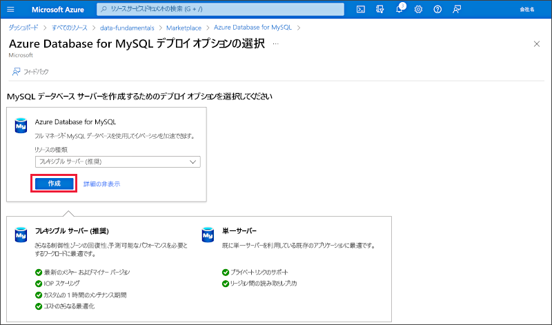

---
lab:
  title: Azure Database for MySQL について調べる
  module: Explore relational data in Azure
---

# Azure Database for MySQL について調べる

この演習では、Azure サブスクリプションで Azure Database for MySQL リソースをプロビジョニングします。

このラボは完了するまで、約 **5** 分かかります。

## 開始する前に

管理レベルのアクセス権を持つ [Azure サブスクリプション](https://azure.microsoft.com/free)が必要です。

## Azure Database for MySQL リソースのプロビジョニング

この演習では、Azure Database for MySQL リソースをプロビジョニングします。

1. Azure portal で、左上隅にある **[&#65291; リソースの作成]** を選択し、 *[Azure Database for MySQL]* を検索します。 次に、表示される **[Azure Database for MySQL]** ページで、**[作成]** を選択します。

1. 使用可能な Azure Database for MySQL のオプションを確認します。 次に、 **[リソースの種類]** で **[フレキシブル サーバー]** を選択し、 **[作成]** を選択します。

    

1. **[SQL データベースの作成]** ページで、次の値を入力します。
    - **サブスクリプション**:Azure サブスクリプションを選択します。
    - **リソース グループ**: ご自分で選択した名前を持つ新しいリソース グループを作成します。
    - **サーバー名**:一意の名前を入力します。
    - **リージョン**: 利用可能な最寄りの場所。
    - **MySQL バージョン**: 変更しません。
    - **ワークロードの種類**: 開発プロジェクトまたは趣味プロジェクト向け。
    - **コンピューティングとストレージ**: 変更しません。
    - **可用性ゾーン**: 変更しません。
    - **高可用性の有効化**: 変更しません。
    - **管理者ユーザー名**: ご自分の名前
    - **[パスワード]** と **[パスワードの確認入力]**: 適切な複雑なパスワード

1. **[次へ: ネットワーク]** を選択します。

1. **[ファイアウォール規則]** で、 **[&#65291; 現在のクライアント IP アドレスを追加する]** を選択します。

1. **[確認と作成]** を選択し、**[作成]** を選択して、Azure MySQL データベースを作成します。

1. デプロイが完了するまで待ちます。 その後、デプロイされたリソースにアクセスすると、次のように表示されます。

    ![[Azure Database for MySQL] ページが表示されている Azure portal のスクリーンショット。](images/mysql-portal.png)

1. Azure Database for MySQL リソースを管理するためのオプションを確認します。

> **ヒント**: Azure Database for MySQL の調査が完了している場合は、この演習で作成したリソース グループを削除してください。
