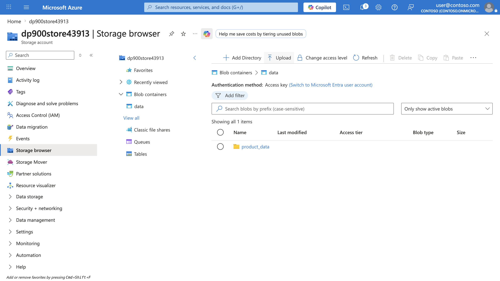
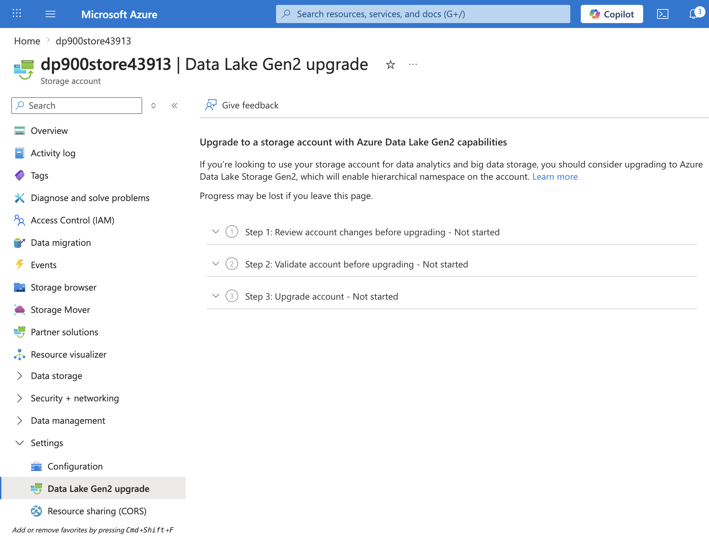
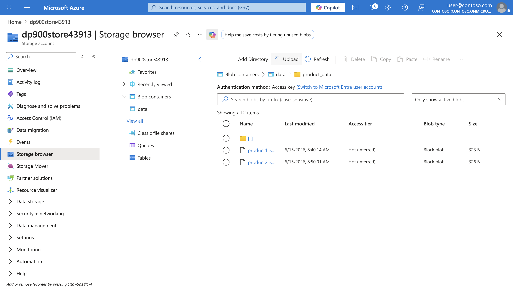
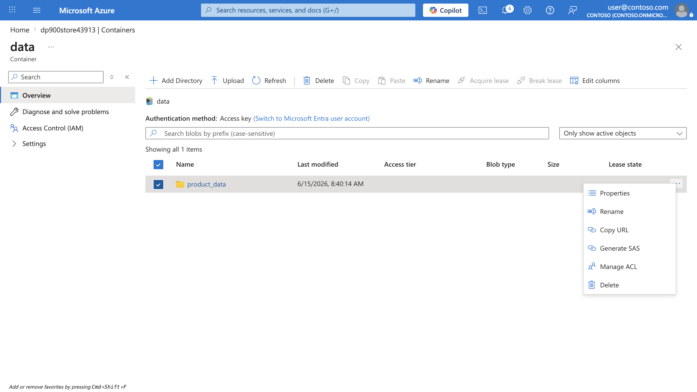

---
lab:
  title: Azure Storage を調べる
  module: Explore Azure Storage for non-relational data
  description: この演習では、Azure Storage アカウントをプロビジョニングして構成し、そのコア サービスである Blob Storage、Data Lake Storage Gen2、Azure Files を調べます。 このラボは Azure を初めて使用する方を対象に書かれているため、すべてのステップがわかりやすい言葉で説明されています。
  duration: 30 minutes
  level: 100
  islab: true
  primarytopics:
    - Azure
    - Azure Files
    - Azure Storage
---

# Azure Storage を調べる

このラボでは、**Azure Storage アカウント**を作成します。これはクラウド上でさまざまなデータを安全に保管するための場所です。 その後、4 つのコア サービスを調べ、それぞれの役割を確認します。

- **Blob Storage** は、画像、ドキュメント、データファイルなどのファイルを保存します。
- **Data Lake Storage Gen2** は、実際のフォルダーを持つ Blob Storage で、ビッグデータ分析に使われます。
- **Azure Files** は、共有ネットワーク ドライブのように動作するクラウド ファイル共有です。

この種のストレージは、リレーショナル データベースとは異なり、データを固定構造の関連テーブルに整理する必要がないため、"非リレーショナル" と呼ばれます。** これらの用語を初めて聞く方も心配しないでください。進行に応じて各手順が説明されています。

このラボは完了するまで、約 **30** 分かかります。

> **ヒント**: ラボ全体を通して、各ステップを行う "目的" を説明する短いメモがあります。各動作の背景にある理由を理解すると、後にコスト、性能、セキュリティ、分析のバランスが取れたストレージ ソリューションを設計するのに役立ちます。_**_

## 開始する前に

管理レベルのアクセス権を持つ [Azure サブスクリプション](https://azure.microsoft.com/free)が必要です。 お持ちでない場合は、上記のリンクを使って無料アカウントにサインアップしてください。

> **Azure とは。** Azure は Microsoft のクラウド プラットフォームです。独自のサーバー コンピューターを購入して実行する代わりに、Microsoft からコンピューティング リソース (ストレージなど) をレンタルし、インターネット経由で使用します。これらのリソースの作成と管理には、**Azure portal** という Web サイトを使用します。__

## Azure Storage アカウントをプロビジョニングする

"プロビジョニング" とは、新しいリソースを作成および設定することを意味します。 Azure Storage を使用する最初の手順は、ストレージ アカウントを作成することです。これは、すべてを格納するコンテナーとして機能します。

> **ストレージ アカウントとは。** Azure Storage のすべてのサービス (BLOB、ファイル、キュー、テーブル) の最上位 "ホーム"です。コスト、維持しているデータのコピー数、暗号化、アクセスできるユーザーなどの設定はすべてここで管理します。__

1. まだサインインしていない場合は、[Azure portal](https://portal.azure.com?azure-portal=true) にサインインします。

1. Azure portal ホーム ページで、左上隅にある **[&#65291; リソースの作成]** を選択し、`Storage account` を検索します。 次に、結果として得られる **[ストレージ アカウント]** ページで、**[作成]** を選択します。

    ![Azure portal ホーム ページを示すスクリーンショット。左上に [リソースの作成] ボタンが強調表示されています。](images/02-storage-lab-create-resource.png)

1. **[ストレージ アカウントの作成]** ページの **[基本]** タブで、次の情報を入力します。
   
    - **サブスクリプション**:Azure サブスクリプションを選択します。
    - **リソース グループ**: **[新規作成]** を選択し、`dp900-lab-rg` などの、任意の名前を入力します。

        > **リソース グループとは。** これは、関連する Azure リソースをまとめて保持するフォルダーです。使い終えたら、ワン クリックでフォルダーを削除してすべてを削除できます。__

    - **ストレージアカウント名**: 英小文字と数字のみから成る一意の名前を入力します (この名前は他の誰かが既に使っていない名前にする必要があります)。
    - **リージョン**: 利用可能な最寄りの場所を選択します。
    - **パフォーマンス**: "標準"**
    - **冗長性**: *"ローカル冗長ストレージ (LRS)"*

    > **注意**: 選択したリージョンによっては、**[優先ストレージの種類]** オプションが Azure Blob Storage または Azure Data Lake Storage Gen 2 に設定されている場合がありますが、既定値のままにしておきます。_**_

    ![サブスクリプション、新しいリソース グループ、ストレージ アカウント名、リージョン、標準パフォーマンス、ローカル冗長ストレージの冗長性が表示されている [ストレージ アカウント作成] ページの [基本] タブのスクリーンショット。](images/02-storage-lab-basics.png)

    > _**ヒント**:新しいリソース グループを使用すると、クリーンアップが簡単になります。Standard + LRS は最も低コストのベースラインであり、学習に適しています。_ LRS の場合、1 つのリージョンに 3 つの同期コピーを保持できます。geo レプリケーションの料金が発生せず、重要ではないデモ データに適しています。

1. **[次へ: 詳細]** を選択し、詳細な構成オプションを表示します。 特に、ここでは階層型名前空間を有効にして、Azure Data Lake Storage Gen 2 がサポートされることに注意してください。 **[階層型名前空間を有効にする]** オプションは**<u>未選択</u>** のままにし (後で有効にします)、**[次へ: ネットワーク>]** を選択して、ストレージ アカウントのネットワーク オプションを表示します。

    ![[階層型名前空間を有効にする] チェックボックスが未選択の [詳細] タブのスクリーンショット。](images/02-storage-lab-advanced.png)

1. **[次へ: データ保護]** を選択し、次に **[回復]** セクションで **[論理的な削除を有効にする]** オプションを選択<u>解除</u>します。 これらのオプションでは、後の回復のために削除されたファイルが保持されますが、後で階層型名前空間を有効にするときに問題が発生する可能性があります。

    ![論理的な削除を有効にする 3 つのオプションが、すべて未入力の状態の [データ保護] タブのスクリーンショット。](images/02-storage-lab-data-protection.png)

1. 既定の設定を変更せずに残りの **[次へ]** ページに進んでから、 **[確認]** ページで選択内容が検証されるのを待ち、 **[作成]** を選択して Azure Storage アカウントを作成します。

    ![[確認] タブのスクリーンショット。ストレージ アカウントの設定のまとめと [作成] ボタンが表示されています。](images/02-storage-lab-review-create.png)

1. デプロイが完了するまで待ちます。 **[リソースに移動]** を選択して、展開されたストレージ アカウントを開きます。

    ![[リソースに移動] ボタンが表示されている [デプロイの完了] ページのスクリーンショット。](images/02-storage-lab-deployment-complete.png)

## BLOB ストレージを探索する

新しい Azure Storage アカウントを作成したので、BLOB データ用のコンテナーを作成できます。

> _**ヒント**:コンテナーは BLOB をグループ化するものです。また、アクセス制御の最初のスコープ レベルです。_ プレーン BLOB ストレージ (階層型名前空間なし) から始めることで、後で Data Lake Gen2 と比較する仮想フォルダーの動作を確認できます。

1. `https://aka.ms/product1.json` から [product1.json](https://aka.ms/product1.json?azure-portal=true) JSON ファイルをダウンロードし、コンピューターに保存します (任意のフォルダーに保存できます。後で BLOB ストレージにアップロードします)。

    JSON ファイルがブラウザーに表示される場合は、ページを右クリックし、**[名前を付けて保存]** を選択します。** ファイルに「**product1.json**」という名前を付けて、ダウンロード フォルダーに保存します。 

1. ストレージ コンテナーの Azure portal ページの左側にある **[データ ストレージ]** セクションで、**[コンテナー]** を選択します。

1. **[コンテナー]** ページで **[&#65291; コンテナーの追加]** を選択します。 **[新しいコンテナー]** ペインで名前に「`data`」と入力します。

    **[匿名アクセス レベル]** は自動的に **[プライベート (匿名アクセスなし)]** に設定され、変更はできません。ストレージ アカウントでは匿名アクセスが既定で無効になっているためです。 **［作成］** を選択します

    ![名前データが入力され、匿名アクセス レベルがプライベートに設定されている [新しいコンテナー] ペインのスクリーンショット。](images/02-storage-lab-new-container.png)

    > _**ヒント**:非公開にすると、サンプル データを安全に保つことができます。静的 Web サイトやオープン データのシナリオを除き、パブリック アクセスが必要になることはほとんどありません。_`data` という名前を付けると、この例はシンプルかつ読みやすくなります。

1. **data** コンテナーが作成された後、それが **[コンテナー]** ページに一覧表示されているのを確認します。

    ![プライベート アクセス レベルのデータ コンテナーが表示されている [コンテナー] ページのスクリーンショット。](images/02-storage-lab-containers-list.png)

1. 左側のペインの上部のセクションで、 **[ストレージ ブラウザー]** を選択します。 このページには、ストレージ アカウント内のデータを処理するために使用できるブラウザーベースのインターフェイスが表示されます。

1. [ストレージ ブラウザー] ページで **[BLOB コンテナー]** を選択し、**data** コンテナーが一覧表示されていることを確認します。

1. **data** コンテナーを選択します。空である点に注意してください。

    ![[ディレクトリの追加] と [アップロード] ツールバー ボタンが表示されている空のデータ コンテナーを示すストレージ ブラウザーのスクリーンショット。](images/02-storage-lab-storage-browser.png)

1. **[&#65291; ディレクトリの追加]** を選択し、`products` という名前の新しいディレクトリを作成する前にフォルダーに関する情報を読みます。

1. ストレージ ブラウザーで、作成した **products** フォルダーの内容が現在のビューに表示されていることを確認します。ページの上部にある "階層リンク" に **BLOB コンテナー > data > products** のパスが反映されているのを確認します。

    ![[製品] フォルダー内のストレージ ブラウザーのスクリーンショット。BLOB コンテナー > データ > 製品の階層リンク パスが表示されています。](images/02-storage-lab-products-folder.png)

1. 階層リンクで、**data** を選択して **data** コンテナーに切り替えます。**products** という名前のフォルダーは含まれ<u>ない</u>ので注意してください。

    BLOB ストレージ内のフォルダーは仮想であり、BLOB のパスの一部としてのみ存在します。 **products** フォルダーには BLOB が含まれていなかったので、実際に存在しません。

    > _**ヒント**:フラット型名前空間とは、ディレクトリが単なる名前のプレフィックス (products/file.json) であることを意味します。_ この設計にすると、サービスで真のツリー構造は維持されず、BLOB 名のインデックスが作成されるため、大規模なスケールが可能になります。

1. **[&#10514; アップロード]** ボタンを使用して、 **[BLOB のアップロード]** パネルを開きます。

1. **[BLOB のアップロード]** パネルで、以前にローカル コンピューターに保存した **product1.json** ファイルを選択します。 次に、**[詳細]** セクションの **[フォルダーにアップロード]** ボックスに `product_data` と入力し、**[アップロード]** ボタンを選択します。

    ![[BLOB のアップロード] パネルのスクリーンショット。product1.json が選択され、[フォルダーにアップロード] ボックスに product_data と入力されています。](images/02-storage-lab-upload-blob.png)

    > _**ヒント**:_ アップロード時にフォルダー名を指定すると、仮想パスが自動的に作成され、BLOB が存在すると "フォルダー" が表示されることがわかります。

1. **[BLOB アップロード]** パネルが開いている場合は閉じ、データ コンテナーに **product_data 仮想フォルダー** が作成されたことを確認します。

    

1. **product_data** フォルダーを選択し、アップロードした **product1.json** BLOB が含まれているか確認します。

1. 左側の **[データ ストレージ]** セクションで、**[コンテナー]** を選択します。

1. **data** コンテナーを開き、作成した **product_data** が一覧表示されていることを確認します。

1. フォルダーの右端の **[&#x2027;&#x2027;&#x2027;]** アイコンを選択します。オプションが表示されないことに注意してください。 フラット型名前空間 BLOB コンテナー内のフォルダーは仮想であり、管理できません。

    > _**ヒント**:_ 実際のディレクトリ オブジェクトは存在しないため、名前の変更やアクセス許可の操作 (階層型名前空間が必要なもの) は実行できません。

1. **data** ページの右上にある **X** アイコンを使用してページを閉じ、**[コンテナー]** ページに戻ります。

## Azure Data Lake Storage Gen2 を確認する

Azure Data Lake Store Gen2 のサポートを使用すると、階層フォルダーを使用して BLOB へのアクセスを整理および管理できます。 また、Azure BLOB ストレージを使用して、一般的なビッグ データ分析プラットフォーム用の分散ファイル システムをホストできます。

> _**ヒント**:階層型名前空間を有効にすると、フォルダーは実際のディレクトリのように動作します。また、フォルダー操作を安全に (エラーなしですべて一度に) 実行できます。また、Linux と同様のファイル アクセス許可制御も可能になります。_ これは、Spark や Hadoop などのビッグ データ ツールを使用する場合や、大規模で整理されたデータ レイクを管理する場合に特に役立ちます。

1. `https://aka.ms/product2.json` から [product2.json](https://aka.ms/product2.json?azure-portal=true) JSON ファイルをダウンロードし、以前に **product1.json** をダウンロードしたのと同じコンピューターの同じフォルダーに保存します。それを後で BLOB ストレージにアップロードします。

1. ストレージ アカウントの Azure portal ページの左側にある **[設定]** セクションまで下にスクロールし、 **[Data Lake Gen2 のアップグレード]** を選択します。

1. **[Data Lake Gen2 のアップグレード]** ページで、階層型名前空間を有効にし、Azure Data Lake Storage Gen 2 をサポートするようにストレージ アカウントをアップグレードする各手順を展開して完了します。 これには時間がかかる場合があります。

    

    > _**ヒント**:_ このアップグレードはアカウントレベルの機能スイッチです。データは残りますが、ディレクトリ セマンティクスは高度な操作をサポートするように変更されます。

1. アップグレードが完了したら、左側のペインの上部セクションで **[ストレージ ブラウザー]** を選択し、**data** BLOB コンテナーのルートに戻ります。これには引き続き **product_data** フォルダーが含まれます。

1. **product_data** フォルダーを選択し、前にアップロードした **product1.json** ファイルがまだ含まれているか確認します。

1. **[&#10514; アップロード]** ボタンを使用して、 **[BLOB のアップロード]** パネルを開きます。

1. **[BLOB のアップロード]** パネルで、ローカル コンピューターに保存した **product2.json** ファイルを選択します。 次に、**[アップロード]** ボタンを選択します。

1. **[BLOB のアップロード]** パネルが開いている場合は閉じ、**product_data** フォルダーに **product2.json** ファイルが含まれているのを確認します。

    

    > _**ヒント**:_ アップグレード後に 2 つ目のファイルを追加することで、シームレスな継続性を確認できます。既存の BLOB は引き続き機能し、新しい BLOB にはディレクトリ ACL (アクセス制御リスト) などの階層型の利点が適用されます。

1. 左側の **[データ ストレージ]** セクションで、**[コンテナー]** を選択します。

1. **data** コンテナーを開き、作成した **product_data** が一覧表示されていることを確認します。

1. フォルダーの右側にある **[&#x2027;&#x2027;&#x2027;]** アイコンを選択し、階層型名前空間を有効にすると、フォルダー レベルで構成タスクを実行できることにご注意ください。これにはフォルダー名の変更やアクセス許可の設定 (**ACL の管理**) を含みます。

    

    > _**ヒント**:_ 実際のフォルダーを使用する場合、フォルダー単位で最小特権のセキュリティを適用し、安全に名前を変更し、何千ものプレフィックス付き BLOB 名をスキャンするよりも高速に再帰的なリストを表示できます。

1. **data** ページの右上にある **X** アイコンを使用してページを閉じ、**[コンテナー]** ページに戻ります。

## Azure Files について調べる

Azure Files は、クラウドベースのファイル共有を作成する方法を提供します。

> _**ヒント**:Azure Files には SMB/NFS エンドポイントが用意されています。これはアプリが従来のファイル システムを想定しているリフト アンド シフト シナリオに適しています。_ これは、ファイル ロックと OS ネイティブ ツールをサポートしており、BLOB ストレージを (置き換えるものではなく) 補完するものです。

> **注**: 先ほど、階層型名前空間 (Azure Data Lake Storage Gen2) を有効にしたため、このアカウントのファイル共有は**クラシック ファイル共有**で管理されます。階層型名前空間のないストレージ アカウントでは、このメニュー項目には**ファイル共有**という名前が付けられていますが、共有の作成と接続の手順は同じです。__

1. ストレージ アカウントの Azure portal ページの左側にある **[データ ストレージ]** セクションで、**[クラシック ファイル共有]** を選択します。

1. **[クラシック ファイル共有]** ページで **[&#65291 クラシック ファイル共有]** を選択します。 **[基本]** タブで名前に「`files`」と入力し、**[アクセス層]** は、**[トランザクション最適化]** が設定されているままにします。

    ![[新しいクラシック ファイル共有] の [基本] タブのスクリーンショット。files という名前とトランザクション最適化アクセス層が表示されています。](images/02-storage-lab-new-file-share.png)

1. **[次: バックアップ >]** を選択し、バックアップを無効にするには **[バックアップを有効にする]** チェックボックスをオフにします。 次に **[確認と作成]** を選択し、**[確認と作成]** タブで **[作成]** を選択します。

    ![[バックアップを有効にする] チェックボックスがオフになっている [バックアップ] タブのスクリーンショット。](images/02-storage-lab-file-share-backup.png)

    > _**ヒント**: _バックアップを無効にすると、短期間のラボ環境のコストを抑えられます。運用環境の回復性のためにはバックアップを有効にします。

1. **[ファイル]** 共有が作成されたら、**[クラシック ファイル共有]** ページに戻り、新しい **files** の共有を開きます。

1. ページの上部で、**[接続]** を選択します。 次に、**[接続]** ペインに、クライアント コンピューターから共有フォルダーに接続するために実行できるスクリプトを含む一般的なオペレーティング システム (Windows、Linux、macOS) のタブがあることに注意してください。

    ![[Windows]、[Linux]、[macOS] のタブに接続スクリプトが表示されているファイル共有の [接続] ペインのスクリーンショット。](images/02-storage-lab-file-share-connect.png)

    > _**ヒント**:_ 生成されたスクリプトは、プラットフォーム ネイティブのコマンドを使用して共有をマウントする方法を正確に示しており、仮想マシン、コンテナー、またはオンプレミス サーバーからのハイブリッド アクセス パターンがわかります。

1. **[接続]** ペインを閉じ、次に **files** ファイル ページを閉じて、Azure ストレージ アカウントの **[クラシック ファイル共有]** ページに戻ります。

## クリーンアップ

Azure Storage を調べ終わったら、追加のコストが発生しないように作成したリソースを削除する必要があります。

1. Azure portal で、ラボの開始時に作成した **[リソース グループ]** に移動します (例: `dp900-lab-rg`)。

1. **[リソース グループの削除]** を選択し、リソース グループ名を入力して削除することを確認し、**[削除]** を選択します。

    ![[リソース グループの削除] パネルのスクリーンショット。ストレージ アカウントが表示されていて、削除を確認するためにリソースグループ名が入力されています。](images/02-storage-lab-delete-rg.png)

    > **ヒント:** リソース グループを削除すると、ストレージ アカウントとその内容がすべて一度に削除されます。これが、実行が継続してコストが発生するものをすべて削除できる最も速い方法です。__

この演習では、Azure Storage アカウントをプロビジョニングして構成し、Blob Storage、Data Lake Storage Gen2、Azure Files を調べました。 これで Azure で非リレーショナル データを保存する主な方法を確認できました。
