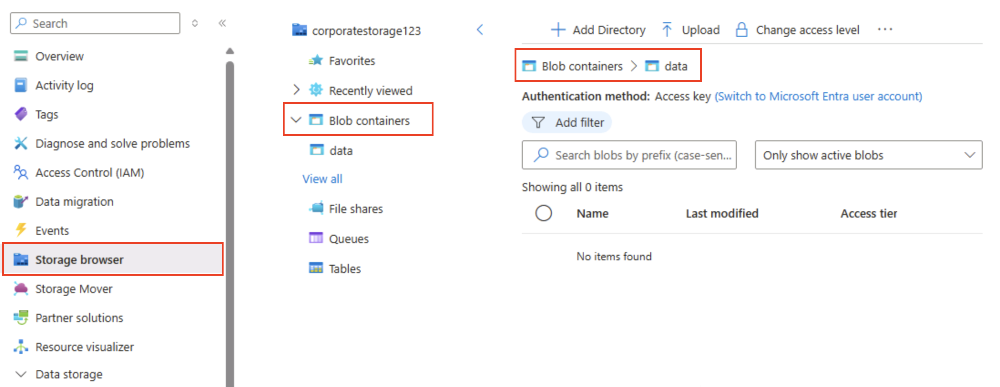
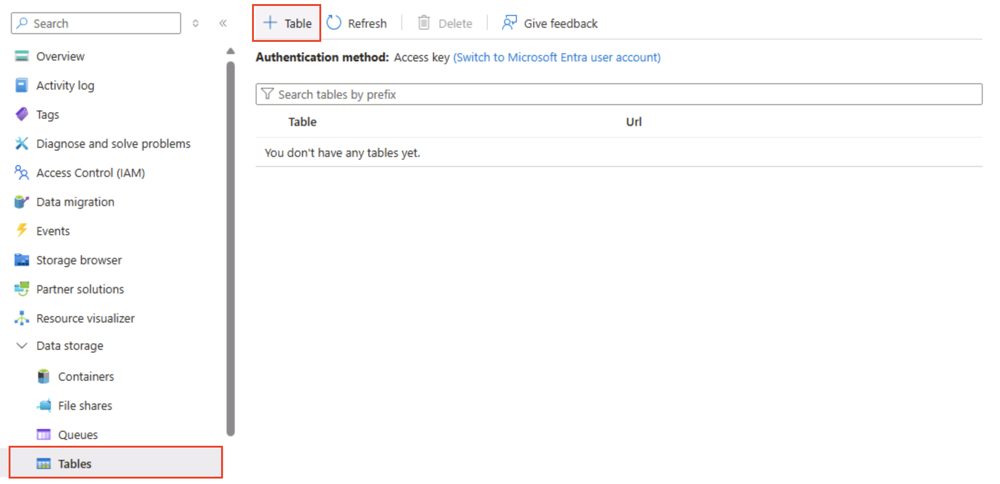

---
lab:
  title: Azure Storage を調べる
  module: Explore Azure Storage for non-relational data
---

# Azure Storage を調べる

この演習では、Azure Storage アカウントをプロビジョニングして構成する方法と、そのコア サービスを調べる方法について説明します。Blob ストレージ、Data Lake Storage Gen2、Azure Files、Azure Tables を確認する方法について説明します。 コンテナーの作成、データのアップロード、階層型名前空間の有効化、ファイル共有の設定、テーブル エンティティの管理に関する実践的な経験を積むことができます。 このようなスキルは、さまざまな分析および適用シナリオに合わせて Azure で非リレーショナル データを保存し、整理し、セキュリティで保護する方法を理解するのに役立ちます。

このラボは完了するまで、約 **15** 分かかります。

> _**ヒント**:各操作の目標を理解することは、後でコスト、パフォーマンス、セキュリティ、分析の目標のバランスが取れたストレージ ソリューションを設計する際に役立ちます。_ このように簡潔な "なぜ" のメモは、各手順を実際の理由に結び付けるものです。

## 開始する前に

管理レベルのアクセス権を持つ [Azure サブスクリプション](https://azure.microsoft.com/free)が必要です。

## Azure Storage アカウントをプロビジョニングする

Azure Storage を使用する際の最初の手順は、Azure サブスクリプションに Azure Storage アカウントをプロビジョニングすることです。

> _**ヒント**:ストレージ アカウントは、すべての Azure Storage サービス (BLOB、ファイル、キュー、テーブル) に対するセキュリティ保護と課金の境界となります。_ ここから下位に、ポリシー、冗長、暗号化、ネットワーク、アクセス制御が適用されます。

1. まだサインインしていない場合は、[Azure portal](https://portal.azure.com?azure-portal=true) にサインインします。

1. Azure portal ホーム ページで、左上隅にある **[&#65291; リソースの作成]** を選択し、`Storage account` を検索します。 次に、結果として得られる **[ストレージ アカウント]** ページで、**[作成]** を選択します。

    

1. **[ストレージ アカウントの作成]** ページで、次の値を入力します。
   
    - **サブスクリプション**:Azure サブスクリプションを選択します。
    - **リソース グループ**: ご自分で選択した名前を持つ新しいリソース グループを作成します。
    - **ストレージ アカウント名**: 小文字と数字を使用して、ストレージ アカウントの一意の名前を入力します。
    - **リージョン**: 使用可能な場所を選択します。
    - **パフォーマンス**: "標準"**
    - **冗長性**: *"ローカル冗長ストレージ (LRS)"*

    

    > _**ヒント**:新しいリソース グループを使用すると、クリーンアップが簡単になります。Standard + LRS は最も低コストのベースラインであり、学習に適しています。_ LRS の場合、1 つのリージョンに 3 つの同期コピーを保持できます。geo レプリケーションの料金が発生せず、重要ではないデモ データに適しています。

1. **[次へ: 詳細]** を選択し、詳細な構成オプションを表示します。 特に、ここでは階層型名前空間を有効にして、Azure Data Lake Storage Gen 2 がサポートされることに注意してください。 このオプションは**<u>オフ</u>** のままにし (後で有効にします)、**[次: ネットワーク >]** を選択して、ご使用のストレージ アカウントのネットワーク オプションを表示します。
   
   

1. **[次へ: データ保護]** を選択し、次に **[回復]** セクションで **[論理的な削除を有効にする]** オプションを選択<u>解除</u>します。 これらのオプションでは、後の回復のために削除されたファイルが保持されますが、後で階層型名前空間を有効にするときに問題が発生する可能性があります。

    

1. 既定の設定を変更せずに残りの **[次へ]** ページに進んでから、 **[確認]** ページで選択内容が検証されるのを待ち、 **[作成]** を選択して Azure Storage アカウントを作成します。

1. デプロイが完了するまで待ちます。 次に、デプロイされたリソースに移動します。

## BLOB ストレージを探索する

新しい Azure Storage アカウントを作成したので、BLOB データ用のコンテナーを作成できます。

> _**ヒント**:コンテナーは BLOB をグループ化するものです。また、アクセス制御の最初のスコープ レベルです。_ プレーン BLOB ストレージ (階層型名前空間なし) から始めることで、後で Data Lake Gen2 と比較する仮想フォルダーの動作を確認できます。

1. `https://aka.ms/product1.json` から [product1.json](https://aka.ms/product1.json?azure-portal=true) JSON ファイルをダウンロードし、コンピューターに保存します (任意のフォルダーに保存できます。後で BLOB ストレージにアップロードします)。

    JSON ファイルがブラウザーに表示される場合は、ページを右クリックし、**[名前を付けて保存]** を選択します。** ファイルに「**product1.json**」という名前を付けて、ダウンロード フォルダーに保存します。 

2. ストレージ コンテナーの Azure portal ページの左側にある **[データ ストレージ]** セクションで、**[コンテナー]** を選択します。
   
    

3. **[コンテナー]** ページで **[&#65291; コンテナーの追加]** を選択し、匿名アクセス レベルが **[プライベート (匿名アクセスなし)]** の `data` という名前の新しいコンテナーを追加します。

    

    > _**ヒント**:非公開にすると、サンプル データを安全に保つことができます。静的 Web サイトやオープン データのシナリオを除き、パブリック アクセスが必要になることはほとんどありません。_`data` という名前を付けると、この例はシンプルかつ読みやすくなります。

4. **data** コンテナーが作成された後、それが **[コンテナー]** ページに一覧表示されているのを確認します。

5. 左側のペインの上部のセクションで、 **[ストレージ ブラウザー]** を選択します。 このページには、ストレージ アカウント内のデータを処理するために使用できるブラウザーベースのインターフェイスが表示されます。

6. [ストレージ ブラウザー] ページで **[BLOB コンテナー]** を選択し、**data** コンテナーが一覧表示されていることを確認します。

7. **data** コンテナーを選択します。空である点に注意してください。

    

8. **[&#65291; ディレクトリの追加]** を選択し、`products` という名前の新しいディレクトリを作成する前にフォルダーに関する情報を読みます。

9. ストレージ ブラウザーで、作成した **products** フォルダーの内容が現在のビューに表示されていることを確認します。ページの上部にある "階層リンク" に **BLOB コンテナー > data > products** のパスが反映されているのを確認します。

    

10. 階層リンクで、**data** を選択して **data** コンテナーに切り替えます。**products** という名前のフォルダーは含まれ<u>ない</u>ので注意してください。

    BLOB ストレージ内のフォルダーは仮想であり、BLOB のパスの一部としてのみ存在します。 **products** フォルダーには BLOB が含まれていなかったので、実際に存在しません。

    > _**ヒント**:フラット型名前空間とは、ディレクトリが単なる名前のプレフィックス (products/file.json) であることを意味します。_ この設計にすると、サービスで真のツリー構造は維持されず、BLOB 名のインデックスが作成されるため、大規模なスケールが可能になります。

11. **[&#10514; アップロード]** ボタンを使用して、 **[BLOB のアップロード]** パネルを開きます。

12. **[BLOB のアップロード]** パネルで、以前にローカル コンピューターに保存した **product1.json** ファイルを選択します。 次に、**[詳細]** セクションの **[フォルダーにアップロード]** ボックスに `product_data` と入力し、**[アップロード]** ボタンを選択します。

    

    > _**ヒント**:_ アップロード時にフォルダー名を指定すると、仮想パスが自動的に作成され、BLOB が存在すると "フォルダー" が表示されることがわかります。

13. **[BLOB アップロード]** パネルが開いている場合は閉じ、データ コンテナーに **product_data 仮想フォルダー** が作成されたことを確認します。

14. **product_data** フォルダーを選択し、アップロードした **product1.json** BLOB が含まれているか確認します。

15. 左側の **[データ ストレージ]** セクションで、**[コンテナー]** を選択します。

16. **data** コンテナーを開き、作成した **product_data** が一覧表示されていることを確認します。

17. フォルダーの右端の **[&#x2027;&#x2027;&#x2027;]** アイコンを選択します。オプションが表示されないことに注意してください。 フラット型名前空間 BLOB コンテナー内のフォルダーは仮想であり、管理できません。

    

    > _**ヒント**:_ 実際のディレクトリ オブジェクトは存在しないため、名前の変更やアクセス許可の操作 (階層型名前空間が必要なもの) は実行できません。

18. **data** ページの右上にある **X** アイコンを使用してページを閉じ、**[コンテナー]** ページに戻ります。

## Azure Data Lake Storage Gen2 を確認する

Azure Data Lake Store Gen2 のサポートを使用すると、階層フォルダーを使用して BLOB へのアクセスを整理および管理できます。 また、Azure BLOB ストレージを使用して、一般的なビッグ データ分析プラットフォーム用の分散ファイル システムをホストできます。

> _**ヒント**:階層型名前空間を有効にすると、フォルダーは実際のディレクトリのように動作します。また、フォルダー操作を安全に (エラーなしですべて一度に) 実行できます。また、Linux と同様のファイル アクセス許可制御も可能になります。_ これは、Spark や Hadoop などのビッグ データ ツールを使用する場合や、大規模で整理されたデータ レイクを管理する場合に特に役立ちます。

1. `https://aka.ms/product2.json` から [product2.json](https://aka.ms/product2.json?azure-portal=true) JSON ファイルをダウンロードし、以前に **product1.json** をダウンロードしたのと同じコンピューターの同じフォルダーに保存します。それを後で BLOB ストレージにアップロードします。

1. ストレージ アカウントの Azure portal ページの左側にある **[設定]** セクションまで下にスクロールし、 **[Data Lake Gen2 のアップグレード]** を選択します。

    

1. **[Data Lake Gen2 のアップグレード]** ページで、階層型名前空間を有効にし、Azure Data Lake Storage Gen 2 をサポートするようにストレージ アカウントをアップグレードする各手順を展開して完了します。 これには時間がかかる場合があります。

    

    > _**ヒント**:_ このアップグレードはアカウントレベルの機能スイッチです。データは残りますが、ディレクトリ セマンティクスは高度な操作をサポートするように変更されます。

1. アップグレードが完了したら、左側のペインの上部セクションで **[ストレージ ブラウザー]** を選択し、**data** BLOB コンテナーのルートに戻ります。これには引き続き **product_data** フォルダーが含まれます。

1. **product_data** フォルダーを選択し、前にアップロードした **product1.json** ファイルがまだ含まれているか確認します。

1. **[&#10514; アップロード]** ボタンを使用して、 **[BLOB のアップロード]** パネルを開きます。

1. **[BLOB のアップロード]** パネルで、ローカル コンピューターに保存した **product2.json** ファイルを選択します。 次に、**[アップロード]** ボタンを選択します。

1. **[BLOB のアップロード]** パネルが開いている場合は閉じ、**product_data** フォルダーに **product2.json** ファイルが含まれているのを確認します。

    

    > _**ヒント**:_ アップグレード後に 2 つ目のファイルを追加することで、シームレスな継続性を確認できます。既存の BLOB は引き続き機能し、新しい BLOB にはディレクトリ ACL (アクセス制御リスト) などの階層型の利点が適用されます。

1. 左側の **[データ ストレージ]** セクションで、**[コンテナー]** を選択します。

1. **data** コンテナーを開き、作成した **product_data** が一覧表示されていることを確認します。

1. フォルダーの右側にある **[&#x2027;&#x2027;&#x2027;]** アイコンを選択し、階層型名前空間を有効にすると、フォルダー レベルで構成タスクを実行できることにご注意ください。これにはフォルダー名の変更やアクセス許可の設定を含みます。

    

    > _**ヒント**:_ 実際のフォルダーを使用する場合、フォルダー単位で最小特権のセキュリティを適用し、安全に名前を変更し、何千ものプレフィックス付き BLOB 名をスキャンするよりも高速に再帰的なリストを表示できます。

1. **data** ページの右上にある **X** アイコンを使用してページを閉じ、**[コンテナー]** ページに戻ります。

## Azure Files について調べる

Azure Files は、クラウドベースのファイル共有を作成する方法を提供します。

> _**ヒント**:Azure Files には SMB/NFS エンドポイントが用意されています。これはアプリが従来のファイル システムを想定しているリフト アンド シフト シナリオに適しています。_ これは、ファイル ロックと OS ネイティブ ツールをサポートしており、BLOB ストレージを (置き換えるものではなく) 補完するものです。

1. ストレージ コンテナーの Azure portal ページの左側にある **[データ ストレージ]** セクションで、**[ファイル共有]** を選択します。

    

1. [ファイル共有] ページで **[&#65291; ファイル共有]** を選択し、**トランザクション最適化**レベルを使用して `files` という名前の新しいファイル共有を追加します。

1. **[次へ: バックアップ >]** を選択し、バックアップを無効にします。 次に、**[Review + create]\(確認と作成\)** を選択します。

    

    > _**ヒント**: _バックアップを無効にすると、短期間のラボ環境のコストを抑えられます。運用環境の回復性のためにはバックアップを有効にします。

1. **[ファイル共有]** で、新しい **files** ファイル共有を開きます。

1. ページの上部で、**[接続]** を選択します。 次に、**[接続]** ペインに、クライアント コンピューターから共有フォルダーに接続するために実行できるスクリプトを含む一般的なオペレーティング システム (Windows、Linux、macOS) のタブがあることに注意してください。

    

    > _**ヒント**:_ 生成されたスクリプトは、プラットフォーム ネイティブのコマンドを使用して共有をマウントする方法を正確に示しており、仮想マシン、コンテナー、またはオンプレミス サーバーからのハイブリッド アクセス パターンがわかります。

1. **[接続]** ペインを閉じ、次に **files** ファイル ページを閉じて、Azure ストレージ アカウントの **[ファイル共有]** ページに戻ります。

## Azure Tables を確認する

Azure テーブルは、データ値の格納を必要としても、リレーショナル データベースの完全な機能と構造を必要としないアプリケーションに、キーと値ストアを提供します。

> _**ヒント**:_ テーブル ストレージは、豊富なクエリと結合を犠牲にして、超低コスト、スキーマレスの柔軟性、水平スケールを実現します。ログ、IoT データ、ユーザー プロファイルに最適です。

1. ストレージ コンテナーの Azure portal ページの左側にある **[データ ストレージ]** セクションで、**[テーブル]** を選択します。

    

1. **[テーブル]** ページで、 **[&#65291; テーブル]** を選択し、`products` という名前の新しいテーブルを作成します。

1. **products** テーブルが作成されたら、左側のペインの上部にある **[ストレージ ブラウザー]** を選択します。

1. ストレージ エクスプローラーで、**[テーブル]** を選択し、**products** テーブルが表示されていることを確認します。

1. **products** テーブルを選択します。

1. **product** ページで、 **[&#65291; エンティティの追加]** を選択します。

1. **[エンティティの追加]** パネルで、次のキー値を入力します。
    - **PartitionKey**: 1
    - **RowKey**: 1

    > _**ヒント**:関連するエンティティをグループ化し、負荷を分散するには、PartitionKey を使用します。パーティション内で一意に識別するには、RowKey を使用します。_ これらを組み合わせることで、検索用の高速な複合主キーを形成できます。

1. **[プロパティの追加]** を選択し、2 つの新しいプロパティを次の値で作成します。

    |プロパティ名 | Type | 値 |
    | ------------ | ---- | ----- |
    | 名前 | String | ウィジェット |
    | 価格 | Double | 2.99 |

    

1. **[挿入]** を選択して、新しいエンティティの行をテーブルに挿入します。

1. ストレージ ブラウザーで、**products** テーブルに行が追加されていること、および行が最後に変更された日時を示す **Timestamp** 列が作成されていることを確認します。

1. 次のプロパティを使用して、**products** テーブルに別のエンティティを追加します。

    |プロパティ名 | Type | 値 |
    | ------------ | ---- | ----- |
    | パーティション キー | String | 1 |
    | 行キー | 文字列 | 2 |
    | 名前 | String | Kniknak |
    | Price | Double | 1.99 |
    | Discontinued | Boolean | true |

    > _**ヒント**:_ 異なるキーと追加のブール型プロパティを持つ 2 つ目のエンティティを追加することで、新しい属性は移行が不要、という書き込み時のスキーマの柔軟性を確認できます。

1. 新しいエンティティを挿入した後、生産が中止された製品を含む行がテーブルに表示されていることを確認します。

    ストレージ ブラウザーのインターフェイスを使用して、テーブルにデータを手動で入力しました。 実際のシナリオでは、アプリケーション開発者は Azure Storage Table API を使用して、テーブルに対して値の読み取りと書き込みを行うアプリケーションを作成できます。これにより、NoSQL ストレージのコスト効率と拡張性に優れたソリューションになります。

> _**ヒント**:Azure Storage の確認を完了したら、この演習で作成したリソース グループを削除できます。_ リソース グループを削除すると、作成したすべてのリソースを 1 回の操作で削除できるので、継続的な課金を回避するには最も簡単な方法です。
