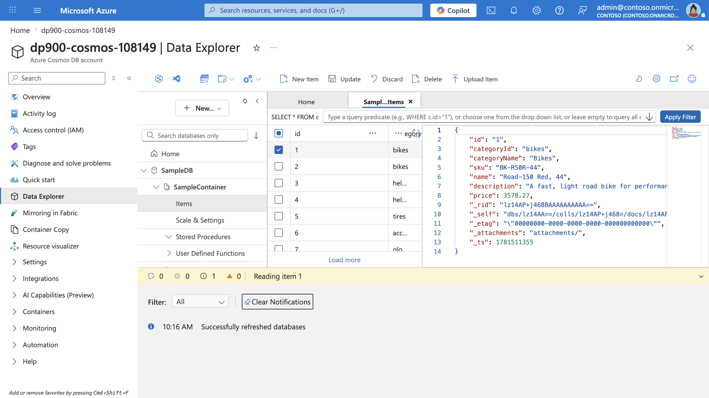

---
lab:
  title: Azure Cosmos DB を調べる
  module: Explore fundamentals of Azure Cosmos DB
  description: このラボでは、Azure Cosmos DB アカウントを作成し、サンプルのデータベースとコンテナーを追加し、Azure portal を使って JSON 項目を追加し、クエリを実行します。 このラボは、Azure または NoSQL を初めて使用する方を対象に書かれているため、すべてのステップがわかりやすい言葉で説明されています。
  duration: 30 minutes
  level: 100
  islab: true
  primarytopics:
    - Azure
    - Azure Cosmos DB
    - Azure Portal
---

# Azure Cosmos DB を調べる

このラボでは、**Azure Cosmos DB** を使って初めての **NoSQL** データベースを作成します。 "NoSQL" データベースは、リレーショナルデータベースの厳密な行と列のテーブルではなく、フレキシブルな方法でデータを保存します。 Cosmos DB では、各データを **JSON 項目**として格納します (`"price": 48.74` などの、プロパティとその値を一覧表示する単純なテキスト形式)。

Cosmos DB アカウントを作成 ("プロビジョニング") し、サンプル データをいくつか追加して JSON として表示し、簡単な SQL のようなクエリを実行して探しているものを見つけます。 これらの用語を初めて聞く方も心配しないでください。進行に応じて各手順が説明されています。

このラボは完了するまで、約 **30** 分かかります。

## 開始する前に

管理レベルのアクセス権を持つ [Azure サブスクリプション](https://azure.microsoft.com/free)が必要です。 お持ちでない場合は、上記のリンクを使って無料アカウントにサインアップしてください。

> **Azure とは。** Azure は Microsoft のクラウド プラットフォームです。独自のサーバー コンピューターを購入して実行する代わりに、Microsoft からコンピューティング リソース (データベースなど) をレンタルし、インターネット経由で使います。それらのリソースの作成と管理には、**Azure portal** という Web サイトを使います。__

## Cosmos DB アカウントを作成する

"プロビジョニング" とは、新しいリソースを作成および設定することを意味します。 Cosmos DB を使うには、まず Cosmos DB アカウントを作成します。 このラボでは、**Azure Cosmos DB for NoSQL** という JSON データの保存とクエリを目的に設計されたオプションを作成します。

1. Azure portal で、左上隅の **[+ リソースの作成]** を選択し、`Azure Cosmos DB` を検索します。  結果で **[Azure Cosmos DB]** を選択し、 **[作成]** を選択します。

    ![Azure Cosmos DB タイルとその [作成] ボタンがハイライトされた Azure Marketplace の検索結果のスクリーンショット。](images/03-cosmos-lab-marketplace.png)

1. **Azure Cosmos DB for NoSQL** のタイルで、 **[作成]** を選びます。

    ![Azure Cosmos DB for NoSQL タイルの [作成] ボタンが表示されている API 選択ページのスクリーンショット。](images/03-cosmos-lab-select-api.png)

    > _**ヒント**:アカウントは、Cosmos DB リソースの最上位レベルです。_ Azure Cosmos DB for NoSQL を選択すると、シンプルな SQL に似た照会言語を使用して JSON データの保存と照会を行うことができます。

1. 次の詳細を入力して、**[確認と作成]** を選択します。
   
    - **ワークロードの種類**: 学習
    - **サブスクリプション**: サンドボックスを使用している場合は、[コンシェルジェ サブスクリプション] を選択します。** それ以外の場合は、ご自分の Azure サブスクリプションを選択します。
    - **リソース グループ**: サンドボックスを使用している場合は、既存のリソース グループを選択します (この名前は、*learn-xxxx...* のようになります)。それ以外の場合は、任意の名前で新しいリソース グループを作成します。
    - **アカウント名**: 一意の名前を入力します。
    - **[可用性ゾーン]**: 無効にする
    - **場所**: 任意の推奨される場所を選びます
    - **容量モード**: プロビジョニングされたスループット
    - **Apply Free-Tier Discount (Free レベル割引を適用する)**: 使用できる場合は [適用] を選びます。
    - **合計アカウント スループットを制限する**: オフ
  
    > _**これらを選択する理由**_
    >
    > **[ワークロードの種類]** を [学習] に設定しているのは、セットアップが簡単になり、コストを抑えることができる初心者向けの既定値が設定されるからです。_**[アカウント名]** はサービスの URL の一部になるため、サービス全体で一意にする必要があります。テストをより速く実行できるよう、お客様の所在地に近い**場所**を選択しています。表示される場所は、お客様のサブスクリプションと、特定の可用性ゾーンが有効になっているかどうかによって変わります。**[容量モード]** に [プロビジョニング スループット] を選択するのは、この短期間のラボでパフォーマンスを予測可能な状態に保つためです。ただし、必要になる頻度が低い場合は [サーバーレス] でも問題ありません。**Free レベル**を使用できる場合は使用します。そうすることで、料金が発生することなく実験できます。_ 最後に、**[合計アカウント スループットを制限する]** 設定はオフのままにします。そうすることで、作業中に予期せず速度が低下することがなくなります。

    ![[Azure Cosmos DB アカウント作成] の [基本] タブのスクリーンショット。ワークロード タイプ、サブスクリプション、リソース グループ、アカウント名、場所が入力されています。](images/03-cosmos-lab-basics.png)

1. 構成を確認したら、**[作成]** を選びます。

    ![[検証が完了しました] と [作成] ボタンを含むアカウント設定の概要が表示されている [確認と作成] タブのスクリーンショット。](images/03-cosmos-lab-review-create.png)

    > **ヒント**: Azure portal によって、この Azure Cosmos DB のインスタンスのプロビジョニングにかかる時間が見積もられます。推定作成時間は、選択した場所に基づいて計算されます。__

1. デプロイが完了するまで待ちます。 次に、デプロイされたリソースに移動します。

## サンプル データベースの作成

"この手順全体を通して、ポータルに表示されるヒントをすべて閉じます"。**

1. 新しい Cosmos DB アカウントのページの左側のペインで **[Data Explorer]** を選びます。

    ![左側のナビゲーション ウィンドウで、データ エクスプローラーが選択されている [Azure Cosmos DB アカウント] ページのスクリーンショット。](images/03-cosmos-lab-overview.png)

1. **[Data Explorer]** ページで、**[クイック スタートの起動]** を選びます。

    ![[クイック スタートの起動] タイルが強調表示された Data Explorer のウェルカム ページのスクリーンショット。](images/03-cosmos-lab-data-explorer.png)

    > _**ヒント**:_ クイック スタートでは、実際に機能するデータベース、コンテナー、サンプル データが作成されます。そのため、最初にスキーマを設計しなくても、項目の追加やクエリの実行を演習できます。

1. **[新しいコンテナー]** ペインで、事前入力済みのサンプル データベース (**SampleDB** という名前のデータベース、**SampleContainer** という名前のコンテナー、**/categoryId** のパーティション キー) を確認し、**[OK]** を選択します。 短いガイド付きチュートリアルがウィンドウの横に表示される場合があります。**[次へ]** で順番に確認するか、**[OK]** を選択して続行します。

    ![事前入力済みの SampleDB データベース、SampleContainer コンテナー、パーティション キーの設定が表示されている [新しいコンテナー] ペインのスクリーンショット。](images/03-cosmos-lab-quick-start.png)

    > **パーティション キーとは。** コンテナーを作成する際に、Azure Cosmos DB で、関連する項目をグループ化するために使用されるデータ内のプロパティ (`categoryId` など) である**パーティション キー**が要求されます。Cosmos DB で、データベースの成長に合わせて高速な処理を維持できるように、バックグラウンドでこれらのグループがコンピューティングとストレージに分散されます。クイック スタートで適切なパーティション キーが選択されるため、ここでこれを選択する必要はありませんが、実際のプロジェクトでは適切なパーティション キーを選択します。クエリでフィルター処理されるさまざまな値を持つパーティション キーは、設計上の最も重要な決定事項の 1 つです。__

1. **SampleDB** データベースとその **SampleContainer** コンテナーが作成されるまで、画面の下部にあるパネルで状態を観察します (1 分ほどかかる場合があります)。

## 項目の表示と作成

1. [Data Explorer] ページで **SampleDB** データベースと **SampleContainer** コンテナーを展開し、**[項目]** を選んでコンテナー内の項目の一覧を表示します。 項目は製品データを表し、それぞれに一意の ID と他のプロパティがあります。 いずれかの項目を選ぶと、右側のペインにそのデータの JSON 表現が表示されます。

    

1. ページの上部にある **[新しい項目]** を選び、新しい空白の項目を作成します。

1. 新しい項目の JSON を以下のように変更し、**[保存]** を選びます。

    ```json
   {
       "name": "Road Helmet,45",
       "id": "123456789",
       "categoryId": "123456789",
       "SKU": "AB-1234-56",
       "description": "The product called \"Road Helmet,45\" ",
       "price": 48.74
   }
    ```

    ![データ エクスプローラーの [新しい項目] エディターのスクリーンショット。商品 JSON が入力され、ツール バーの [保存] ボタンが表示されています。](images/03-cosmos-lab-new-item.png)

1. 新しい項目を保存すると、追加のメタデータ プロパティが自動的に追加されることに注意してください。

    > _**ヒント**:Cosmos DB では、項目が JSON (JavaScript Object Notation) 形式で格納されるため、厳格なスキーマを指定せずにシナリオに適したフィールドを追加できます。`id` はコンテナー内で一意にする必要があります。_ 保存すると、Cosmos DB により、データの管理と最適化に役立つシステム プロパティ (タイムスタンプや内部識別子など) が追加されます。
    > - _rid - Cosmos DB が内部で項目を特定するために使用する内部リソース ID。**
    > - _self - 項目の完全なリソース リンク。**
    > - _etag - オプティミスティック同時実行制御チェックに使用されるエンティティ タグ。**
    > - _ts - 項目が最後に変更されたときの Unix タイムスタンプ (秒単位)。**
    > - _attachments - ドキュメントの添付ファイルへのリンク (存在する場合)。**

## データベースのクエリを実行する

1. **[Data Explorer]** ページで、**[新しい SQL クエリ]** アイコンを選びます。

    ![新しいクエリのタブが開いているデータ エクスプローラーのスクリーンショット。既定の SELECT * FROM c というクエリと [クエリの実行] ボタンが表示されています。](images/03-cosmos-lab-new-sqlquery.png)

1. SQL クエリ エディターで既定のクエリ (`SELECT * FROM c`) を確認し、`SELECT * FROM c` ボタンを使って実行します。

1. すべての項目の完全な JSON 表現を含む結果を確認します。

1. 次のように、クエリを変更します。

    ```sql
   SELECT *
   FROM c
   WHERE CONTAINS(c.name,"Helmet")
    ```

    > _**ヒント**:_ NoSQL API は、SQL に似たなじみのあるクエリを使用して JSON ドキュメントを検索します。すべての項目を一覧表示するには `SELECT * FROM c` を、プロパティ内のテキストでフィルター処理するには `CONTAINS` を使用します。これは、追加のセットアップなしですばやく検索する場合に便利です。

1. **[クエリの実行]** ボタンを使って、修正したクエリを実行し、結果を確認します。これには、**name** フィールドに "Helmet" というテキストが含まれる項目の JSON エンティティが含まれます。

    ![CONTAINS クエリを実行しているクエリ エディターのスクリーンショット。[結果] ウィンドウに一致するヘルメット項目が表示されています。](images/03-cosmos-lab-query.png)

1. SQL クエリ エディターを閉じ、変更内容を破棄します。

    ここでは、Azure portal の Data Explorer インターフェイスを使って、Cosmos DB データベースで JSON エンティティを作成し、クエリを実行する方法について確認しました。 実際のシナリオでは、アプリケーション開発者は、数多くあるプログラミング言語固有のソフトウェア開発キット (SDK) のいずれかを使って NoSQL API を呼び出し、データベース内のデータを操作します。

## クリーンアップ

Azure Cosmos DB を調べ終わったら、追加のコストが発生しないように作成したリソースを削除する必要があります。

1. Azure portal で、クラスターの Cosmos DB アカウントが含まれる**リソース グループ**に移動します。

1. **[リソース グループの削除]** を選択し、リソース グループ名を入力して削除することを確認し、**[削除]** を選択します。

    > **ヒント:** リソース グループを削除すると、Cosmos DB アカウントとその内容がすべて一度に削除されます。これが、実行が継続してコストが発生するものをすべて削除できる最も速い方法です。__

このラボでは、Azure Cosmos DB アカウントを作成し、JSON 項目を追加し、SQL に似た言語を使用してクエリを実行しました。 これで、クラウドの NoSQL データを使用する第一歩を踏み出すことができました。
