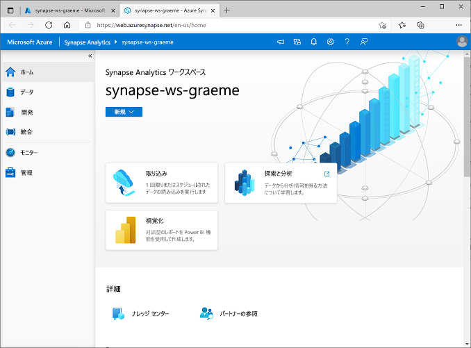
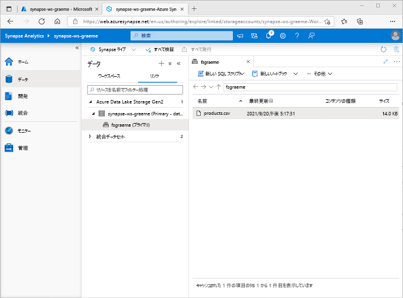
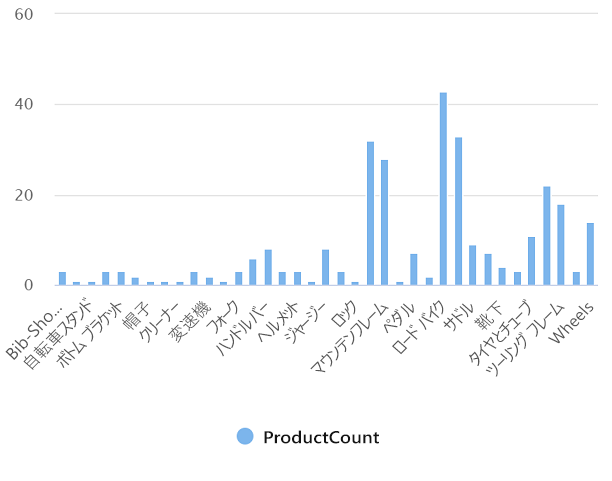
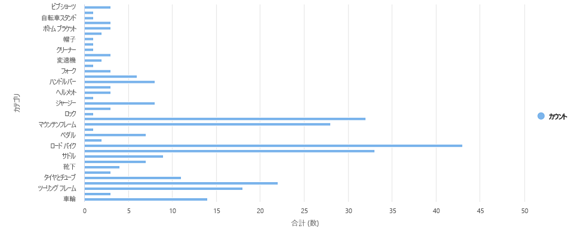

---
lab:
  title: Azure Synapse Analytics を使用して Azure のデータ分析を調べる
  module: Explore fundamentals of large-scale data warehousing
---

# Azure Synapse Analytics を使用して Azure のデータ分析を調べる

この演習では、自分の Azure サブスクリプションで Azure Synapse Analytics ワークスペースをプロビジョニングし、それを使用してデータの取り込みとクエリを実行します。

このラボは完了するまで、約 **30** 分かかります。

## 開始する前に

管理レベルのアクセス権を持つ [Azure サブスクリプション](https://azure.microsoft.com/free)が必要です。

## Azure Synapse Analytics ワークスペースをプロビジョニングする

Azure Synapse Analytics を使用するには、Azure サブスクリプションで Azure Synapse Analytics ワークスペース リソースをプロビジョニングする必要があります。

1. Azure portal ([https://portal.azure.com](https://portal.azure.com?azure-portal=true)) を開き、ご利用の Azure サブスクリプションに関連付けられている資格情報を使用してサインインします。

    > **ヒント**: ご自分のサブスクリプションが含まれているディレクトリで作業していることを確認してください。右上のユーザー ID の下に表示されています。 表示されない場合は、ユーザー アイコンを選択してディレクトリを切り替えてください。

2. Azure portal の **[ホーム]** ページで、**[&#65291; リソースの作成]** アイコンを使用して、新しいリソースを作成します。
3. *Azure Synapse Analytics* を検索し、次の設定を使用して、新しい **Azure Synapse Analytics** リソースを作成します。
    - **[サブスクリプション]**:"*ご自身の Azure サブスクリプション*"
        - **リソース グループ**: *適切な名前 (例: "synapse-rg") の新しいリソース グループを作成します*。
        - **管理対象リソース グループ**: *適切な名前 (例: "synapse") を入力します*。
    - **ワークスペース名**: "*一意のワークスペース名 (例: "synapse-ws-<your_name>") を入力します*"。
    - **リージョン**: *次のいずれかのリージョンを選択します*:
        - オーストラリア東部
        - 米国中部
        - 米国東部 2
        - 北ヨーロッパ
        - 米国中南部
        - 東南アジア
        - 英国南部
        - 西ヨーロッパ
        - 米国西部
        - WestUS 2
    - **Data Lake Storage Gen 2**: サブスクリプションから
        - **アカウント名**: *一意の名前 (例: "datalake<your_name>") の新しいアカウントを作成します*。
        - **アカウント名**: *一意の名前 (例: "fs<your_name>") の新しいファイル システムを作成します*。

    > **注**: Synapse Analytics ワークスペースには、Azure サブスクリプションに 2 つのリソース グループが必要です。1 つは明示的に作成したリソース用で、もう 1 つはサービスによって使用される管理対象リソース用です。 また、データ、スクリプト、その他のアーティファクトを格納するための Data Lake ストレージ アカウントも必要です。

4. これらの詳細を入力したら、**[確認と作成]** を選択し、**[作成]** を選択して、ワークスペースを作成します。
5. ワークスペースが作成されるまで待ちます。これには 5 分程度かかる場合があります。
6. デプロイが完了したら、作成されたリソース グループにアクセスして、Synapse Analytics ワークスペースと Data Lake ストレージ アカウントが含まれていることを確認します。
7. Synapse ワークスペースを選択し、**[概要]** ページの **[Synapse Studio を開く]** カードで、**[開く]** を選択し、新しいブラウザー タブで Synapse Studio を開きます。Synapse Studio は、Synapse Analytics ワークスペースの操作に使用できる Web ベースのインターフェイスです。
8. Synapse Studio の左側で、**&rsaquo;&rsaquo;** アイコンを使用してメニューを展開します。次に示すように、リソースの管理とデータ分析タスクの実行に使用するさまざまなページが Synapse Studio 内に表示されます。

    

## データの取り込み

Azure Synapse Analytics を使用して実行できる主なタスクの 1 つは、さまざまなソースから分析用にデータをワークスペースに転送 (必要に応じて変換) する*パイプライン*を定義することです。

1. Synapse Studio の **[ホーム]** ページで、 **[取り込み]** を選択して、 **[データ コピー ツール]** を開きます。
2. データ コピー ツールの **[プロパティ]** ステップで、**[組み込みコピー タスク]** と **[1 回実行する]** が選択されていることを確認し、**[次へ >]** をクリックします。
3. **[ソース]** ステップの **[データセット]** サブステップで、次の設定を選択します。
    - **[ソースの種類]**: すべて
    - **[接続]** : "新しい接続を作成し、表示される **[新しい接続]** ペインの **[汎用プロトコル]** タブで **[HTTP]** を選びます。続けて、次の設定を使ってデータ ファイルへの接続を作成します。"**
        - **名前**: AdventureWorks 製品
        - **説明**: HTTP 経由の製品一覧
        - **統合ランタイム経由で接続する**: AutoResolveIntegrationRuntime
        - **ベース URL**: `https://raw.githubusercontent.com/MicrosoftLearning/DP-900T00A-Azure-Data-Fundamentals/master/Azure-Synapse/products.csv`
        - **サーバー証明書の検証**: 有効にする
        - **認証の種類**: 匿名
4. 接続を作成したら、**[ソース/データセット]** サブステップで、次の設定が選択されていることを確認し、**[次へ >]** を選択します。
    - **相対 URL**: *空白のまま*
    - **要求メソッド**:GET
    - **追加ヘッダー** :*空白のまま*
    - **バイナリ コピー**: 選択<u>解除</u>
    - **要求タイムアウト**: *空白のまま*
    - **最大同時接続数**: *空白のまま*
5. **[ソース]** ステップの **[構成]** サブステップで、**[データのプレビュー]** を選択して、パイプラインに取り込む製品データのプレビューを表示し、プレビューを閉じます。
6. 接続をプレビューしたら、**[ソース/データセット]** ステップで、次の設定が選択されていることを確認し、**[次へ >]** を選択します。
    - **ファイル形式**: DelimitedText
    - **列区切り記号**: コンマ (,)
    - **行区切り記号**: 改行 (\n)
    - **最初の行をヘッダーとして使用**: 選択
    - **圧縮の種類**: なし
7. **[ターゲット]** ステップの **[データセット]** サブステップで、次の設定を選択します。
    - **[ターゲットの種類]** : Azure Data Lake Storage Gen 2
    - **[接続]**: データ レイク ストアへの既存の接続を選びます (これは、ワークスペースを作成したときに自動的に作成されました)。**
8. 接続を選択したら、 **[ターゲット/データセット]** ステップで、次の設定が選択されていることを確認し、 **[次へ]** を選択します。
    - **フォルダーのパス** :*ファイル システム フォルダーを参照します。*
    - **ファイル名**: products.csv
    - **コピー動作**: なし
    - **最大同時接続数**: *空白のまま*
    - **ブロック サイズ (MB)**: *空白のまま*
9. **[ターゲット]** ステップの **[構成]** サブステップで、次のプロパティが選択されていることを確認します。 次に、**[次へ]** を選択します。
    - **ファイル形式**: DelimitedText
    - **列区切り記号**: コンマ (,)
    - **行区切り記号**: 改行 (\n)
    - **ヘッダーをファイルに追加**: 選択
    - **圧縮の種類**: なし
    - **ファイルごとの最大行数**: *空白のまま*
    - **ファイル名のプレフィックス**: *空白のまま*
10. **[設定]** ステップで、次の設定を入力し、**[次へ >]** をクリックします。
    - **タスク名**: 製品のコピー
    - **タスクの説明**: 製品データのコピー
    - **フォールト トレランス**: *空白のまま*
    - **ログを有効にする**: 選択<u>解除</u>
    - **ステージングを有効にする**: 選択<u>解除</u>
11. **[確認と完了]** ステップの **[確認]** サブステップで、概要を読み、**[次へ >]** をクリックします。
12. **[デプロイ]** サブステップで、パイプラインがデプロイされるまで待ち、 **[完了]** をクリックします。
13. Synapse Studio で、 **[監視]** ページを選択し、 **[パイプラインの実行]** タブで、 **[製品のコピー]** パイプラインが完了して **[成功]** の状態になるまで待ちます ([パイプラインの実行] ページの **[&#8635; 最新の情報に更新]** ボタンを使用して状態を更新できます)。
14. **[データ]** ページで、**[リンク]** タブを選択し、Synapse ワークスペースのファイル ストレージが表示されるまで **[Azure Data Lake Storage Gen 2]** 階層を展開します。 次に示すように、ファイル ストレージを選択して、**products.csv** という名前のファイルがこの場所にコピーされていることを確認します。

    

## SQL プールを使用してデータを分析する

ワークスペースにデータを取り込んだので、Synapse Analytics を使用してクエリと分析を行うことができます。 データのクエリを実行する最も一般的な方法の 1 つは SQL を使用することです。Synapse Analytics では、*SQL プール*を使用して SQL コードを実行できます。

1. Synapse Studio で、Synapse ワークスペースのファイル ストレージ の **products.csv** ファイルを右クリックし、**[新しい SQL スクリプト]** をポイントして、**[上位 100 行を選択する]** を選択します。
2. **[SQL スクリプト 1]** ペインが開いたら、生成された SQL コードを確認します。これは次のようになります。

    ```SQL
    -- This is auto-generated code
    SELECT
        TOP 100 *
    FROM
        OPENROWSET(
            BULK 'https://datalakexx.dfs.core.windows.net/fsxx/products.csv',
            FORMAT = 'CSV',
            PARSER_VERSION='2.0'
        ) AS [result]
    ```

    このコードでは、インポートしたテキストファイルから行セットを開き、最初の 100 行のデータを取得します。

3. **[接続先]** ボックスの一覧で、**[組み込み]** が選択されていることを確認します。これは、ワークスペースで作成された組み込みの SQL プールを表します。
4. ツールバーの **[&#9655; 実行]** ボタンを使用して SQL コードを実行し、結果を確認します。これは次のようになります。

    | C1 | c2 | c3 | c4 |
    | -- | -- | -- | -- |
    | ProductID | ProductName | カテゴリ | ListPrice |
    | 771 | Mountain-100 Silver, 38 | マウンテン バイク | 3399.9900 |
    | 772 | Mountain-100 Silver, 42 | マウンテン バイク | 3399.9900 |
    | ... | ... | ... | ... |

5. 結果は、C1、C2、C3、C4 の名前の 4 つの列で構成されています。結果の最初の行には、データ フィールドの名前が含まれています。 この問題を解決するには、次に示すように OPENROWSET 関数に HEADER_ROW = TRUE パラメーターを追加し (*datalakexx* と *fsxx* をデータ レイク ストレージ アカウントとファイル システムの名前に置き換える)、クエリを再実行します。

    ```SQL
    SELECT
        TOP 100 *
    FROM
        OPENROWSET(
            BULK 'https://datalakexx.dfs.core.windows.net/fsxx/products.csv',
            FORMAT = 'CSV',
            PARSER_VERSION='2.0',
            HEADER_ROW = TRUE
        ) AS [result]
    ```

    結果は次のようになります。

    | ProductID | ProductName | カテゴリ | ListPrice |
    | -- | -- | -- | -- |
    | 771 | Mountain-100 Silver, 38 | マウンテン バイク | 3399.9900 |
    | 772 | Mountain-100 Silver, 42 | マウンテン バイク | 3399.9900 |
    | ... | ... | ... | ... |

6. 次のようにクエリを変更します (*datalakexx* と *fsxx* をデータ レイク ストレージ アカウントとファイル システムの名前に置き換えます)。

    ```SQL
    SELECT
        Category, COUNT(*) AS ProductCount
    FROM
        OPENROWSET(
            BULK 'https://datalakexx.dfs.core.windows.net/fsxx/products.csv',
            FORMAT = 'CSV',
            PARSER_VERSION='2.0',
            HEADER_ROW = TRUE
        ) AS [result]
    GROUP BY Category;
    ```

7. 次のように、変更されたクエリを実行します。これにより、各カテゴリの製品数を含む結果セットが返されます。

    | カテゴリ | ProductCount |
    | -- | -- |
    | Bib-Shorts | 3 |
    | バイク ラック | 1 |
    | ... | ... |

8. **[SQL スクリプト 1]** の **[プロパティ]** ペインで、**[名前]** を "**カテゴリ別の製品数**" に変更します。 次に、ツールバーの **[公開]** を選択して、スクリプトを保存します。

9. **[カテゴリ別の製品数]** スクリプト ペインを閉じます。

10. Synapse Studio で、**[開発]** ページを選択し、公開した **[カテゴリ別の製品数]** SQL スクリプトが保存されていることを確認します。

11. **[カテゴリ別の製品数]** SQL スクリプトを選択し、もう一度開きます。 次に、スクリプトが **[組み込み]** SQL プールに接続されていることを確認し、それを実行して製品数を取得します。

12. **[結果]** ペインで、**[グラフ]** ビューを選択し、グラフの次の設定を選択します。
    - **グラフの種類**: 列
    - **カテゴリ列**: カテゴリ
    - **凡例 (系列) 列**: productcount
    - **凡例の位置**: 下中央
    - **凡例 (系列) ラベル**: *空白のまま*
    - **凡例 (系列) の最小値**: *空白のまま*
    - **凡例 (系列) の最大値**: *空白のまま*
    - **カテゴリ ラベル**: *空白のまま*

    結果のグラフは次のようになります。

    

## Spark プールを使用してデータを分析する

SQL は構造化データセットでクエリを実行するための共通言語ですが、多くのデータ アナリストは、Python など、分析用のデータの探索と準備に役立つ言語を見つけています。 Azure Synapse Analytics では、*Spark プール*で Python (およびその他の) コードを実行できます。これは Apache Spark に基づく分散データ処理エンジンを使用します。

1. Synapse Studio で、**[管理]** ページを選択します。
2. **[Apache Spark プール]** タブを選択し、**[&#65291; 新規]** アイコンを使用して、次の設定で新しい Spark プールを作成します。
    - **Apache Spark プール名**: Spark
    - **ノード サイズ ファミリ**: メモリ最適化
    - **ノード サイズ**: 小 (4 仮想コア/32 GB)
    - **自動スケール**: 有効
    - **ノードの数**: 3----3
3. Spark プールを確認して作成し、デプロイされるのを待ちます (数分かかる場合があります)。
4. Spark プールがデプロイされたら、Synapse Studio の **[データ]** ページで、Synapse ワークスペースのファイル システムを参照します。 次に、**products.csv** を右クリックし、**[新しいノートブック]** をポイントして、**[データ フレームに読み込む]** を選択します。
5. **[ノートブック 1]** ペインが表示されたら、**[アタッチ先]** ボックスの一覧で、以前に作成した **spark** Spark プールを選択し、**[言語]** が **[PySpark (Python)]** に設定されていることを確認します。
6. ノートブックの最初の (および唯一の) セルのコードを確認します。次のようになります。

    ```Python
    %%pyspark
    df = spark.read.load('abfss://fsxx@datalakexx.dfs.core.windows.net/products.csv', format='csv'
    ## If header exists uncomment line below
    ##, header=True
    )
    display(df.limit(10))
    ```

7.  コード セルの左側にある **[&#9655; 実行]** アイコンを使用して実行し、結果が表示されるまで待ちます。 ノートブックで初めてセルを実行すると、Spark プールが開始されます。結果が返されるまでに 1 分ほどかかることがあります。

    > **注**: Python カーネルがまだ使用できないことが理由でエラーが発生した場合は、もう一度セルを実行します。

8. 最終的には、セルの下に結果が表示され、次のようになります。

    | _c0_ | _c1_ | _c2_ | _c3_ |
    | -- | -- | -- | -- |
    | ProductID | ProductName | カテゴリ | ListPrice |
    | 771 | Mountain-100 Silver, 38 | マウンテン バイク | 3399.9900 |
    | 772 | Mountain-100 Silver, 42 | マウンテン バイク | 3399.9900 |
    | ... | ... | ... | ... |

9. *,header=True* 行のコメントを解除します (products.csv のファイルには最初の行に列ヘッダーがあるため)。コードは次のようになります。

    ```Python
    %%pyspark
    df = spark.read.load('abfss://fsxx@datalakexx.dfs.core.windows.net/products.csv', format='csv'
    ## If header exists uncomment line below
    , header=True
    )
    display(df.limit(10))
    ```

10. セルを再実行し、結果が次のようになっていることを確認します。

    | ProductID | ProductName | カテゴリ | ListPrice |
    | -- | -- | -- | -- |
    | 771 | Mountain-100 Silver, 38 | マウンテン バイク | 3399.9900 |
    | 772 | Mountain-100 Silver, 42 | マウンテン バイク | 3399.9900 |
    | ... | ... | ... | ... |

    Spark プールは既に開始されているので、セルの再実行にかかる時間は短くなります。

11. 結果の下にある **[&#65291; コード]** アイコンを使用して、ノートブックに新しいコード セルを追加します。
12. 新しい空のコード セルに、次のコードを追加します。

    ```Python
    df_counts = df.groupBy(df.Category).count()
    display(df_counts)
    ```

13. 左側の **[&#9655; 実行]** アイコンを選択して新しいコード セルを実行し、結果を確認します。次のようになります。

    | カテゴリ | count |
    | -- | -- |
    | ヘッドセット | 3 |
    | ホイール | 14 |
    | ... | ... |

14. セルの結果出力で、**[グラフ]** ビューを選択します。 結果のグラフは次のようになります。

    

15. **[ノートブック 1]** ペインを閉じて、変更を破棄します。

## Azure リソースを削除する

Azure Synapse Analytics を調べ終わったら、不要な Azure コストを避けるために、作成したリソースを削除する必要があります。

1. Synapse Studio ブラウザー タブを閉じ、Azure portal に戻ります。
2. Azure portal の **[ホーム]** ページで、**[リソース グループ]** を選択します。
3. (管理対象リソース グループではなく) Synapse Analytics ワークスペースのリソース グループを選択し、Synapse ワークスペース、ストレージ アカウント、ワークスペースの Spark プールが含まれていることを確認します。
4. リソース グループの **[概要]** ページの上部で、**[リソース グループの削除]** を選択します。
5. リソース グループ名を入力して、削除することを確認し、**[削除]** を選択します。

    数分後に、Azure Synapse ワークスペースとそれに関連付けられているマネージド ワークスペースが削除されます。
