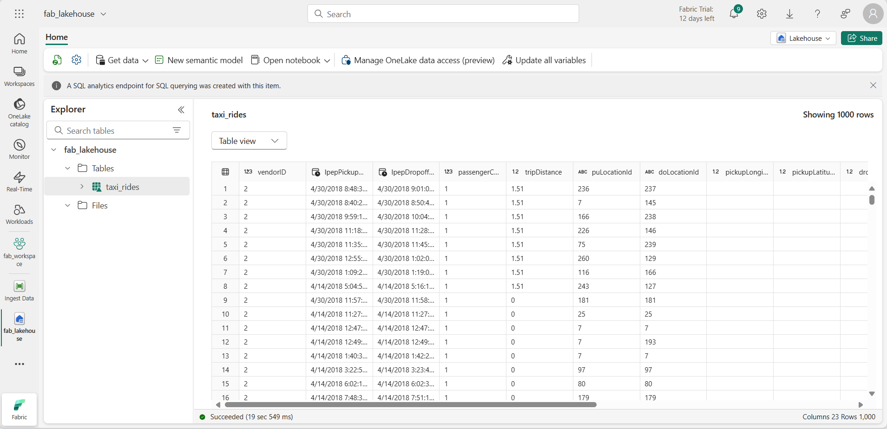
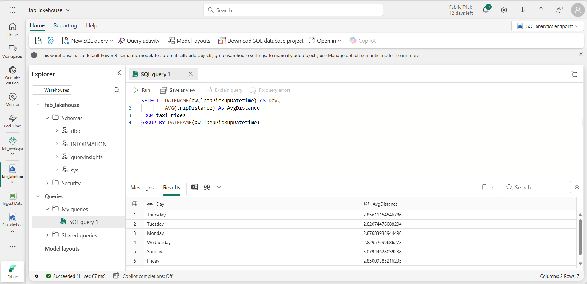

---
lab:
  title: Microsoft Fabric のデータ分析を探索する
  module: Explore fundamentals of large-scale data analytics
  description: このラボでは、Microsoft Fabric レイクハウスを作成し、パイプラインを使用して実際の NYC タクシーのデータを取り込み、SQL を使用してクエリを実行します。 このラボは初めて使用する方を対象に書かれているので、すべてのステップがわかりやすい言葉で説明されています。
  duration: 30 minutes
  level: 100
  islab: true
  primarytopics:
    - Microsoft Fabric
---

# Microsoft Fabric のデータ分析を探索する

このラボでは、データの保存からレポート作成まですべてを一か所で処理するオールインワン分析プラットフォームである **Microsoft Fabric** を活用してデータを取り込み分析する方法を探ります。

**レイクハウス**という単一の場所で、生データファイル "および" SQL でクエリを実行できる整理されたテーブルの両方を保存できます。** その後、**コピー ジョブ** (1 つの場所から別の場所にデータをコピーするための自動化されたガイド付きの方法) を使用して、実際のニューヨーク市のタクシー乗車のセットを取り込み、SQL クエリを実行してデータに関する質問に答えると完了します。

このラボでは、次のことを行います。

- **Microsoft Fabric レイクハウスの概念を理解する**: Fabric でのデータ資産の整理と管理の中心となる、ワークスペースとレイクハウスを作成する方法を学びます。
- **コピー ジョブを使用してデータを取り込む**: ガイド付きコピー ジョブを使用して、外部データをレイクハウスに読み込み、コードを記述せずにクエリを実行できるようにします。
- **SQL を使用してデータを探索してクエリを実行する**: 読み込まれたデータを使い慣れた SQL クエリを使用して分析し、Fabric 内で直接分析情報を取得します。
- **リソースを管理する**: 不要な料金の発生を回避するために、リソースをクリーンアップする適切な習慣を学びます。

これらの用語を初めて聞く方も心配しないでください。進行に応じて各手順が説明されています。

## NYC タクシー データセットの背景

"NYC Taxi - Green" データセットには、乗車および降車時刻、場所、乗車距離、運賃、乗客数など、ニューヨーク市のタクシー乗車の詳細な記録が含まれています。 これは、ユーザーが都市内を移動する方法を調べ、需要を予測し、通常とは異なるパターンを見つけるためにデータ分析で広く使用されています。 このラボでは、この実際のデータセットを使用して、Microsoft Fabric での取り込みと分析を実践します。

このラボは完了するまで、約 **30** 分かかります。

> **注**: この演習を完了するには、Microsoft Fabric ライセンスが必要です。 無料の Fabric 試用版ライセンスを有効にする方法の詳細については、[Fabric の概要](https://learn.microsoft.com/fabric/get-started/fabric-trial)に関するページを参照してください。 これを行うには、Microsoft の "学校" または "職場" アカウントが必要です。** ** お持ちでない場合は、[Microsoft Office 365 E3 以降の試用版にサインアップ](https://www.microsoft.com/microsoft-365/business/compare-more-office-365-for-business-plans)できます。

*Microsoft Fabric の機能を初めて使用する場合は、ヒントを含むプロンプトが表示されることがあります。これらを閉じます。*

## ワークスペースの作成

Fabric でデータを操作する前に、Fabric 試用版を有効にしてワークスペースを作成してください。

> **ワークスペースとは。** Fabric で作成したものすべて (レイクハウス、パイプライン、レポートなど) をまとめたプロジェクト フォルダーのようなものだと考えてください。Fabric の容量を有効にすると、ワークスペースでそれらのアイテムを実行するために必要な計算能力が得られます。__

1. ブラウザーの `https://app.fabric.microsoft.com/home?experience=fabric` で [Microsoft Fabric ホーム ページ](https://app.fabric.microsoft.com/home?experience=fabric)に移動し、Fabric 資格情報でサインインします。

1. 左側のメニュー バーの下部に、環境スイッチャーがあります。 **Power BI** が表示されたら、選択して **[Fabric]** を選び、このラボで使用されている Data Engineering 機能をすべて利用できるようにします。

    

1. 左側のメニュー バーで、 **[ワークスペース]** を選択します (アイコンは &#128455; に似ています)。

    ![[新しいワークスペース] ボタンが表示されたワークスペースのポップアップのスクリーンショット。](./images/04b-fabric-lake-lab-workspaces.png)

1. **[+ 新しいワークスペース]** を選択して、ワークスペースに (`dp900-fabric-lakehouse` のような) 名前を付け、**[詳細]** セクションで、Fabric 容量を含むライセンス モード ([試用版]、[Premium]、または [Fabric]) を選択します。****** 次に、**[適用]** を選びます。

    > _**ヒント** Fabric を含む容量を選択すると、Data Engineering タスクに必要なエンジンがワークスペースに与えられます。専用のワークスペースを使用すると、ラボ リソースが分離されたままになるため、簡単にクリーンアップできます。_

    ![名前とライセンス モードが表示された [ワークスペースの作成] ペインのスクリーンショット。](./images/04b-fabric-lake-lab-create-workspace.png)

1. 開いた新しいワークスペースは空のはずです。

    

## レイクハウスを作成する

ワークスペースが作成されたので、次にデータ ファイル用のデータ レイクハウスを作成します。

> **レイクハウスとは。** 生データファイル "および" 整理されたテーブルの両方を収納する単一のストレージ領域です。テーブルは通常のデータベースと同様に SQL でクエリを実行でき、ファイル領域は任意の形式でデータを保持できます。この組み合わせが "レイク" (フレキシブルなファイル ストレージ) と "ハウス" (構造化テーブル) と呼ばれる理由です。_**_

1. ワークスペース ツールバーで、**[+ 新しい項目]** を選択します。 **[新しい項目]** ペインで `Lakehouse` を検索し、**[レイクハウス]** タイルを選択します。

    ![[レイクハウス] タイルを表示するようにフィルター処理されている [新しい項目] ペインのスクリーンショット。](./images/04b-fabric-lake-lab-create.png)

1. **[新しいレイクハウス]** ダイアログで、`taxi_lakehouse` のような名前を入力し、**[レイクハウス スキーマ]** を選択したままにして **[作成]** を選択します。

    ![名前とレイクハウス スキーマ オプションが表示されている [新しいレイクハウス] ダイアログのスクリーンショット。](./images/04b-fabric-lake-lab-name-lakehouse.png)

    1 分ほどすると、新しいレイクハウスが作成されます。

1. 新しいレイクハウスを表示します。左側の **[エクスプローラー]** ペインでレイクハウス内のテーブルやファイルを参照できます。
   
    - **Tables** フォルダーには、SQL セマンティクスを使ったクエリが可能なテーブルが入っており、スキーマ (デフォルトの **dbo** スキーマなど) に整理されています。 Microsoft Fabric レイクハウスのテーブルは、Apache Spark でよく使われるオープンソースの *Delta Lake* ファイル形式に基づいています。
    - **Files** フォルダーには、マネージド デルタ テーブルに関連付けられていないレイクハウスの OneLake ストレージ内のデータ ファイルが含まれています。 このフォルダーに ''ショートカット'' を作成して、外部に格納されているデータを参照することもできます。**

    現在、レイクハウスにはテーブルやファイルはありません。

    ![エクスプローラー ペインと [データ取得] オプションが表示されている新しいレイクハウスのスクリーンショット。](./images/04b-fabric-lake-lab-new-lakehouse.png)

    > _**ヒント**:生データまたはステージング データには Files を使用し、キュレーション済みでクエリ対応のデータセットにはテーブルを使用します。テーブルは Delta Lake によってサポートされるため、信頼性の高い更新と効率的なクエリがサポートされています。_

## データの取り込み

レイクハウスにデータを取り込む簡単な方法は**コピー ジョブ**を使うことです。 これはソース (この場合はサンプル データセット) からデータをレイクハウス内のテーブルにコピーします。

> **コピー ジョブとは。** コードを記述せずにソースからレイクハウスにデータを移動するためのガイド付きの反復可能な方法です。コピー ジョブは、1 回だけ実行したり、スケジュールに従って実行したりすることができるため、手動でデータをコピーするよりもはるかに簡単です。__

1. レイクハウスの **[ホーム]** ページの **[データの取得]** メニューで、**[新しいコピー ジョブ]** を選択します。

    ![新しいコピー ジョブが選択されている [データの取得] メニューのスクリーンショット。](./images/04b-fabric-lake-lab-new-copy-job.png)

1. **[新しいコピー ジョブ]** ダイアログでジョブに `Ingest Data` と名前を付け、**[作成]** を選択します。

    ![「Ingest Data」という名前が表示されている [新しいコピー ジョブ] ダイアログのスクリーンショット。](./images/04b-fabric-lake-lab-name-copy-job.png)

1. **[データ ソースの選択]** ページで、上部にある **[サンプル データ]** タブを選択します。

    ![コピー ジョブ ウィザードの [データ ソースの選択] ページのスクリーンショット。](./images/04b-fabric-lake-lab-choose-data-source.png)

1. **[NYC Taxi - Green]** サンプル データセットを選択します。

    ![NYC Taxi - Green データセットが表示されている [サンプル データ] タブのスクリーンショット。](./images/04b-fabric-lake-lab-sample-data.png)

1. **[データ選択]** ページで、タクシー乗車データのプレビューを確認し、次に **[次へ]** を選択します。

    

1. **[設定]** ページで、読み取り方法として **[完全なコピー]** が選択され、宛先のルート フォルダーとして **[Tables]** が選択されていることを確認して、その後 **[次へ]** を選択します。

    > **これらを選択する理由。****完全なコピー**ではすべてのデータが一度に読み込まれ、ルート フォルダーに **Tables** を選択すると、すぐにクエリ可能なマネージド Delta テーブルにデータが読み込まれます。__

    ![[完全なコピー] と Tables が選択されているコピー ジョブの [設定] ページのスクリーンショット。](./images/04b-fabric-lake-lab-settings.png)

1. **[データ変換先に接続]** ページで、宛先スキーマを `dbo` に、宛先テーブル名を `taxi_rides` に設定し、**[次へ]** を選択します。

    ![dbo スキーマと taxi_rides テーブルが表示されている [データ変換先に接続] ページのスクリーンショット。](./images/04b-fabric-lake-lab-map-destination.png)

1. **[レビューと保存]** ページで、**[すぐにデータ転送を開始する]** が選択され、**[1 回実行]** オプションが選択されていることを確認して、**[保存と実行]** を選択します。

    > **注**: すぐに開始すると、追加の手順なしでコピー ジョブの動作の監視と、データの到着の確認が可能になります。__

    ![コピー ジョブの [レビューと保存] ページのスクリーンショット。](./images/04b-fabric-lake-lab-review-save.png)

1. コピー ジョブが実行されます。 **[結果]** のペインで、**[状態]** に **[成功]** と表示され、**[完了したテーブル]** には **1/1** と表示されるまで待ちます。

    > **注**: サンプル データは Parquet ファイルとしてコピーされるため、"読み込まれた行" と "書き込まれた行" カウンターが **0** と表示されることがありますが、テーブルは正常に作成および入力されています。****

    ![[結果] ペインに状態が [成功] と表示されているコピー ジョブのスクリーンショット。](./images/04b-fabric-lake-lab-copy-job-succeeded.png)

1. 上部のメニュー バーで、レイクハウスを選択します (ワークスペースから見つけることもできます)。 **[エクスプローラー]** ペインで、**[Tables]** > **[dbo]** の順に展開し、**[taxi_rides]** テーブルを選択してその内容を表示します。

    > **ヒント**: テーブルがすぐに表示されない場合は、**[Tables]** ノードの **[...]** メニューから **[最新の情報に更新]** を選択します。__

    

## レイクハウス内のデータに対してクエリを実行する

レイクハウスのテーブルにデータを取り込んだので、SQL を使用してクエリを実行しましょう。

> _**ヒント**:レイクハウス テーブルは SQL に対応しています。データを別のシステムに移動することなく、すぐに分析できます。_

1. レイクハウス ページの右上で **[以下を使用してデータを分析する]** を選択し、**[SQL 分析エンドポイント]** を選択します。

    > _**ヒント**:SQL 分析エンドポイントは、レイクハウス テーブルで SQL クエリを実行するために最適化されており、使い慣れたクエリ ツールと統合されています。_

    ![[SQL 分析エンドポイント] が表示されている [以下を使用してデータを分析する] メニューのスクリーンショット。](./images/04b-fabric-lake-lab-sql-endpoint.png)

1. ツール バーで、 **[新しい SQL クエリ]** を選択します。 クエリ エディターに次の SQL コードを入力します。

    ```sql
    SELECT  DATENAME(dw,lpepPickupDatetime) AS Day,
            AVG(tripDistance) As AvgDistance
    FROM taxi_rides 
    GROUP BY DATENAME(dw,lpepPickupDatetime)
    ```

1. **[&#9655; 実行]** ボタンを選択してクエリを実行し、結果を確認します。これには、各曜日の平均乗車距離が含まれている必要があります。

    > _**ヒント**:このクエリでは、乗車を曜日名でグループ化し、平均距離を計算し、構築可能な集計の簡単な例を示します。_

    

## リソースをクリーンアップする

Microsoft Fabric の探索が終了したら、この演習用に作成したワークスペースを削除できます。

> _**ヒント**:ワークスペースを削除すると、ラボで作成されたすべての項目が削除され、請求が継続されないようにすることができます。_

1. 左側のバーで、ワークスペースのアイコンを選択して、それに含まれるすべての項目を表示します。

1. ツール バーの **[ワークスペース設定]** を選択します。

1. **[全般]** セクションで、**[このワークスペースの削除]** を選択します。
