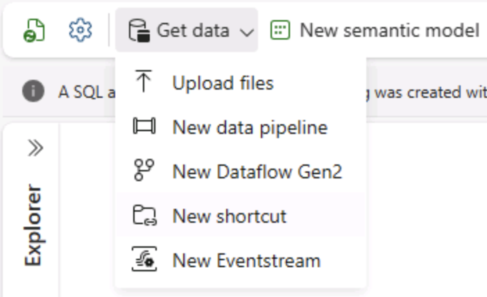
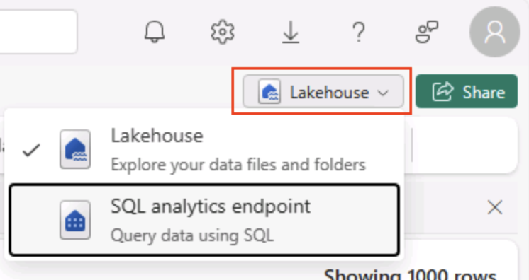

---
lab:
  title: Microsoft Fabric のデータ分析を探索する
  module: Explore fundamentals of large-scale data analytics
---

# Microsoft Fabric のデータ分析を探索する

この演習では、Microsoft Fabric Lakehouse のデータ インジェストと分析について探索します。

このラボでは、次のことを行います。

- **Microsoft Fabric Lakehouse の概念を理解する**。Fabric でのデータ資産の整理と管理の中心となる、ワークスペースとレイクハウスを作成する方法を学びます。
- **パイプラインを使用してデータを取り込む**。ガイド付きパイプラインを使用して外部データをレイクハウスに取り込み、手動コーディングなしでクエリを実行できるようにします。
- **SQL を使用してデータを探索してクエリを実行する**。使い慣れた SQL クエリを使用して取り込まれたデータを分析し、Fabric 内で直接分析情報を得ます。
- **リソースを管理する**:不要な料金を回避するためにリソースをクリーンアップするためのベスト プラクティスを学びます。

## NYC タクシー データセットの背景

"NYC Taxi - Green" データセットには、乗車および降車時刻、場所、乗車距離、運賃、乗客数など、ニューヨーク市のタクシー乗車の詳細な記録が含まれています。 都市のモビリティ、需要予測、異常検出を探索するために、Data Analytics と機械学習で広く使用されています。 このラボでは、この実際のデータセットを使用して、Microsoft Fabric でのデータ インジェストと分析を実践します。

このラボは完了するまで、約 **25** 分かかります。

> **注**: この演習を完了するには、Microsoft Fabric ライセンスが必要です。 無料の Fabric 試用版ライセンスを有効にする方法の詳細については、[Fabric の概要](https://learn.microsoft.com/fabric/get-started/fabric-trial)に関するページを参照してください。 これを行うには、Microsoft の "学校" または "職場" アカウントが必要です。** ** お持ちでない場合は、[Microsoft Office 365 E3 以降の試用版にサインアップ](https://www.microsoft.com/microsoft-365/business/compare-more-office-365-for-business-plans)できます。

*Microsoft Fabric の機能を初めて使用する場合は、ヒントを含むプロンプトが表示されることがあります。これらを閉じます。*

## ワークスペースの作成

Fabric でデータを操作する前に、Fabric 試用版を有効にしてワークスペースを作成してください。

> _**ヒント**:ワークスペースは、すべての資産 (レイクハウス、パイプライン、ノートブック、レポート) のコンテナーです。Fabric 容量を有効にすると、これらの項目が実行されます。_

1. ブラウザーの `https://app.fabric.microsoft.com/home?experience=fabric` で [Microsoft Fabric ホーム ページ](https://app.fabric.microsoft.com/home?experience=fabric)に移動し、Fabric 資格情報でサインインします。

1. 左側のメニュー バーで、 **[ワークスペース]** を選択します (アイコンは &#128455; に似ています)。

    

1. 新しいワークスペースを任意の名前で作成し、 **[詳細]** セクションで、Fabric 容量を含むライセンス モード ("*試用版*"、*Premium*、または *Fabric*) を選択します。

    > _**ヒント** Fabric を含む容量を選択すると、Data Engineering タスクに必要なエンジンがワークスペースに与えられます。専用のワークスペースを使用すると、ラボ リソースが分離されたままになるため、簡単にクリーンアップできます。_

1. 開いた新しいワークスペースは空のはずです。

    

## レイクハウスを作成する

ワークスペースが作成されたので、次にデータ ファイル用のデータ レイクハウスを作成します。

> _**ヒント**:レイクハウスでは OneLake にファイルとテーブルがまとめられます。生ファイルを格納したり、SQL を使用してクエリを実行できるマネージド Delta テーブルを作成したりすることもできます。_

1. 左側のメニュー バーで、**[作成]** を選択します。 *[新規]* ページの [*[Data Engineering]* セクションで、**[レイクハウス]** を選択します。 任意の一意の名前を設定します。

    >**注**: **[作成]** オプションがサイド バーにピン留めされていない場合は、最初に省略記号 (**...**) オプションを選択する必要があります。

    ![メニュー バーにある Fabric の [作成] オプションのスクリーンショット。](./images/fabric-workspace-create.png)

    1 分ほどすると、新しいレイクハウスが作成されます。

    

1. 新しいレイクハウスを表示します。左側の **[レイクハウス エクスプローラー]** ペインを使用すると、レイクハウス内のテーブルとファイルを参照できることに注意してください。
   
    - **Tables** フォルダーには、SQL セマンティクスを使用してクエリを実行できるテーブルが含まれています。 Microsoft Fabric レイクハウスのテーブルは、Apache Spark でよく使われるオープンソースの *Delta Lake* ファイル形式に基づいています。
    - **Files** フォルダーには、マネージド デルタ テーブルに関連付けられていないレイクハウスの OneLake ストレージ内のデータ ファイルが含まれています。 このフォルダーに ''ショートカット'' を作成して、外部に格納されているデータを参照することもできます。**

    現在、レイクハウスにはテーブルやファイルはありません。

    > _**ヒント**:生データまたはステージング データには Files を使用し、キュレーション済みでクエリ対応のデータセットにはテーブルを使用します。テーブルは Delta Lake によってサポートされるため、信頼性の高い更新と効率的なクエリがサポートされています。_

## データの取り込み

データを簡単に取り込むには、パイプラインで**データのコピー** アクティビティを使用して、データをソースから抽出し、レイクハウス内のファイルにコピーします。

> _**ヒント**:パイプラインは、データをレイクハウスに取り込むための、ガイド付きの反復可能な方法を提供します。ゼロからコーディングするよりも簡単で、必要に応じて後でスケジュールすることができます。_

1. ご自分のレイクハウスの **[ホーム]** ページで、**[データの取得]** メニューの **[新しいデータ パイプライン]** を選択し、**Ingest Data** という名前の新しいデータ パイプラインを作成します。

    

1. **データのコピー** ウィザードの **[データ ソースの選択]** ページで、**[サンプル データ]** を選択し、**NYC Taxi - Green** サンプル データセットを選択します。

    ![[サンプル データ] オプションが強調表示されているパイプラインのデータ コピー ウィザードのスクリーンショット](./images/fabric-pipeline-sampledata.png)

    ![[データ ソースの選択] ページのスクリーンショット。](./images/choose-data-source.png)

1. **[データ ソースへの接続]** ページでデータ ソース内のテーブルを表示します。 ニューヨーク市のタクシー乗車の詳細を含むテーブルが 1 つ必要です。 **[次へ]** を選択して、**[データの宛先に接続]** ページに進みます。

1. **[データのコピー先への接続]** ページで、次のデータ コピー先オプションを設定し、**[次へ]** を選択します。
    - **ルート フォルダー**: テーブル
    - **設定の読み込み**: 新しいテーブルに読み込む
    - **変換先テーブル名**: taxi_rides *(これを変更する前に、列マッピングのプレビューが表示されるまで待つ必要がある場合があります)*
    - **列マッピング**: "既定のマッピングのままにする"**
    - **パーティションを有効にする**: "未選択"**

    ![パイプラインの [宛先] オプションのスクリーンショット](./images/fabric-pipeline-destination.png)

    > _**これらを選択する理由**_
    > 
    > _テーブルを **root** として始めるため、データは直接マネージド Delta テーブルに格納され、すぐにクエリを実行できます。**新しいテーブル**に読み込むため、このラボは自己完結型のままになり、既存のテーブルは上書きされません。サンプル データは既に想定されている構造と一致しているため**既定の列マッピング**を使用します。カスタム マッピングは必要ありません。**パーティション分割**は、この小さなデータセットをシンプルにしておくためにオフになっています。パーティション分割は大規模なデータに役立ちますが、ここでは必要ありません。_

1. **[レビューと保存]** ページで、 **[データ転送をすぐに開始する]** オプションが確実に選択されているようにし、 **[保存と実行]** を選択します。

    > _**ヒント**:すぐに開始すると、パイプラインの動作を監視し、追加の手順なしでデータが到着することを確認できます。_

    次に示すように、**データのコピー** アクティビティを含む新しいパイプラインが作成されます。

    

    パイプラインの実行が開始されたら、パイプライン デザイナーの **[出力]** ペインで状態を監視できます。 **&#8635;** ([更新]) アイコンを使用して、状態を更新し、正常に終了するまで待ちます (10 分以上かかる場合があります)。** この特定のデータセットには、約 2.5 Gb のデータを格納する 7,500 万を超える行が含まれています。 

1. 上部のメニュー バーで、レイクハウスを選択します。 ワークスペースから見つけることもできます。 

    

1. **[ホーム]** ページの **[Lakehouse エクスプローラー]** ウィンドウの **[テーブル]** ノードの **[...]** メニューで **[更新]** を選択し、**[テーブル]** を展開して、**taxi_rides** テーブルが作成されたことを確認します。

    ![Fabric レイクハウスの [更新] オプションのスクリーンショット](./images/fabric-lakehouse-tables-refresh.png)

    > **注**: 新しいテーブルに*未確認*と表示されている場合は、**[更新]** メニュー オプションを使用してビューを更新します。

    > _**ヒント**:エクスプローラー ビューがキャッシュされます。更新により、新しいテーブルが正しく表示されるように、最新のテーブル メタデータが強制的にフェッチされます。_

1. **taxi_rides** テーブルを選択して、その内容を表示します。

    

## レイクハウス内のデータに対してクエリを実行する

レイクハウスのテーブルにデータを取り込んだので、SQL を使用してクエリを実行しましょう。

> _**ヒント**:レイクハウス テーブルは SQL に対応しています。データを別のシステムに移動することなく、すぐに分析できます。_

1. [レイクハウス] ページの右上で、**レイクハウス**ビューをご自分のレイクハウスの **[SQL 分析エンドポイント]** に切り替えます。

    

    > _**ヒント**:SQL 分析エンドポイントは、レイクハウス テーブルで SQL クエリを実行するために最適化されており、使い慣れたクエリ ツールと統合されています。_

1. ツール バーで、 **[新しい SQL クエリ]** を選択します。 クエリ エディターに次の SQL コードを入力します。

    ```sql
    SELECT  DATENAME(dw,lpepPickupDatetime) AS Day,
            AVG(tripDistance) As AvgDistance
    FROM taxi_rides 
    GROUP BY DATENAME(dw,lpepPickupDatetime)
    ```

1. **[&#9655; 実行]** ボタンを選択してクエリを実行し、結果を確認します。これには、各曜日の平均乗車距離が含まれている必要があります。

    > _**ヒント**:このクエリでは、乗車を曜日名でグループ化し、平均距離を計算し、構築可能な集計の簡単な例を示します。_

    

## リソースをクリーンアップする

Microsoft Fabric の探索が終了したら、この演習用に作成したワークスペースを削除できます。

> _**ヒント**:ワークスペースを削除すると、ラボで作成されたすべての項目が削除され、請求が継続されないようにすることができます。_

1. 左側のバーで、ワークスペースのアイコンを選択して、それに含まれるすべての項目を表示します。

1. ツール バーの **[ワークスペース設定]** を選択します。

1. **[全般]** セクションで、**[このワークスペースの削除]** を選択します。
