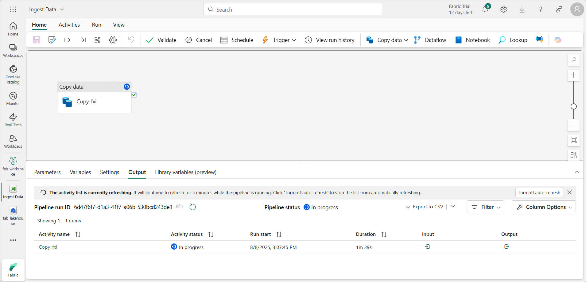

---
lab:
  title: Microsoft Fabric のデータ分析を探索する
  module: Explore fundamentals of large-scale data analytics
---

# Microsoft Fabric のデータ分析を探索する

この演習では、Microsoft Fabric Lakehouse のデータ インジェストと分析について探索します。

このラボは完了するまで、約 **25** 分かかります。

> **注**: この演習を完了するには、Microsoft Fabric ライセンスが必要です。 無料の Fabric 試用版ライセンスを有効にする方法の詳細については、[Fabric の概要](https://learn.microsoft.com/fabric/get-started/fabric-trial)に関するページを参照してください。 これを行うには、Microsoft の "学校" または "職場" アカウントが必要です。** ** お持ちでない場合は、[Microsoft Office 365 E3 以降の試用版にサインアップ](https://www.microsoft.com/microsoft-365/business/compare-more-office-365-for-business-plans)できます。

## ワークスペースの作成

Fabric でデータを操作する前に、Fabric 試用版を有効にしてワークスペースを作成してください。

1. [Microsoft Fabric](https://app.fabric.microsoft.com) (`https://app.fabric.microsoft.com`) にサインインします。
2. 左側のメニュー バーで、 **[ワークスペース]** を選択します (アイコンは &#128455; に似ています)。
3. 新しいワークスペースを任意の名前で作成し、 **[詳細]** セクションで、Fabric 容量を含むライセンス モード ("*試用版*"、*Premium*、または *Fabric*) を選択します。
4. 開いた新しいワークスペースは空のはずです。

    

## レイクハウスを作成する

ワークスペースが作成されたので、次はポータルで *[Data Engineering]* エクスペリエンスに切り替えて、データ ファイルのデータ レイクハウスを作成します。

1. ポータルの左下で、 **[データ エンジニアリング]** エクスペリエンスに切り替えます。

    

    Data Engineering のホーム ページには、一般的に使用される Data Engineering 資産を作成するためのタイルが含まれています。

2. **[Data Engineering]** ホーム ページで、任意の名前で新しい**レイクハウス**を作成します。

    1 分ほどすると、新しいレイクハウスが作成されます。

    

3. 新しいレイクハウスを表示します。左側の **[レイクハウス エクスプローラー]** ペインを使用すると、レイクハウス内のテーブルとファイルを参照できることに注意してください。
    - **Tables** フォルダーには、SQL を使用してクエリを実行できるテーブルが含まれます。 Microsoft Fabric レイクハウスのテーブルは、Apache Spark でよく使われるオープンソースの *Delta Lake* ファイル形式に基づいています。
    - **Files** フォルダーには、マネージド デルタ テーブルに関連付けられていないレイクハウスの OneLake ストレージ内のデータ ファイルが含まれています。 このフォルダーに ''ショートカット'' を作成して、外部に格納されているデータを参照することもできます。**

    現在、レイクハウスにはテーブルやファイルはありません。

## データの取り込み

データを簡単に取り込むには、パイプラインで**データのコピー** アクティビティを使用して、データをソースから抽出し、レイクハウス内のファイルにコピーします。

1. ご自分のレイクハウスの **[ホーム]** ページで、 **[データの取得]** メニューの **[新しいデータ パイプライン]** を選択し、**Ingest Sales Data** という名前の新しいデータ パイプラインを作成します。
1. **データのコピー** ウィザードの **[データ ソースの選択]** ページで、**Retail Data Model from Wide World Importers** サンプル データセットを選択します。

    ![[データ ソースの選択] ページのスクリーンショット。](./images/choose-data-source.png)

1. **[次へ]** を選択し、 **[データ ソースへの接続]** ページでデータ ソース内のテーブルを表示します。
1. 製品のレコードが含まれる **dimension_stock_item** テーブルを選択します。 **[次へ]** を選択して、 **[データの宛先の選択]** ページに進みます。
1. **[データのコピー先の選択]** ページで、既存のレイクハウスを選択します。 **[次へ]** を選択します。
1. データのコピー先オプションを次のように設定し、 **[次へ]** を選択します。
    - **ルート フォルダー**: テーブル
    - **設定の読み込み**: 新しいテーブルに読み込む
    - **変換先テーブル名**: dimension_stock_item
    - **列マッピング**: "既定のマッピングのままにする"**
    - **パーティションを有効にする**: "未選択"**
1. **[レビューと保存]** ページで、 **[データ転送をすぐに開始する]** オプションが確実に選択されているようにし、 **[保存と実行]** を選択します。

    次に示すように、**データのコピー** アクティビティを含む新しいパイプラインが作成されます。

    

    パイプラインの実行が開始されたら、パイプライン デザイナーの **[出力]** ペインで状態を監視できます。 **&#8635;** ([更新]) アイコンを使用して、状態を更新し、正常に終了するまで待ちます。**

1. 左側のハブ メニュー バーで、レイクハウスを選択します。
1. **[ホーム]** ページの **[レイクハウス エクスプローラー]** ペインで、 **[テーブル]** を展開し、**dimension_stock_item** テーブルが作成されていることを確認します。

    > **注**: 新しいテーブルに "未確認" と表示されている場合は、レイクハウスのツール バーの **[更新]** ボタンを使用してビューを更新します。**

1. **dimension_stock_item** テーブルを選択して、その内容を表示します。

    

## レイクハウス内のデータに対してクエリを実行する

レイクハウスのテーブルにデータを取り込んだので、SQL を使用してクエリを実行しましょう。

1. [レイクハウス] ページの右上で、ご自分のレイクハウスの **[SQL エンドポイント]** に切り替えます。

    ![[SQL エンドポイント] メニューのスクリーンショット。](./images/endpoint-switcher.png)

1. ツール バーで、 **[新しい SQL クエリ]** を選択します。 クエリ エディターに次の SQL コードを入力します。

    ```sql
    SELECT Brand, COUNT(StockItemKey) AS Products
    FROM dimension_stock_item
    GROUP BY Brand
    ```

1. **[&#9655; 実行]** ボタンを選択してクエリを実行し、結果を確認します。ブランドの値が 2 つ (*N/A* と *Northwind*) あり、それぞれ製品の数が表示されているはずです。

    

## レイクハウスでデータを視覚化する

Microsoft Fabric のレイクハウスでデータ モデル内のすべてのテーブルを整理し、視覚化とレポートを作成するのに使用できます。

1. ページの左下にある **[探索]** ペインで、 **[モデル]** タブを選択して、レイクハウスのテーブルのデータ モデルを表示します (この場合は、テーブルは 1 つだけです)。

    

1. ツール バーで **[新しいレポート]** を選択し、Power BI レポート デザイナーが表示される新しいブラウザー タブを開きます。
1. レポート デザイナーで次の手順を行います。
    1. **[データ]** ペインで **dimension_stock_item** テーブルを展開し、 **[Brand]** フィールドと **[StockItemKey]** フィールドを選択します。
    1. **[視覚化]** ペインで、**積み上げ横棒グラフ**視覚化 (一番目に表示されている) を選択します。 次に、**Y 軸** に **[Brand]** フィールドを含め、**X 軸** の集計を **[Count]** に変更して、 **[Count of StockItemKey]** フィールドが確実に含まれるようにします。 最後に、レポート キャンバスの視覚化のサイズを変更して、使用可能な領域を埋めます。

        

    > **ヒント**: **>>** アイコンを使用すると、レポートを見やすくするためにレポート デザイナー ペインを非表示にできます。

1. **[ファイル]** メニューの **[保存]** を選択して、レポートを**ブランド数量レポート**としてご自分の Fabric ワークスペースに保存します。

    レポートが表示されているブラウザー タブを閉じると、ご自分のレイクハウスに戻ることができます。 レポートは、Microsoft Fabric ポータルで、ご自分のワークスペースのページで確認できます。

## リソースをクリーンアップする

Microsoft Fabric の探索が終了したら、この演習用に作成したワークスペースを削除できます。

1. 左側のバーで、ワークスペースのアイコンを選択して、それに含まれるすべての項目を表示します。
2. ツール バーの **[...]** メニューで、 **[ワークスペースの設定]** を選択してください。
3. **[その他]** セクションで、 **[このワークスペースの削除]** を選択してください。
