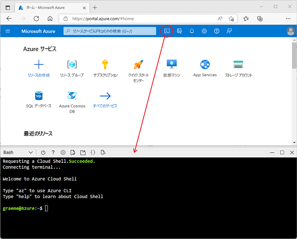

---
lab:
  title: Azure Stream Analytics を調べる
  module: Explore fundamentals of real-time analytics
---

# Azure Stream Analytics を調べる

この演習では、Azure サブスクリプションに Azure Stream Analytics ジョブをプロビジョニングし、それを使用してリアルタイム データのストリームを処理します。

このラボは完了するまで、約 **15** 分かかります。

## 開始する前に

管理レベルのアクセス権を持つ [Azure サブスクリプション](https://azure.microsoft.com/free)が必要です。

## Azure リソースを作成する

1. [Azure portal](https://portal.azure.com) でご自分の Azure サブスクリプション資格情報を使用して、Azure サブスクリプションにサインインします。

1. ページ上部の検索バーの右側にある **[\>_]** ボタンを使用して、Azure portal で新しい Cloud Shell を作成し、メッセージが表示されたら ***Bash*** 環境を選択してストレージを作成します。 次に示すように、Azure portal の下部にあるペインに、Cloud Shell のコマンド ライン インターフェイスが表示されます。

    

1. Azure Cloud Shell で次のコマンドを入力して、この演習に必要なファイルをダウンロードします。

    ```bash
    git clone https://github.com/MicrosoftLearning/DP-900T00A-Azure-Data-Fundamentals dp-900
    ```

1. コマンドが完了するまで待ってから、次のコマンドを入力して、現在のディレクトリを、この演習用のファイルが含まれるフォルダーに変更します。

    ```bash
    cd dp-900/streaming
    ```

1. 次のコマンドを入力して、この演習で必要な Azure リソースを作成するスクリプトを実行します。

    ```bash
    bash setup.sh
    ```

    > 今後の変更と試験的な機能に関する警告メッセージは無視します。

    実行されたスクリプトによって次のアクションが実行されるのを待ちます。

    1. リソースの作成に必要な Azure CLI 拡張機能がインストールされます ("試験段階の拡張機能に関する警告は無視してかまいません")。**
    1. この演習用に提供されている Azure リソース グループを見つけます。
    1. シミュレートされたデバイスからデータのストリームを受け取るために使用される *Azure IoT Hub* リソースが作成されます。
    1. 処理されたデータの格納に使用される "Azure ストレージ アカウント" が作成されます。**
    1. 受信したデバイス データをリアルタイムで処理し、その結果をストレージ アカウントに書き込む "Azure Stream Analytics" ジョブが作成されます。**

## Azure リソースを調べる

1. [Azure portal](https://portal.azure.com?azure-portal=true) のホーム ページで **[リソース グループ]** を選び、サブスクリプション内のリソース グループを表示します。 これには、セットアップ スクリプトによって示されている **learn*xxxxxxxxxxxxxxxxx...** * リソース グループが含まれているはずです。
2. **learn*xxxxxxxxxxxxxxxxx...** * リソース グループを選択し、それに含まれるリソースを確認します。次のものが含まれている必要があります。
    - 受信デバイス データを受け取るために使用される **iothub*xxxxxxxxxxxxx*** という名前の *IoT ハブ*。
    - データ処理の結果が書き込まれる **store*xxxxxxxxxxxx*** という名前の "ストレージ アカウント"。**
    - ストリーミング データの処理に使用される **stream*xxxxxxxxxxxxx*** という名前の "Stream Analytics ジョブ"。**

    これら 3 つのリソースすべてが一覧に表示されていない場合は、表示されるまで **[&#8635; 最新の情報に更新]** ボタンをクリックします。

3. **stream*xxxxxxxxxxxxx*** Stream Analytics ジョブを選び、その **[概要]** ページの情報を見ます。次の詳細に注意してください。
    - ジョブには、**iotinput** という名前の 1 つの "入力" と、**bloboutput** という名前の 1 つの "出力" があります。**** これらでは、セットアップ スクリプトによって作成された IoT ハブとストレージ アカウントが参照されています。
    - ジョブの "クエリ" では、**iotinput** 入力からデータが読み取られ、10 秒ごとに処理されたメッセージの数をカウントして集計されて、結果が **bloboutput** 出力に書き込まれます。**

## リソースを使用してストリーミング データを分析する

1. Stream Analytics ジョブの **[概要]** ページの先頭にある **[&#9655; 開始]** ボタンを選んでから、**[ジョブの開始]** ペインで **[開始]** を選んでジョブを開始します。
2. ストリーミング ジョブが正常に開始されたことを示す通知を待ちます。
3. Azure Cloud Shell に戻り、次のコマンドを入力して、IoT ハブにデータを送信するデバイスをシミュレートします。

    ```
    bash iotdevice.sh
    ```

4. シミュレーションが開始するまで待ちます。これは、次のような出力で示されます。

    ```
    Device simulation in progress: 6%|#    | 7/120 [00:08<02:21, 1.26s/it]
    ```

5. シミュレーションが実行されている間に Azure portal に戻り、**learn*xxxxxxxxxxxxxxxxx...** * リソース グループのページに戻って、**store*xxxxxxxxxxxx*** ストレージ アカウントを選択します。
6. ストレージ アカウント ブレードの左側のペインで、**[コンテナー]** タブを選びます。
7. **data** コンテナーを開きます。
8. **data** コンテナーで、今年のフォルダーと月、日、時のサブフォルダーが含まれるフォルダー階層内を移動します。
9. 時のフォルダーで、作成されたファイルをメモしておきます。このファイルには、**0_xxxxxxxxxxxxxxxx.json** のような名前が付いています。
10. ファイルの **...** メニュー (ファイルの詳細の右) で **[表示/編集]** を選び、ファイルの内容を確認します。次のように、IoT デバイスから受信したメッセージの数を示す 10 秒ごとの JSON レコードで構成されているはずです。

    ```
    {"starttime":"2021-10-23T01:02:13.2221657Z","endtime":"2021-10-23T01:02:23.2221657Z","device":"iotdevice","messages":2}
    {"starttime":"2021-10-23T01:02:14.5366678Z","endtime":"2021-10-23T01:02:24.5366678Z","device":"iotdevice","messages":3}
    {"starttime":"2021-10-23T01:02:15.7413754Z","endtime":"2021-10-23T01:02:25.7413754Z","device":"iotdevice","messages":4}
    ...
    ```

11. **[&#8635; 最新の情報に更新]** ボタンを使ってファイルを更新します。デバイスから IoT ハブにストリーミングされたデバイス データが Stream Analytics ジョブによってリアルタイムで処理されているため、追加の結果がファイルに書き込まれていることに注意してください。
12. Azure Cloud Shell に戻り、デバイスのシミュレーションが完了するまで待ちます (約 3 分間実行されるはずです)。
13. Azure portal に戻り、ファイルをもう一度最新の情報に更新して、シミュレーション中に生成された結果の完全なセットを確認します。
14. **learn*xxxxxxxxxxxxxxxxx...** * リソース グループに戻り、**stream*xxxxxxxxxxxxx*** Stream Analytics ジョブを再び開きます。
15. Stream Analytics ジョブのページの上部にある **[&#11036; 停止]** ボタンを使ってジョブを停止し、メッセージが表示されたら確認します。

> **注**: ストリーミング ソリューションの調査が完了した場合は、この演習で作成したリソース グループを削除してください。
