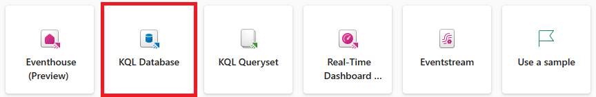
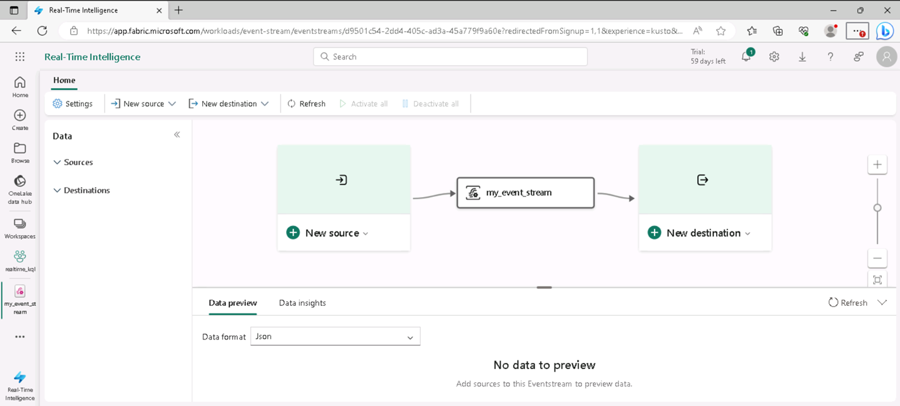

---
lab:
  title: Microsoft Fabric のリアルタイム分析を探索する
  module: Explore fundamentals of large-scale data analytics
---

# Microsoft Fabric のリアルタイム分析を探索する

この演習では、Microsoft Fabric のリアルタイム分析について探索します。

このラボは完了するまで、約 **25** 分かかります。

> **注**: この演習を完了するには、Microsoft Fabric ライセンスが必要です。 無料の Fabric 試用版ライセンスを有効にする方法の詳細については、[Fabric の概要](https://learn.microsoft.com/fabric/get-started/fabric-trial)に関するページを参照してください。 これを行うには、Microsoft の "学校" または "職場" アカウントが必要です。** ** お持ちでない場合は、[Microsoft Office 365 E3 以降の試用版にサインアップ](https://www.microsoft.com/microsoft-365/business/compare-more-office-365-for-business-plans)できます。

## ワークスペースの作成

Fabric でデータを操作する前に、Fabric 試用版を有効にしてワークスペースを作成してください。

1. [Microsoft Fabric](https://app.fabric.microsoft.com) (`https://app.fabric.microsoft.com`) にサインインします。
2. 左側のメニュー バーで、 **[ワークスペース]** を選択します (アイコンは &#128455; に似ています)。
3. 新しいワークスペースを任意の名前で作成し、 **[詳細]** セクションで、Fabric 容量を含むライセンス モード ("*試用版*"、*Premium*、または *Fabric*) を選択します。
4. 開いた新しいワークスペースは空のはずです。

    

## KQL データベースを作成する

ワークスペースを作成したので、リアルタイム データを格納する KQL データベースを作成しましょう。

1. ポータルの左下で、 **[リアルタイム分析]** エクスペリエンスに切り替えます。

    

    リアルタイム分析のホーム ページには、リアルタイム データ分析のために一般的に使用される資産を作成するためのタイルが用意されています

2. リアルタイム分析ホーム ページで、新しい **KQL データベース**を任意の名前で作成します。

    

   ダッシュボード画面が表示されたら、上部にある [KQL データベース] ボタンを選択します。

    

    選択後、***[新しい KQL データベース]*** ダイアログ ボックスが表示されます。ここで KQL データベースに名前を付けます。

    

   - データベースに名前を付けます。このシナリオでは次のとおりです: `my_kql_db`
   - ***[作成]*** をクリックします
  
    1 分ほどすると、新しい KQL レイクハウスが作成されます。

    現段階では、データベースにテーブルはありません。

## Eventstream を作成する

イベントストリームは、ストリーミング ソースからリアルタイム データを取り込むためのスケーラブルで柔軟な方法を提供します。

1. 左側のメニュー バーで、リアルタイム分析エクスペリエンスの **[ホーム]** ページを選択します。
1. ホーム ページでタイルを選択し、新しい**イベントストリーム**を任意の名前で作成します。

    しばらくすると、イベントストリームのビジュアル デザイナーが表示されます。

    

    ビジュアル デザイナー キャンバスにはイベントストリームに接続するソースが表示され、そのソースが宛先に接続されます。

1. デザイナー キャンバスで、ソースの **[新しいソース]** リストの **[サンプル データ]** を選択します。 次に、 **[サンプル データ]** ペインで、**taxis** という名前を指定し、**Yellow Taxi** のサンプル データ (タクシーの移動から収集されたデータを表す) を選択します。 その後、 **[追加]** を選択します。
1. デザイナー キャンバスの下にある **[データ プレビュー]** タブを選択して、ソースからストリーミングされるデータをプレビューします。

    

1. デザイナー キャンバスで、ご自分の宛先の **[新しい宛先]** リストで、 **[KQL データベース]** を選択します。 次に、 **[KQL データベース]** ペインで、**taxi-data** という宛先名を指定し、ご自分のワークスペースと KQL データベースを選択します。 次に、 **[作成して構成する]** を選択します。
1. **データの取り込み**ウィザードの **[宛先]** ページで、 **[新しいテーブル]** を選択し、**taxi-data** という名前のテーブルを入力します。 **[次へ: ソース]** を選択します。
1. **[ソース]** ページで、既定のデータ接続名を確認し、 **[次へ: スキーマ]** を選択します。
1. **[スキーマ]** ページで、 **[データ形式]** を TXT から **JSON** に変更し、プレビューを表示して、この形式で複数のデータ列が作成されることを確認します。 **[次へ: 概要]** を選択します。
1. **[概要]** ページで、連続した取り込みが確立されるまで待ってから、 **[閉じる]** を選択します。
1. 完成したイベントストリームが次のようになっていることを確認します。

    

## KQL データベース内のリアルタイム データに対してクエリを実行する

ご自分のイベントストリームで KQL データベース内のテーブルを継続的に設定することで、リアルタイム データに対してクエリを実行できます。

1. 左側のメニュー ハブで、KQL データベースを選択します (または、ワークスペースを選択して KQL データベースを見つけます)。
1. **taxi-data** テーブル (イベントストリームによって作成される) に対して、 **...** メニューで、 **[クエリ テーブル] > [過去 24 時間以内に取り込まれたレコード]** を選択します。

    ![KQL データベースの [クエリ テーブル] メニューのスクリーンショット。](./images/kql-query.png)

1. クエリの結果を表示します。次のような KQL クエリであるはずです。

    ```kql
    ['taxi-data']
    | where ingestion_time() between (now(-1d) .. now())
    ```

    結果に、過去 24 時間にストリーミング ソースから取り込まれたすべてのタクシー レコードが表示されます。

1. クエリ エディターの上半分にあるすべての KQL クエリ コードを次のコードに置き換えます。

    ```kql
    // This query returns the number of taxi pickups per hour
    ['taxi-data']
    | summarize PickupCount = count() by bin(todatetime(tpep_pickup_datetime), 1h)
    ```

1. **[&#9655; 実行]** ボタンを使用してクエリを実行し、結果を表示します。各時間のタクシー送迎数を示す結果が表示されるはずです。

## リソースをクリーンアップする

Microsoft Fabric のリアルタイム分析の探索が終了したら、この演習用に作成したワークスペースを削除できます。

1. 左側のバーで、ワークスペースのアイコンを選択して、それに含まれるすべての項目を表示します。
2. ツール バーの **[...]** メニューで、 **[ワークスペースの設定]** を選択してください。
3. **[その他]** セクションで、 **[このワークスペースの削除]** を選択してください。
