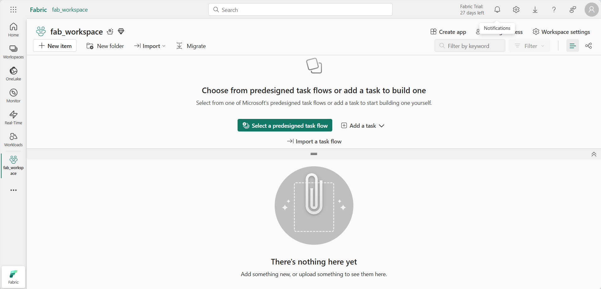

---
lab:
  title: Microsoft Fabric のリアルタイム分析を探索する
  module: Explore real-time analytics in Microsoft Fabric
  description: このラボでは、Microsoft Fabric のリアルタイム インテリジェンス機能を使用して、タクシー データのライブ ストリームのキャプチャ、保存、クエリを行います。 このラボは完全な初心者向けに書かれているので、すべてのステップが平易な言葉で説明されています。
  duration: 30 minutes
  level: 100
  islab: true
  primarytopics:
    - Microsoft Fabric
---

# Microsoft Fabric のリアルタイム分析を探索する

ほとんどのデータ分析は、以前に収集されたデータを基にしています。 **リアルタイム分析**とは異なります。こちらはデータを "届いたらその都度" その瞬間で処理します。** 新しい移動が絶え間なくストリーミングされる、タクシーの移動のライブ フィードを想像してください。

このラボでは、**Microsoft Fabric** の**リアルタイム インテリジェンス**機能を使用して、タクシー データのライブ ストリームをキャプチャし、保存し、クエリを実行して質問に答えます。新しいデータが届くにつれて応答が変わる様子を見守ります。 これらの用語を初めて聞く方も心配しないでください。進行に応じて各ステップを説明します。

このラボの所要時間は約 **30** 分です。

> **注**: この演習を完了するには、[Microsoft Fabric テナント](https://learn.microsoft.com/fabric/get-started/fabric-trial)が必要です。

## ワークスペースの作成

Fabric でデータを操作する前に、Fabric 容量を有効にしてワークスペースを作成する必要があります。

> "**ワークスペースとは何でしょうか?** Fabric で作成したものすべて (Eventstream、Eventhouse、ダッシュボードなど) をまとめたプロジェクト フォルダーのようなものだと考えてください。Fabric の容量を有効にすることで、ワークスペースにそれらのアイテムを実行するために必要な計算能力が与えられます。"__

1. ブラウザーの `https://app.fabric.microsoft.com/home?experience=fabric` で [Microsoft Fabric ホーム ページ](https://app.fabric.microsoft.com/home?experience=fabric)に移動し、Fabric 資格情報でサインインします。

1. 左側のメニュー バーの下部に、環境スイッチャーがあります。 **Power BI** が表示されたら、選択して **[Fabric]** を選び、このラボで使用されているリアルタイム インテリジェンス機能をすべて利用できるようにします。

    

1. 左側のメニュー バーで、 **[ワークスペース]** を選択します (アイコンは &#128455; に似ています)。

    ![[新しいワークスペース] ボタンが表示されたワークスペースのポップアップのスクリーンショット。](./images/05c-fabric-realtime-lab-workspaces.png)

1. **[+ 新しいワークスペース]** を選択して、ワークスペースに (`dp900-realtime` のような) 名前を付け、**[詳細]** セクションで、Fabric 容量を含むライセンス モード ([試用版]、*[Premium]*、または *[Fabric]*) を選択します。** 次に、**[適用]** を選びます。

    > _**ヒント**:Fabric を含む容量を使用すると、リアルタイムのインジェストと分析に必要なエンジンがワークスペースに確保されます。_ ワークスペースを分けることで、ラボのリソースが分離され、クリーンアップが簡単になります。

    ![名前とライセンス モードが表示された [ワークスペースの作成] ペインのスクリーンショット。](./images/05c-fabric-realtime-lab-create-workspace.png)

1. 開いた新しいワークスペースは空のはずです。

    

## Eventstream を作成する

これで、ストリーミング ソースからリアルタイム データを検索してキャプチャする準備ができました。 これを行うには、Fabric リアルタイム ハブから開始します。

> "**Eventstream とは何ですか?** ストリームとはリアルタイムで届く連続したデータの流れです。**Eventstream** は、ストリーミング ソースに接続し、そのフローを保存して分析できる宛先まで運ぶ Fabric の機能です。**リアルタイム ハブ**は、利用可能なストリーミング ソースを見つけて接続するための中心的な場所です。"__

> **ヒント**: 初めてリアルタイム ハブを使用する場合は、*はじめに*のヒントが表示される場合があります。 これらを閉じることができます。

1. 左側のメニュー バーで、**リアルタイム** ハブを選択します。

    リアルタイム ハブを使用すると、ストリーミング データのソースを簡単に見つけて管理できます。

    ![Microsoft Fabric の [リアルタイム ハブ] ホーム ページのスクリーンショット。](./images/05c-fabric-realtime-lab-real-time-hub.png)

1. リアルタイム ハブの**接続先**セクションで、**[データ ソース]** を選択します。

    使用可能なストリーミング データ ソースのカタログが表示されます。

    

1. **Yellow taxi** サンプル データ ソースを見つけて、**[接続]** を選択します。 **[データ ソースの接続]** ウィザードが、**[接続設定の構成]** ページで開きます。

    > "**ヒント**:Yellow taxi サンプルは安全な公開用ストリームであり、資格情報は必要ありません。これはすべての学習者に共通します。"__

    ![既定の [マイ ワークスペース] と無料トライアルのプロンプトが表示された [接続設定の構成] ページのスクリーンショット。](./images/05c-fabric-realtime-lab-real-time-hub-yellow-taxi-switch-workspace.png)

1. 右側の **[ストリームの詳細]** ペインで **[ワークスペース]** ドロップダウンを選択し、[マイ ワークスペース] ではなく、以前作成したワークスペース (例: `dp900-realtime`) を選択してください。** 「Try Microsoft Fabric for free (Microsoft Fabric を無料で試す)」というプロンプトが表示された場合は、無視してください。**

    ![[dp900-realtime] ワークスペースが選択された [ワークスペース] ドロップダウンのスクリーンショット。](./images/05c-fabric-realtime-lab-real-time-hub-yellow-taxi-switch-workspace-selected.png)

1. **[ソース名]** を `taxi` に設定し、既定の **[Eventstream 名]** を `taxi-data` に編集します。 **[ストリーム名]** は自動的に *[taxi-data-stream]* に設定されます。

    ![[taxi] ソースと [taxi-data] の Eventstream 名が表示された構成済み接続設定のスクリーンショット。](./images/05c-fabric-realtime-lab-real-time-hub-yellow-taxi-names-updated.png)

1. [**次へ**] を選択します。 **[確認および接続]** ページでソースとストリームの詳細をレビューしてから、**[接続]** を選択します。

    ![ソースとストリームの概要が表示された [確認および接続] ページのスクリーンショット。](./images/05c-fabric-realtime-lab-real-time-hub-yellow-taxi-review.png)

1. **[Eventstream の作成]** および **[Eventstream ソースの作成]** のタスクに **[成功]** の状態が表示されまで待ってから、**[Eventstream を開く]** を選択します。

    ![両方のタスクの成功と、[Eventstream を開く] ボタンが表示された完了済みウィザードのスクリーンショット。](./images/05c-fabric-realtime-lab-real-time-hub-yellow-taxi-completed.png)

    デザイン キャンバスに Eventstream が開き、**[taxi]** ソースと **[taxi-data-stream]** が表示されます。

## Eventhouse を作成してストリームを保存する

Eventstream にはリアルタイムのタクシー データがキャプチャされますが、現時点では何も保存されません。 データを保持してクエリを実行できるようにするには、Eventstream の "宛先" として **[Eventhouse]** を追加してください。**

> "**Evenhouse とは何ですか?** リアルタイム データ用に作られた耐久性のあるストレージです。**KQL データベース**が搭載されており、そこでストリーミング データがテーブルに保存されます。**KQL** (Kusto 照会言語) は、大量のデータ、特に次々と届くデータを迅速に探し、フィルター処理し、分析するために設計された読み取り専用の SQL に似た言語です。"__

1. デザイン キャンバスに **[taxi-data]** Eventstream を**編集モード**で開き、ツール バーで **[宛先の追加]** を選択してから、**[Eventhouse]** を選択します。

    ![[宛先の追加] メニューが開いており、[Eventhouse] オプションが表示された、編集モードでの Eventstream キャンバスのスクリーンショット。](./images/05c-fabric-realtime-lab-event-stream-edit-mode.png)

1. 右側に開いた **[Eventhouse]** ペインで、次のように宛先を設定します。

    - **[データ インジェスト モード]** には、**[インジェスト前のイベント処理]** を選択します。
    - **[宛先名]** は既定値のまま (`Eventhouse`) にします。
    - **[ワークスペース]** には、以前作成したワークスペース (例: `dp900-realtime`) を選択します。
    - **[Eventhouse]** には **[新規作成]** を選択し、Evenhouse の名前を `taxi-eventhouse` にし、**[完了]** を選択します。 **[KQL データベース]** は自動的に同じ名前に設定されます。

    ![[新しい Eventhouse の作成] ダイアログと [taxi-eventhouse] という名前が表示された、Eventhouse の宛先ペインのスクリーンショット。](./images/05c-fabric-realtime-lab-event-stream-create-new-event-house.png)

1. **[KQL 宛先テーブル]** には **[新規作成]** を選択し、テーブル名を `yellow-taxi` にして **[完了]** を選択します。 **[データ ソースを追加した後、インジェストをアクティブにする]** が選択されていることを確認してから、**[保存]** を選択します。

    ![[新しいテーブルの作成] ダイアログと [yellow-taxi] という名前が表示された Eventhouse の宛先ペインのスクリーンショット。](./images/05c-fabric-realtime-lab-event-stream-create-new-event-house-destination-table.png)

1. キャンバス上に、**[Eventhouse]** 宛先ノードが追加されます。 **[taxi-data-stream]** ノードに接続されていることを確認します。 ストリームと Eventhouse が結合していない場合は、ストリーム ノードの右端の丸から **[Eventhouse]** ノードに接続をドラッグします。

    ![[taxi] ソース、[taxi-data-stream]、接続された [Eventhouse] の宛先が表示された Eventstream キャンバスのスクリーンショット。](./images/05c-fabric-realtime-lab-event-stream-connect-event-house.png)

1. ツール バーで **[公開]** を選択して変更を有効にします。

    > "**ヒント**: キャンバス上で行った変更は、公開するまで**編集モード**のままです。公開することで、Eventstream が **[ライブ]** モードに切り替わり、Eventhouse へのイベントの移動が開始します。"__

1. Eventstream が **[ライブ]** モードに切り替わると、**[taxi]** ソース、**[taxi-data-stream]**、**[Eventhouse]** の宛先にそれぞれ **[アクティブ]** の状態が表示されます。 **[Eventhouse]** ノードを選択し、キャンバス下のペインで **[データ プレビュー]** タブを選択します。インジェストが始まるまで数分待ち、**[最新の情報に更新]** を選択すると、タクシー データの行が表示されます。

    ![[Eventhouse] ノードが選択され、[データ プレビュー] にタクシー データが表示された、公開済みライブ Eventstream のスクリーンショット。](./images/05c-fabric-realtime-lab-event-stream-publish-live.png)

    > "**ヒント**: 公開後、最初のイベントがテーブルに書き込まれるまでに数分かかることがあります。プレビューが空の場合は、少し待ってから再度 **[最新の情報に更新]** を選択してください。"__

    次に、キャプチャしたデータに対してクエリを実行して分析する方法を見てみましょう。

## キャプチャされたデータに対してクエリを実行する

Eventstream は、リアルタイムのタクシー データを、KQL データベースの **[yellow-taxi]** テーブルに読み込みます。 そのテーブルにクエリを実行すると、キャプチャされたデータを探すことができます。

> _**ヒント**:KQL は、タイム スタンプ付きの大量のデータを高速に探索できるように設計されています。_ クエリを実行すると、インジェストを検証し、すぐに分析を開始できます。

1. 左側のメニュー バーで **[ワークスペース]** を選択し、ワークスペース (例: `dp900-realtime`) を開き、**[taxi-eventhouse]** KQL データベースを選択します。

    ![[taxi-eventhouse] データベースが表示されたワークスペースのポップアップのスクリーンショット。](./images/05c-fabric-realtime-lab-query-select-taxi-eventhouse.png)

1. データベースのページで、**[taxi-eventhouse]** データベースに **[taxi-eventhouse_queryset]** と、先に作成した **[yellow-taxi]** テーブルが含まれていることに注目してください。

    ![クエリセットと yellow-taxi テーブルが表示された [taxi-eventhouse] データベース ページのスクリーンショット。](./images/05c-fabric-realtime-lab-query-database.png)

1. 左側のペインで **[taxi-eventhouse_queryset]** を選択します。 出発点として使えるいくつかのサンプル KQL クエリが開きます。

    

1. クエリ ペイン内のすべてのテキストを選択して削除します。 その後、次のクエリを入力し、**[実行]** を選択すると、テーブルのデータのうち 100 行が表示されます。

    ```kql
    ['yellow-taxi']
    | take 100
    ```

    ![新しいクエリと [実行] ボタンが強調表示された taxi-eventhouse クエリセットのスクリーンショット。](./images/05c-fabric-realtime-lab-query-yellow-taxi.png)

    > "**注**: テーブル名 `yellow-taxi` はハイフンを含むため、`['...']` で囲まれています。KQL は特殊文字を含む名前にこの構文を使用します。"__

    > **ヒント**: `take 100` は簡易な正常性チェックです。行が到着していることを確認し、すべてをスキャンせずに小規模なサンプルを検査します。__

1. 1 時間ごとのタクシー乗車数が表示されるように、クエリを次のコードに置き換えて、**[実行]** を選択します。

    ```kql
    ['yellow-taxi']
    | summarize PickupCount = count() by bin(todatetime(tpep_pickup_datetime), 1h)
    ```

    結果のテーブルには、1 時間ごとの乗車数が列で表示されます。

    

    > **ヒント**: `bin(..., 1h)` イベントを時間単位のバケットにグループ化することで、時間の経過に伴う傾向を簡単に把握できます。__

1. 1 時間ごとの傾向を視覚化するには、クエリ結果の下で **[テーブル 1]** ドロップダウンを選択し、ビジュアルを追加します。 右側の **[ビジュアル書式設定]** ペインで、**[ビジュアル タイプ]** を **[縦棒グラフ]** に設定します。 1 時間ごとの乗車数が縦棒グラフで表示されます。

    ![[ビジュアル書式設定] ペインで、1 時間ごとの乗車結果が縦棒グラフで表示されているスクリーンショット。](./images/05c-fabric-realtime-lab-query-yellow-taxi-hourly-trends-visual.png)

1. 数秒待ってから、もう一度 **[実行]** を選択します。リアルタイム ストリームからテーブルに新しいデータが追加されると、乗車数が変化することに注目してください。

    > _**ヒント**:ストリームによって継続的にデータが追加されるため、結果は時間の経過と共に変化します。_ 再実行すると、新しいイベントが到着したときに集計がどのように更新されるかがわかります。

## リソースをクリーンアップする

この演習では、Eventhouse を作成し、Eventstream を使用してリアルタイム データをキャプチャし、KQL データベースのテーブルでキャプチャしたデータにクエリを実行しました。

Fabric のリアルタイム インテリジェンスの探索が終了したら、この演習用に作成したワークスペースを削除できます。

> _**ヒント**:ワークスペースを削除すると、ラボで作成されたすべての項目が削除され、請求が継続されないようにすることができます。_

1. 左側のバーで、ワークスペースのアイコンを選択します。

1. ツール バーで、**[ワークスペース設定]** を選択します。

1. **[全般]** セクションで、**[このワークスペースの削除]** を選択します。

    ![[ワークスペースの削除] ボタンのスクリーンショット。](./images/05c-fabric-realtime-lab-remove-workspace.png)