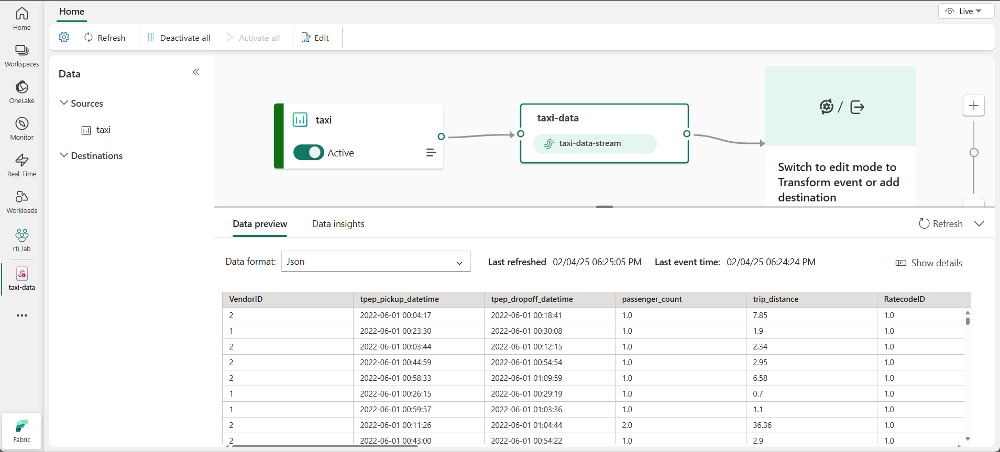

---
lab:
  title: Microsoft Fabric のリアルタイム分析を探索する
  module: Explore real-time analytics in Microsoft Fabric
---

# Microsoft Fabric のリアルタイム分析を探索する

Microsoft Fabric には、リアルタイム データ ストリーム用の分析ソリューションを作成できるリアルタイム インテリジェンスが用意されています。 この演習では、Microsoft Fabric のリアルタイム インテリジェンス機能を使用して、あるタクシー会社のデータのリアルタイム ストリームを取り込み、分析し、可視化します。

このラボの所要時間は約 **30** 分です。

> **注**: この演習を完了するには、[Microsoft Fabric テナント](https://learn.microsoft.com/fabric/get-started/fabric-trial)が必要です。

## ワークスペースの作成

Fabric でデータを操作する前に、Fabric 容量を有効にしてワークスペースを作成する必要があります。

1. ブラウザーの `https://app.fabric.microsoft.com/home?experience=fabric` で [Microsoft Fabric ホーム ページ](https://app.fabric.microsoft.com/home?experience=fabric)に移動し、Fabric 資格情報でサインインします。
1. 左側のメニュー バーで、 **[ワークスペース]** を選択します (アイコンは &#128455; に似ています)。
1. 任意の名前で新しいワークスペースを作成し、Fabric 容量を含むライセンス モード ("試用版"、*Premium*、または *Fabric*) を選択します。**
1. 開いた新しいワークスペースは空のはずです。

    

## Eventstream を作成する

これで、ストリーミング ソースからリアルタイム データを検索して取り込む準備ができました。 これを行うには、Fabric リアルタイム ハブから開始します。

> **ヒント**: 初めてリアルタイム ハブを使用する場合は、*はじめに*のヒントが表示される場合があります。 これらを閉じることができます。

1. 左側のメニュー バーで、**リアルタイム** ハブを選択します。

    リアルタイム ハブを使用すると、ストリーミング データのソースを簡単に見つけて管理できます。

    

1. リアルタイム ハブの**接続先**セクションで、**[データ ソース]** を選択します。
1. **Yellow taxi** サンプル データ ソースを見つけて、**[接続]** を選択します。 次に、**接続**ウィザードで、ソースに `taxi` という名前を付け、既定のイベントストリーム名を編集して `taxi-data` に変更します。 このデータに関連付けられている既定のストリームには、*taxi-data-stream* という名前が自動的に付けられます。

    

1. **[次へ]** を選択し、ソースとイベントストリームが作成されるまで待ってから、**[イベントストリームを開く]** を選択します。 Eventstream では、デザイン キャンバスに**タクシー** ソースと **taxi-data-stream** が表示されます。

   

## イベントハウスを作成する

イベントストリームはリアルタイムの株式データを取り込みますが、現時点では何もしません。 キャプチャしたデータをテーブルに格納できるイベントハウスを作成しましょう。

1. 左側のメニュー バーで、**[作成]** を選択します。 [新規] ページの *[Real-Time Intelligence]* セクションで、**[イベントハウス]** を選択します。** 任意の一意の名前を設定します。

    >**注**: **[作成]** オプションがサイド バーにピン留めされていない場合は、最初に省略記号 (**...**) オプションを選択する必要があります。

    新しい空のイベントハウスが表示されるまで、表示されているヒントまたはプロンプトを閉じます。

    

1. 左側のペインで、イベントハウスに Eventhouse と同じ名前の KQL データベースが含まれていることに注意してください。 このデータベースでは、リアルタイム データ用のテーブルを作成することも、必要に応じて追加のデータベースを作成することもできます。
1. データベースを選択し、関連付けられた *queryset* があることに注意してください。 このファイルには、データベース内のテーブルのクエリを開始するために使用できる KQL クエリのサンプルがいくつか含まれています。

    ただし、現時点ではクエリを実行するテーブルはありません。 イベントストリームから新しいテーブルにデータを取得することで、この問題を解決しましょう。

1. KQL データベースのメイン ページで、 **[データの取得]** を選択します。
1. データ ソースで、**[イベントストリーム]**、**[新しいイベントストリーム]** を選択します。
1. **[選択またはコピー先テーブルの作成]** ウィンドウで、`taxi` という名前の新しいテーブルを作成します。 次に、**[データ ソースの構成]** ウィンドウで、ワークスペースと **taxi-data** Eventstream を選択し、接続 `taxi-table` に名前を付けます。

   

1. **[次へ]** ボタンを使用して、データを検査し、構成を完了する手順を完了します。 次に、構成ウィンドウを閉じて、イベントハウスと stock テーブルを表示します。

   

    ストリームとテーブルの間の接続が作成されました。 イベントストリームでそのことを確認しましょう。

1. 左側のメニュー バーで、**[リアルタイム]** ハブを選択し、**[マイ データ ストリーム]** ページを表示します。 **taxi-data-stream** ストリームの **[...]** メニューで、**[Eventstream を開く]** を選択します。

    イベントストリームにストリームの宛先が表示されるようになりました。

   

    > **ヒント**: デザイン キャンバス上のコピー先を選択し、その下にデータ プレビューが表示されない場合は、**[更新する]** を選択します。

    この演習では、リアルタイム データをキャプチャしてテーブルに読み込む非常にシンプルな Eventstream を作成しました。 実際のソリューションでは、通常、変換を追加して、時間枠にわたってデータを集計します (たとえば、5 分間の各株の平均価格を取得する場合)。

    次に、キャプチャしたデータに対してクエリを実行して分析する方法を見てみましょう。

## キャプチャされたデータに対してクエリを実行する

Eventstream は、リアルタイムのタクシー料金のデータをキャプチャし、KQL データベースのテーブルに読み込みます。 このテーブルに対してクエリを実行し、キャプチャされたデータを確認できます。

1. 左側のメニュー バーで、Eventhouse データベースを選択します。
1. データベースの *queryset* を選択します。
1. クエリ ペインで、次に示すように最初のクエリ例を変更します。

    ```kql
    taxi
    | take 100
    ```

1. クエリ コードを選択して実行し、テーブルの 100 行のデータを表示します。

    

1. 結果を確認してからクエリを変更し、1 時間ごとのタクシーのピックアップ数を表示します。

    ```kql
    taxi
    | summarize PickupCount = count() by bin(todatetime(tpep_pickup_datetime), 1h)
    ```

1. 変更したクエリを強調表示し、クエリを実行して結果を表示します。
1. 数秒待ってから、もう一度実行します。リアルタイム ストリームから新しいデータがテーブルに追加されると、ピックアップ数が変化することに注意します。

## リソースをクリーンアップする

この演習では、Eventhouse を作成し、Eventstream を使用してリアルタイム データを取り込み、KQL データベース テーブルで取り込まれたデータのクエリを実行し、リアルタイム データを視覚化するリアルタイム ダッシュボードを作成し、アクティベーターを使用してアラートを構成しました。

Fabric のリアルタイム インテリジェンスの探索が終了したら、この演習用に作成したワークスペースを削除できます。

1. 左側のバーで、ワークスペースのアイコンを選択します。
2. ツール バーで、**[ワークスペース設定]** を選択します。
3. **[全般]** セクションで、**[このワークスペースの削除]** を選択します。
