---
lab:
  title: Power BI を使用したデータの可視化の基礎を調べる
  module: Explore fundamentals of data visualization
  description: このラボでは、複数のソースから Power BI Desktop にデータをインポートし、簡単なデータ モデルを構築して、グラフとマップを備えた対話型レポートを作成します。 このラボは完全な初心者向けに書かれているので、すべてのステップが平易な言葉で説明されています。
  duration: 30 minutes
  level: 100
  islab: true
  primarytopics:
    - Power BI
---

# Power BI を使用したデータの可視化の基礎を調べる

**Power BI** は、数値の羅列を見つめるのではなく、データでパターンを認識したりストーリーを伝えたりできるよう、生データをグラフ、マップ、対話型レポートに変換するための、Microsoft のツールです。

このラボでは、無料の **Power BI Desktop** アプリを使って、いくつかのサンプル売上データ (顧客、製品、注文) を取り込み、それらのテーブルを簡単な**データ モデル**に結びつけてから、クリックして探索できるテーブル、グラフ、マップを含むレポートを作成します。 Power BI を使ったことがなくても心配いりません。作業を進めながらすべてのステップについて説明します。

このラボは完了するまで、約 **30** 分かかります。

> **注意**: このラボを終えるには、Windows コンピューターが必要です。Power BI Desktop は Windows でのみ動きます。

## Power BI Desktop をインストールする

Microsoft Power BI Desktop が Windows コンピューターにまだインストールされていない場合は、無料でダウンロードしてインストールできます。

> **Power BI Desktop とは?** 自分のコンピューターでデータ モデルとレポートを作成できる無料のアプリです。レポートの準備ができたら、必要に応じてそれを Power BI サービスに発行し、他のユーザーと共有できます。__

1. [https://aka.ms/power-bi-desktop](https://aka.ms/power-bi-desktop?azure-portal=true) から Power BI Desktop インストーラーをダウンロードします。

1. ファイルのダウンロードが完了したら、ファイルを開き、セットアップ ウィザードを使用してコンピューターに Power BI Desktop をインストールします。 このインストールには数分かかる場合があります。

## データのインポート

1. Power BI Desktop を開きます。 アプリケーション インターフェイスは次のようになります。

    

    これで、レポートのデータをインポートする準備ができました。

1. Power BI Desktop のようこそ画面で **[その他のソースからデータを取得する]** を選択し、データ ソースの一覧で **[Web]** を選択し、**[接続]** を選択します。

    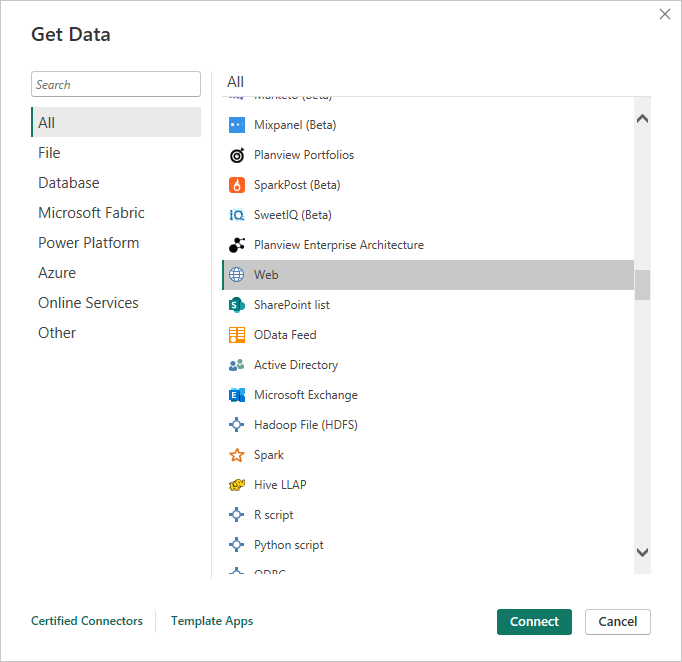

1. **[Web から]** ダイアログ ボックスで、次の URL を入力し、**[OK]** を選択します。

    ```
    https://github.com/MicrosoftLearning/DP-900T00A-Azure-Data-Fundamentals/raw/master/power-bi/customers.csv
    ```

    > _**ヒント**:_ サンプル CSV ファイルで Web コネクタを使用すると、全員が同じクリーンなデータを使用して作業できます。ローカル ファイルや資格情報は必要ありません。

1. [Web コンテンツへのアクセス] ダイアログで、 **[接続]** を選択します。

1. URL によって、次に示すように顧客データを含むデータセットが開くことを確認します。 次に、**[読み込み]** を選択して、レポートのデータ モデルにデータを読み込みます。

    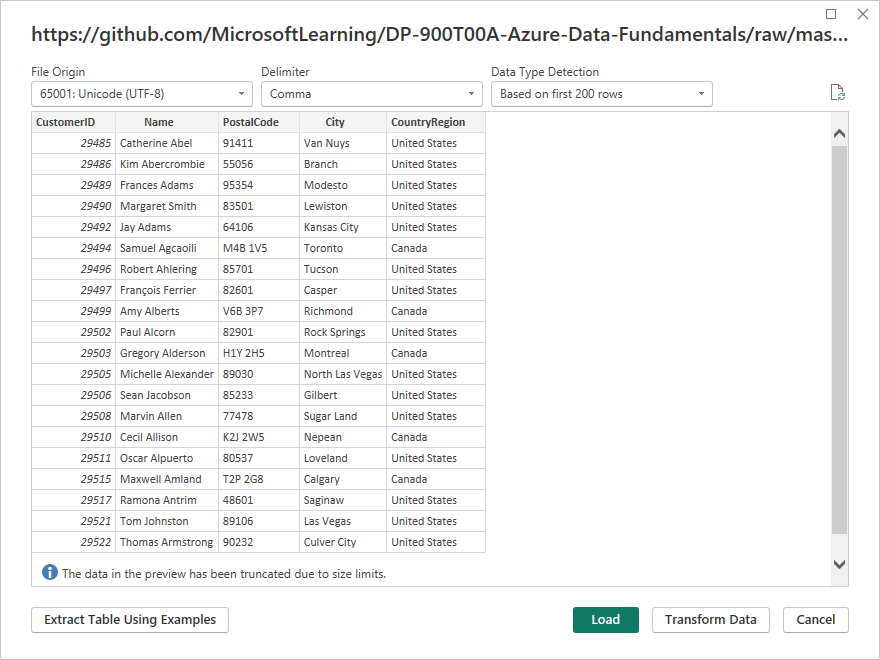

    > _**ヒント**:このラボでは、データを直接読み込むのが最も短時間で済みます。_ 必要に応じて、後からいつでも Power Query で変換を適用できます。

1. メインの Power BI Desktop ウィンドウの [データ] メニューで、 **[データの取得]** 、 **[Web]** の順に選択します。

    ![Power BI の [データの取得] メニューを示すスクリーンショット。](images/06-pbi-lab-get-data.png)

1. **[Web から]** ダイアログ ボックスで、次の URL を入力し、**[OK]** を選択します。

    ```
    https://github.com/MicrosoftLearning/DP-900T00A-Azure-Data-Fundamentals/raw/master/power-bi/products.csv
    ```

1. ダイアログで、 **[読み込み]** を選択して、このファイル内の製品データをデータ モデルに読み込みます。

1. 前の 3 つの手順を繰り返して、次の URL から注文データを含む 3 番目のデータセットをインポートします。

    ```
    https://github.com/MicrosoftLearning/DP-900T00A-Azure-Data-Fundamentals/raw/master/power-bi/orders.csv
    ```

    > _**ヒント**:Customers、Products、Orders を取り込むことで、小規模ながら現実的なモデルを作成できます。_ 複数の関連テーブルを使用すると、複数のエンティティ全体を分析できます (たとえば、製品カテゴリと市区町村別の収益)。

## データ モデルを探索する

インポートした 3 つのデータ テーブルがデータ モデルに読み込まれたため、今度はこれを探索して検索条件を絞ります。

> **データ モデルとは?** Power BI に取り込む一連のテーブルと、それらの間の接続です。**顧客**、**製品**、**注文**のテーブルをリンクすると、Power BI は、"各都市での各製品カテゴリの収益はどれくらいか?" のような、3 つすべてに関連する質問に回答できます。__
1. Power BI Desktop の左側の端で、 **[モデル]** タブを選択し、モデルの表を調節して表示されるようにします。 右側のペインは、 **>>** アイコンを使用して非表示にすることができます。

    ![Power BI の [モデル] タブを示すスクリーンショット。](images/06-pbi-lab-model-tab.png)

1. **[orders]** テーブルで、**[Revenue]** フィールドを選択し、**[プロパティ]** ペインで、**[Format] (書式)** プロパティを **[Currency] (通貨)** に設定します。

    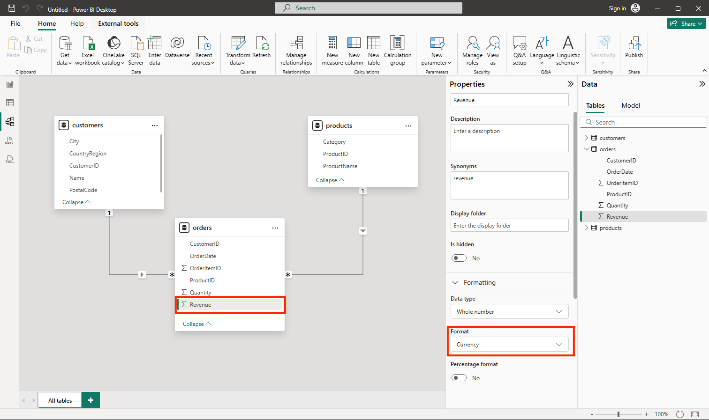

    この手順により、収益の値がレポートの視覚化で通貨として確実に表示されるようになります。

    > _**ヒント**:_ メジャーを書式設定すると、視覚エフェクトが読みやすくなり、ビジネス ユーザーが想定する表示形式に数字を整えることができます。

1. products テーブルで、 **[Category]** フィールドを右クリックし (または **&vellip;** メニューを開いて)、 **[階層の作成]** を選択します。 この手順によって、**カテゴリ階層**という名前の階層が作成されます。 これを確認するには、**products** テーブルを展開するかスクロールする必要がある場合があります。または、 **[フィールド]** ペインでも確認することができます。

    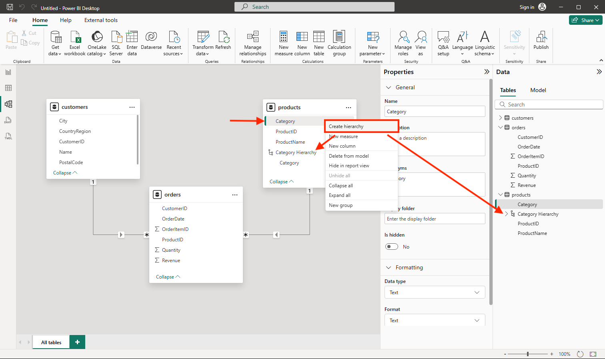

1. products テーブルで、**ProductName** フィールドを右クリックし (または **&vellip;** メニューを開いて)、 **[階層に追加]**  >  **[Category 階層]** を選択します。 これにより、前に作成した階層に **ProductName** フィールドが追加されます。

    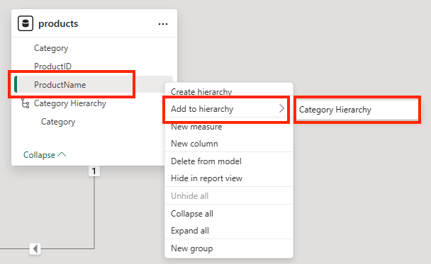

1. **[フィールド]** ウィンドウで、**[Category 階層]** を右クリックし (または **[...]** メニューを開いて)、**[名前の変更]** を選択します。 階層の名前を **[Categorized Product]** に変更します。

    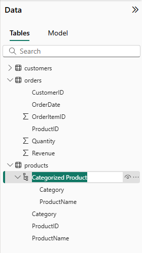

    > _**ヒント**:_ カテゴリ→製品の階層構造にすることで、視覚エフェクトのドリルダウンが可能になり、閲覧者は概要から詳細まで確認できるようになります。

1. 左端にある **[テーブル ビュー]** タブを選択してから、**[データ]** ペインで **[customers]** テーブルを選択します。

1. **[City]** 列ヘッダーを選択し、**[データ カテゴリ]** プロパティを **[市区町村]** に設定します。

    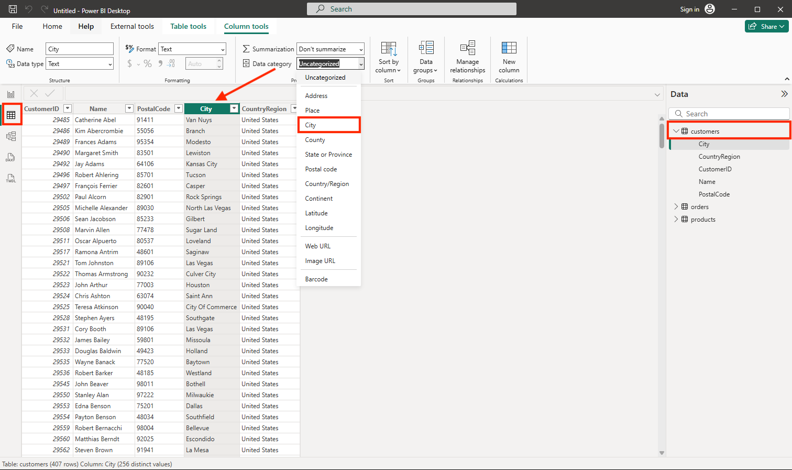

    この手順により、この列の値が市区町村名として解釈されるようになり、マップの視覚化を含める場合に役立てることができます。

    > _**ヒント**:_ Power BI で位置情報を正しくジオコードし、マップの視覚エフェクトでポイントを適切な場所に配置するには、データ カテゴリが役立ちます。

## レポートを作成する

これでレポートを作成する準備がほぼ完了しました。 まず、いくつかの設定を確認して、すべての視覚化が有効になっていることを確認する必要があります。

1. **[ファイル]** メニューの **[オプションと設定]** をクリックします。 次に、**[オプション]** を選択し、**[セキュリティ]** セクションで、**[地図と塗り分け地図の画像を使用する]** が有効になっていることを確認し、**[OK]** を選択します。

    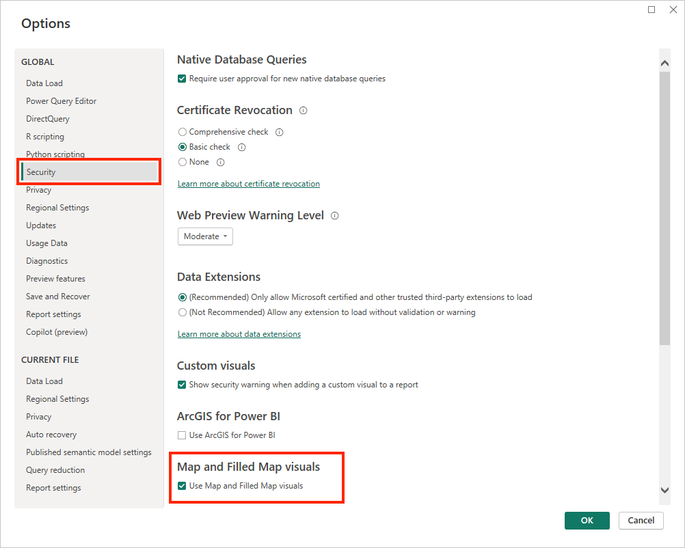

    この設定により、地図の視覚化を確実にレポートに含めることができます。

    > _**ヒント**:一部の環境では、マップの視覚エフェクトが無効になっています。_ 有効にすると、視覚化ペインにマップの視覚エフェクトが表示されます。

1. 左端にある **[レポート ビュー]** タブを選択し、レポート デザイン インターフェイスを表示します。

    ![Power BI の [レポート] タブを示すスクリーンショット。](images/06-pbi-lab-report-tab.png)

1. レポート デザイン画面の上にあるリボンで **[テキスト ボックス]** を選択し、「**Sales Report**」というテキストを含むテキスト ボックスをレポートに追加します。 テキストの書式を設定して、フォントサイズを 32 にして太字にします。

    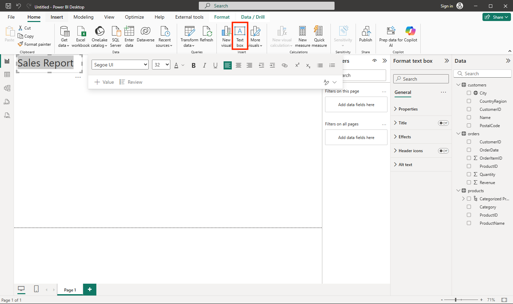

    > _**ヒント**:_ わかりやすいタイトルにすると、ユーザーはレポートの目的を一目で理解できます。

1. レポート上の空の領域を選択して、テキスト ボックスを選択解除します。 次に、 **[データ]** ペインで **[products]** を展開し、 **[Categorized Products]** フィールドを選択します。 この手順により、テーブルがレポートに追加されます。

    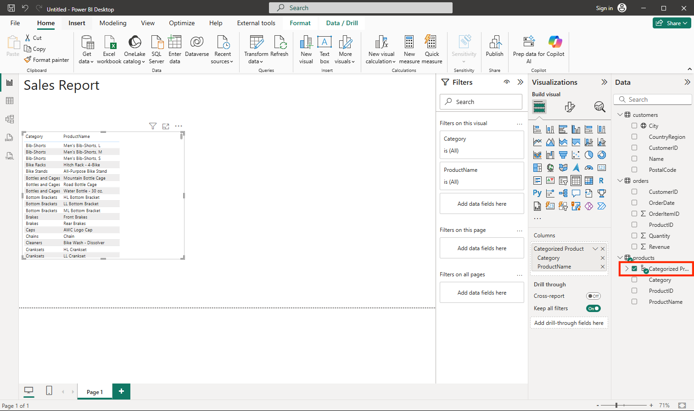

    > _**ヒント**:_ 階層フィールドを使用して、ドリルダウンをシームレスにサポートする視覚エフェクトに切り替えることができるようになりました。

1. テーブルを選択したまま、 **[データ]** ペインで **[orders]** を展開し、 **[Revenue]** を選択します。 テーブルに Revenue 列が追加されます。 テーブルを表示するには、サイズを拡大する必要がある場合があります。

    収益は、モデルで指定したとおりに通貨として書式設定されます。 ただし、小数点以下の桁数を指定していないので、値には小数部が含まれます。 作成しようとしている視覚化にとって重要ではありませんが、 **[モデル]** タブまたは **[データ]** タブに戻って小数点以下の桁数を変更することもできます。

    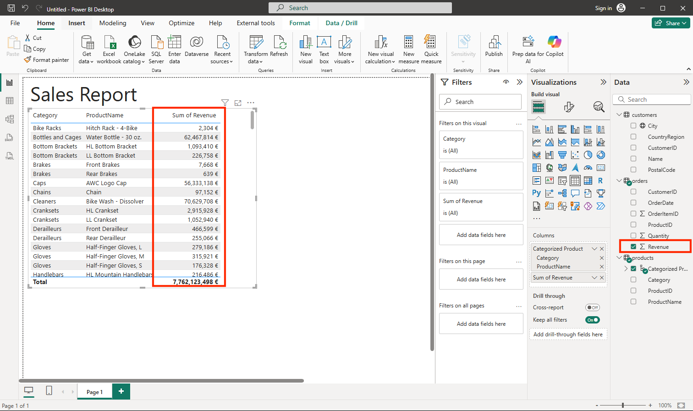

1. テーブルを選択したまま、**[視覚化]** ウィンドウで、**[積み上げ縦棒グラフ]** の視覚化を選択します。 テーブルが、カテゴリ別の収益を示す縦棒グラフに変更されます。

    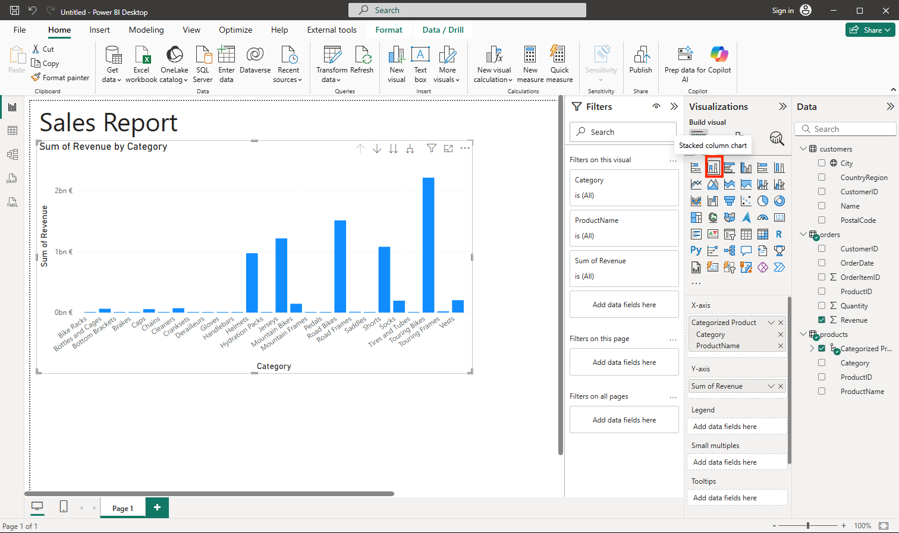

    > _**ヒント**:_ 縦棒グラフを使用すると、カテゴリを並べて簡単に比較できます。

1. 選択した縦棒グラフの上にある **[&#8595;]** アイコンを選択して、ドリルダウンをオンにします。 次に、グラフで任意の列を選択してドリルダウンし、このカテゴリの個々の製品の収益を確認します。 この機能は、カテゴリと製品の階層を定義したため使用でます。

    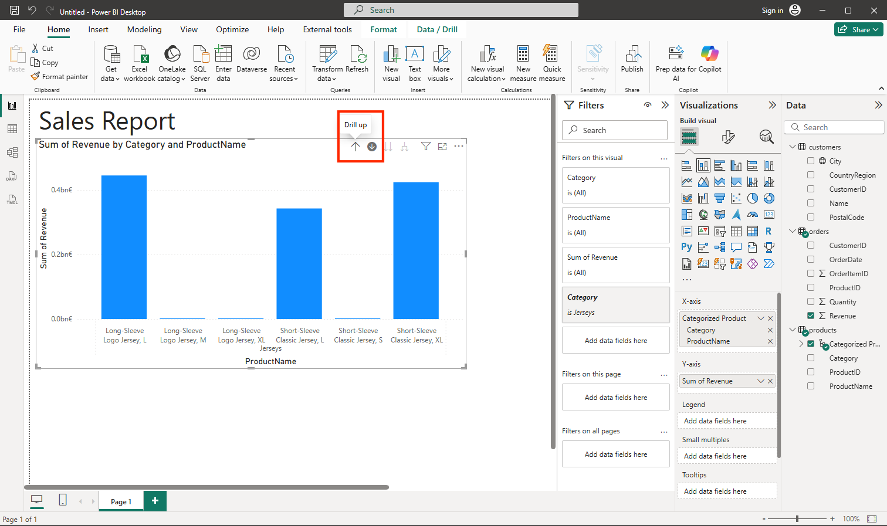

    > _**ヒント**:_ ドリルダウンにより、ビューが乱雑になることなく、必要に応じて詳細を表示できます。これは階層型の分析情報に最適です。

1. **[&#x2191;]** アイコンを使用して、カテゴリ レベルにドリルアップして戻ります。 次に、 **(** [&#8595;] **)** アイコンを選択して、ドリルダウン機能をオフにします。

1. レポートの空白の領域を選択し、 **[データ]** ペインで、 **[orders]** テーブルの **[Quantity]** フィールドと **[products]** テーブルの **[Category]** フィールドを選択します。 この手順により、製品カテゴリ別の売上数量を示す別の縦棒グラフが表示されます。

1. 新しい縦棒グラフを選択した状態で、**[視覚化]** ウィンドウの **[円グラフ]** を選択し、グラフのサイズを変更して、カテゴリ別の収益の縦棒グラフの横に配置します。

    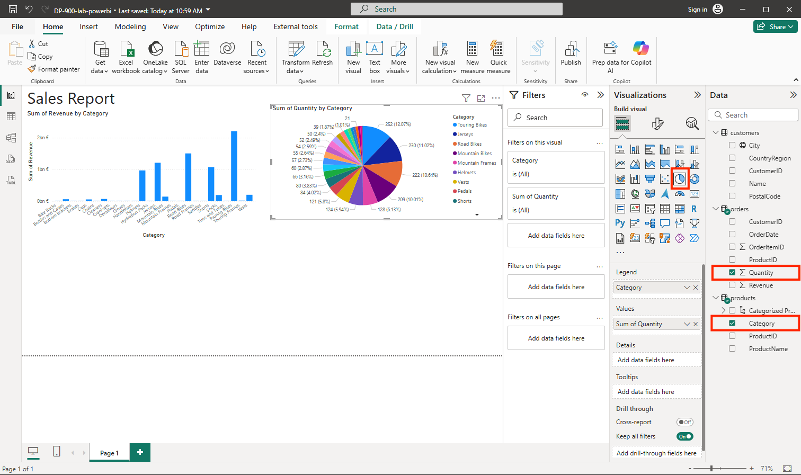

    > _**ヒント**:_ 数量をカテゴリ別に円グラフで表示すると、比例貢献度が浮き彫りになり、収益の縦棒グラフを補完することができます。

1. レポートの空白の領域を選択し、 **[データ]** ペインで、 **[customers]** テーブルの **[City]** フィールドと **[orders]** テーブルの **[Revenue]** フィールドを選択します。 これにより、都市別の売上高を示すマップが作成されます。 必要に応じて視覚化を配置し直し、サイズ変更します。

    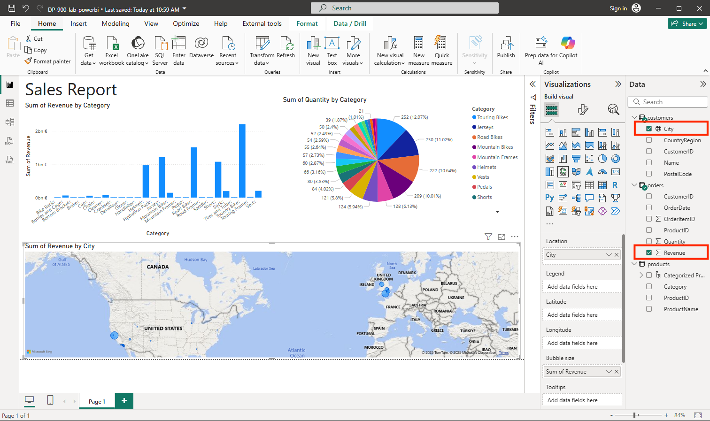

    > _**ヒント**:_ 市区町村別に収益をマップすると、地理的な視点が加わります。表やグラフではわかりにくいパターンも、マップ上で浮かび上がることがあります。

1. マップでは、ドラッグ、ダブルクリック、マウスホイールの使用、またはタッチスクリーン上でのピンチやドラッグを行って対話することができます。 次に、特定の都市を選択すると、レポート内の他の視覚化が変更されて、選択された都市のデータが強調表示されるのがわかります。

    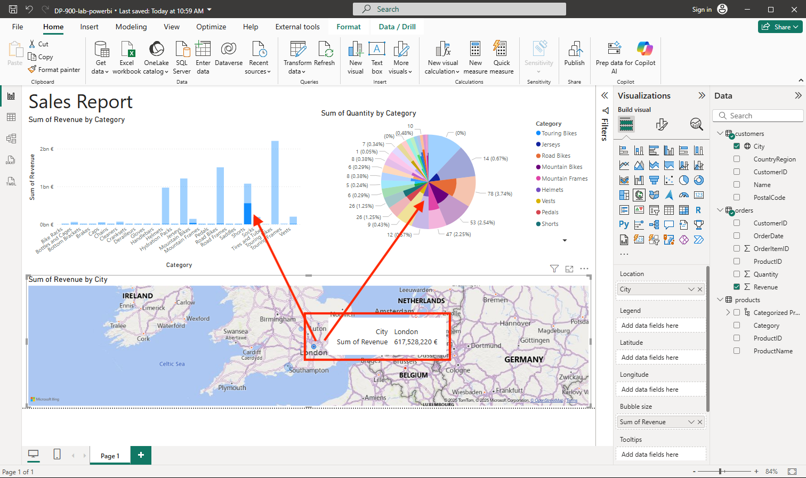

    > _**ヒント**:_ クロス強調表示を使用すると、ユーザーは 1 つの視覚エフェクトを操作してページ全体の関連する変更を確認できるため、静的レポートが対話型エクスペリエンスに変わります。

1. **[ファイル]** メニューの **[保存]** をクリックします。 次に、適切な .pbix ファイル名を使用してファイルを保存します。 都合の良いときにこのファイルを開いて、データ モデリングや視覚化をさらに調べることができます。

    > _**ヒント**:_.pbix を保存すると、モデル、クエリ、レポートがまとめて保存されるため、後で再度開いて反復処理を行うことができます。

[Power BI サービス](https://www.powerbi.com/?azure-portal=true)のサブスクリプションをお持ちの場合は、ご自分のアカウントにサインインし、レポートを Power BI ワークスペースに発行できます。 

> **ヒント**: Power BI サービスに発行すると、レポートを共有し、更新をスケジュールし、ワークスペース内の他のユーザーと共同作業を行うことができます。

## クリーンアップ

このコースの他のラボとは異なり、この演習では有料の Azure リソースを作成しなかったため、削除や無効化を行う必要はありません。 作成したレポートは、ご自分のコンピューターに `.pbix` ファイルとして保存されます。

このラボでは、複数のソースからデータを Power BI Desktop にインポートし、それを簡単なデータ モデルに接続して、テーブル、グラフ、マップを含む対話型レポートを作成しました。 生データから視覚的な分析情報への変換の第一歩を踏み出すことができました。
