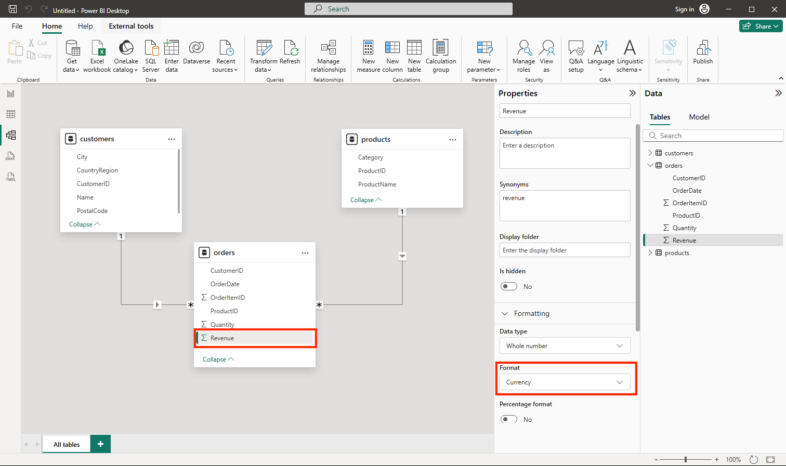

---
lab:
  title: Power BI を使用したデータの可視化の基礎を調べる
  module: Explore fundamentals of data visualization
---

# Power BI を使用したデータの可視化の基礎を調べる

この演習では、Microsoft Power BI Desktop を使用して、対話型データの視覚化を含むデータ モデルとレポートを作成します。

このラボは完了するまで、約 **20** 分かかります。

## 開始する前に

管理レベルのアクセス権を持つ [Azure サブスクリプション](https://azure.microsoft.com/free)が必要です。

### Power BI Desktop をインストールする

Microsoft Power BI Desktop が Windows コンピューターにまだインストールされていない場合は、無料でダウンロードしてインストールできます。

1. [https://aka.ms/power-bi-desktop](https://aka.ms/power-bi-desktop?azure-portal=true) から Power BI Desktop インストーラーをダウンロードします。
1. ファイルのダウンロードが完了したら、ファイルを開き、セットアップ ウィザードを使用してコンピューターに Power BI Desktop をインストールします。 このインストールには数分かかる場合があります。

## データのインポート

1. Power BI Desktop を開きます。 アプリケーション インターフェイスは次のようになります。

    

    これで、レポートのデータをインポートする準備ができました。

1. Power BI Desktop のようこそ画面で、**[データの取得]** を選択し、データ ソースの一覧で **[Web]** を選択し、**[接続]** を選択します。

    

1. **[Web から]** ダイアログ ボックスで、次の URL を入力し、**[OK]** を選択します。

    ```
    https://github.com/MicrosoftLearning/DP-900T00A-Azure-Data-Fundamentals/raw/master/power-bi/customers.csv
    ```

1. [Web コンテンツへのアクセス] ダイアログで、 **[接続]** を選択します。

1. URL によって、次に示すように顧客データを含むデータセットが開くことを確認します。 次に、**[読み込み]** を選択して、レポートのデータ モデルにデータを読み込みます。

    

1. メインの Power BI Desktop ウィンドウの [データ] メニューで、 **[データの取得]** 、 **[Web]** の順に選択します。

    ![Power BI の [データの取得] メニューを示すスクリーンショット。](images/get-data.png)

1. **[Web から]** ダイアログ ボックスで、次の URL を入力し、**[OK]** を選択します。

    ```
    https://github.com/MicrosoftLearning/DP-900T00A-Azure-Data-Fundamentals/raw/master/power-bi/products.csv
    ```

1. ダイアログで、 **[読み込み]** を選択して、このファイル内の製品データをデータ モデルに読み込みます。

1. 前の 3 つの手順を繰り返して、次の URL から注文データを含む 3 番目のデータセットをインポートします。

    ```
    https://github.com/MicrosoftLearning/DP-900T00A-Azure-Data-Fundamentals/raw/master/power-bi/orders.csv
    ```

## データ モデルを探索する

インポートした 3 つのデータ テーブルがデータ モデルに読み込まれたため、今度はこれを探索して検索条件を絞ります。

1. Power BI Desktop の左側の端で、 **[モデル]** タブを選択し、モデルの表を調節して表示されるようにします。 右側のペインは、 **>>** アイコンを使用して非表示にすることができます。

    ![Power BI の [モデル] タブを示すスクリーンショット。](images/model-tab.png)

1. **[orders]** テーブルで、**[Revenue]** フィールドを選択し、**[プロパティ]** ペインで、**[Format] (書式)** プロパティを **[Currency] (通貨)** に設定します。

    

    この手順により、収益の値がレポートの視覚化で通貨として確実に表示されるようになります。

1. products テーブルで、 **[Category]** フィールドを右クリックし (または **&vellip;** メニューを開いて)、 **[階層の作成]** を選択します。 この手順によって、**カテゴリ階層**という名前の階層が作成されます。 これを確認するには、**products** テーブルを展開するかスクロールする必要がある場合があります。または、 **[フィールド]** ペインでも確認することができます。

    

1. products テーブルで、**ProductName** フィールドを右クリックし (または **&vellip;** メニューを開いて)、 **[階層に追加]**  >  **[Category 階層]** を選択します。 これにより、前に作成した階層に **ProductName** フィールドが追加されます。
1. **[フィールド]** ウィンドウで、**[Category 階層]** を右クリックし (または **[...]** メニューを開いて)、**[名前の変更]** を選択します。 階層の名前を **[Categorized Product]** に変更します。

    

1. 左端にある **[データ ビュー]** タブを選択し、 **[データ]** ペインで **[customers]** テーブルを選択します。
1. **[City]** 列ヘッダーを選択し、**[データ カテゴリ]** プロパティを **[市区町村]** に設定します。

    

    この手順により、この列の値が市区町村名として解釈されるようになり、マップの視覚化を含める場合に役立てることができます。

## レポートを作成する

これでレポートを作成する準備がほぼ完了しました。 まず、いくつかの設定を確認して、すべての視覚化が有効になっていることを確認する必要があります。

1. **[ファイル]** メニューの **[オプションと設定]** をクリックします。 次に、**[オプション]** を選択し、**[セキュリティ]** セクションで、**[地図と塗り分け地図の画像を使用する]** が有効になっていることを確認し、**[OK]** を選択します。

    

    この設定により、地図の視覚化を確実にレポートに含めることができます。

1. 左端にある **[レポート ビュー]** タブを選択し、レポート デザイン インターフェイスを表示します。

    ![Power BI の [レポート] タブを示すスクリーンショット。](images/report-tab.png)

1. レポート デザイン画面の上にあるリボンで **[テキスト ボックス]** を選択し、「**Sales Report**」というテキストを含むテキスト ボックスをレポートに追加します。 テキストの書式を設定して、フォントサイズを 32 にして太字にします。

    

1. レポート上の空の領域を選択して、テキスト ボックスを選択解除します。 次に、 **[データ]** ペインで **[products]** を展開し、 **[Categorized Products]** フィールドを選択します。 この手順により、テーブルがレポートに追加されます。

    

1. テーブルを選択したまま、 **[データ]** ペインで **[orders]** を展開し、 **[Revenue]** を選択します。 テーブルに Revenue 列が追加されます。 テーブルを表示するには、サイズを拡大する必要がある場合があります。

    収益は、モデルで指定したとおりに通貨として書式設定されます。 ただし、小数点以下の桁数を指定していないので、値には小数部が含まれます。 作成しようとしている視覚化にとって重要ではありませんが、 **[モデル]** タブまたは **[データ]** タブに戻って小数点以下の桁数を変更することもできます。

    

1. テーブルを選択したまま、**[視覚化]** ウィンドウで、**[積み上げ縦棒グラフ]** の視覚化を選択します。 テーブルが、カテゴリ別の収益を示す縦棒グラフに変更されます。

    

1. 選択した縦棒グラフの上にある **[&#8595;]** アイコンを選択して、ドリルダウンをオンにします。 次に、グラフで 2 番目の列を選択してドリルダウンし、このカテゴリの個々の製品の収益を確認します。 この機能は、カテゴリと製品の階層を定義したため使用でます。

    

1. **[&#x2191;]** アイコンを使用して、カテゴリ レベルにドリルアップして戻ります。 次に、 **(** [&#8595;] **)** アイコンを選択して、ドリルダウン機能をオフにします。
1. レポートの空白の領域を選択し、 **[データ]** ペインで、 **[orders]** テーブルの **[Quantity]** フィールドと **[products]** テーブルの **[Category]** フィールドを選択します。 この手順により、製品カテゴリ別の売上数量を示す別の縦棒グラフが表示されます。
1. 新しい縦棒グラフを選択した状態で、**[視覚化]** ウィンドウの **[円グラフ]** を選択し、グラフのサイズを変更して、カテゴリ別の収益の縦棒グラフの横に配置します。

    

1. レポートの空白の領域を選択し、 **[データ]** ペインで、 **[customers]** テーブルの **[City]** フィールドと **[orders]** テーブルの **[Revenue]** フィールドを選択します。 これにより、都市別の売上高を示すマップが作成されます。 必要に応じて視覚化を配置し直し、サイズ変更します。

    

1. マップでは、ドラッグ、ダブルクリック、マウスホイールの使用、またはタッチスクリーン上でのピンチやドラッグを行って対話することができます。 次に、特定の都市を選択すると、レポート内の他の視覚化が変更されて、選択された都市のデータが強調表示されるのがわかります。

    

1. **[ファイル]** メニューの **[保存]** をクリックします。 次に、適切な .pbix ファイル名を使用してファイルを保存します。 都合の良いときにこのファイルを開いて、データ モデリングや視覚化をさらに調べることができます。

[Power BI サービス](https://www.powerbi.com/?azure-portal=true)のサブスクリプションをお持ちの場合は、ご自分のアカウントにサインインし、レポートを Power BI ワークスペースに発行できます。 
